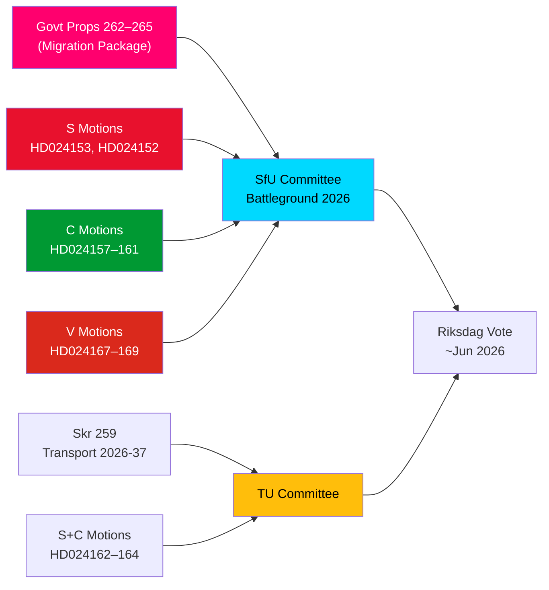

# 情报简报 — 反对派动议：瑞典移民方案承压

**作者**：詹姆斯·彼得·索林  
**日期**：2026-05-14  
**分类**：公开  
**置信度**：[B2] 可能属实 — 海军准则  
**分析深度**：深度分析

---

## 执行摘要

2026年5月13日，瑞典里克斯达格收到了15份反对派动议的显著组合，S、C和V同时挑战了四项移民收紧提案——2025/26届里克斯会议提案262-265。这些动议揭示了对政府移民政策路线的重大议会反对集团：S部分接受遣返活动，但坚决拒绝废除永久居留许可；C要求基于权利的保障措施，尤其是针对被拘留儿童；V则整体反对四项提案。加上S和C提出的三项要求2026-2037年国家交通基础设施计划加强气候方向的动议，2026年5月14日标志着一个在移民、儿童权利和气候交通政策上集中立法审查的日子。

## 支持的关键决策

1. **反对派移民抵制的可行性**：若政府试图在没有反对派修正案的情况下通过提案262-265，S+C+V集团（共约150席）保证了委员会层面的实质性挑战，但M+SD+KD联合政府维持着通过的工作多数。
2. **被拘留儿童的保护措施**：C的HD024160动议（barn i förvar）依据CRC第37条和ECHR第5条提出了具有重要宪法意义的挑战；Lagrådet已标注关切——这种修正压力可能产生委员会让步。
3. **交通基础设施中的气候条款**：要求在skr. 2025/26:259（2026-2037年国家交通计划）中明确气候适应的S动议HD024162表明，反对派将在财政辩论中失去主动权后，利用交通预算进程推进气候政策。

## 60秒情报要点

- **移民集团团结**：S、C和V在同一天针对全部四项移民提案提交协调动议——自2021年以来在移民问题上罕见的三党反对派协调。从分析角度看，这是"动议集群攻击"——旨在实现最大程度的同步媒体报道。
- **永久居留许可争议点**：S的旗舰动议HD024153要求拒绝整个永久居留许可的逐步废除；影响8万至10万现有许可持有人；AMR协议合规论据存争议。
- **儿童权利维度**：C的HD024160（barn i förvar）+ Lagrådet的宪法批评（CRC第37条/ECHR第5条）为政府让步创造了空间。先例：2024年社会服务改革中，政府接受了Lagrådet支持的5项修正案中的2项。
- **V的全面反对**：Vänsterpartiet整体拒绝四项移民提案——包括遣返活动和品行要求。V的策略是选举性的（巩固第4细分市场），而非阻碍性的（无法获得多数）。
- **联合政府算术**：政府拥有176席（多数1席）。S+C+V+MP = 173——距多数差2席。政府确定能通过，但若2名政府议员倒戈，特定修正提案上将存在漏洞。
- **交通基础设施**：三项动议（S+C）要求在2026-2037年交通计划中加强气候方向；具体是在项目选择标准中将2030年前交通碳排放减少30%作为指标。
- **SfU委员会战场**：SfU将处理4项提案对应的10项动议；委员会日程公告预计在2026-05-20前发布——快速通道信号将意味着场景2（全面通过不作修改）。

## 主要未来触发因素

**72小时内**：SfU委员会公告prop. 2025/26:262-265听证日程。若委员会主席（SD/M）宣布快速通道日程，S+C+V的反对压力将加剧。

<!-- source-sha: 13fb01dbf19848515cc9696908bf9f099436e97c -->
