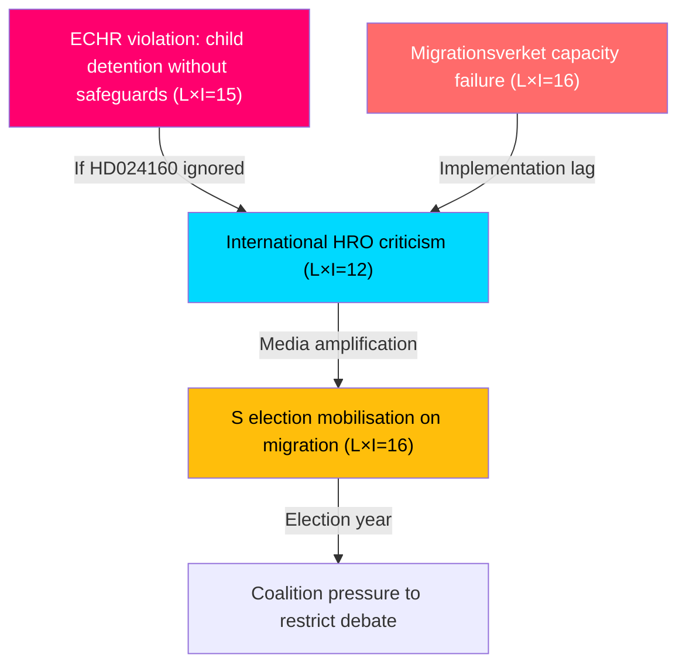

# Risk Assessment — Opposition Motions 2026-05-14

**Author**: James Pether Sörling  
**Methodology**: `analysis/methodologies/political-risk-methodology.md`  
**Scale**: Likelihood (L) × Impact (I) = Risk Score (1–25)

---

## 5-Dimension Risk Register

### Dimension 1: Constitutional/Legal Risks

| Risk | L (1–5) | I (1–5) | Score | Mitigation |
|------|---------|---------|-------|------------|
| Prop 265 challenged at Constitutional Court (Lagrådsremiss retroactively contested) | 2 | 5 | 10 | Lagrådet review completed; minor amendment risk remains |
| ECHR Art. 5 violation if child detention implemented without safeguards (HD024160 concern) | 3 | 5 | 15 | **HIGH RISK** — Lagrådet specifically flagged CRC Art. 37 |
| Permanent permit abolition (prop 262) creates EU treaty non-compliance claim | 2 | 4 | 8 | S's HD024153 raises the argument but EU Commission has not yet signalled infringement |

### Dimension 2: Political Risks

| Risk | L (1–5) | I (1–5) | Score | Mitigation |
|------|---------|---------|-------|------------|
| Coalition fracture (SD dissent on child rights or C defection) | 1 | 5 | 5 | Low probability; SD strongly supports migration tightening |
| S uses HD024153 as 2026 election centrepiece — effectively mobilises migration-liberal voters | 4 | 4 | 16 | **HIGH RISK** — S has electoral incentive to maximise this conflict |
| C splits from government support on child detention issue | 2 | 3 | 6 | C not in coalition; moderate risk of parliamentary defection on HD024160 |
| V's total-rejection positioning fragments opposition (prevents S-C tactical alliance) | 3 | 3 | 9 | Medium risk; S and C may distance from V to preserve pragmatic credibility |

### Dimension 3: Implementation/Administrative Risks

| Risk | L (1–5) | I (1–5) | Score | Mitigation |
|------|---------|---------|-------|------------|
| Migrationsverket capacity insufficient for vandel reassessments (prop 264) at scale | 4 | 4 | 16 | **HIGH RISK** — Statskontoret evidence of persistent Migrationsverket backlogs |
| Permanent permit phase-out creates legal vacuum for existing permit holders | 3 | 4 | 12 | Transitional provisions needed; government has included transition rules but S disputes adequacy |
| Child-safe detention facilities (HD024160 demand) require capital investment Migrationsverket lacks | 3 | 3 | 9 | Infrastructure procurement timeline risk if amendment accepted |

### Dimension 4: Electoral/Reputational Risks

| Risk | L (1–5) | I (1–5) | Score | Mitigation |
|------|---------|---------|-------|------------|
| Government faces international human rights body criticism (UNHCR, Amnesty) on permanent permit abolition | 4 | 3 | 12 | UNHCR has historically criticised Swedish migration tightening; reputational risk is real |
| Transport plan (skr 259) criticised by Klimatpolitiska rådet for climate inadequacy | 3 | 3 | 9 | Annual climate council review expected spring 2026 |
| S's migration repositioning (accepting return activities) loses progressive voters to V/MP | 3 | 3 | 9 | Risk of left-flank voter migration; S is taking a calculated electoral risk |

### Dimension 5: International/EU Risks

| Risk | L (1–5) | I (1–5) | Score | Mitigation |
|------|---------|---------|-------|------------|
| EU Commission prelim investigation into Swedish AMR Pact implementation | 2 | 4 | 8 | EU pact does not require permanent permit abolition — Sweden has flexibility |
| Nordic peer reaction: Norway/Denmark watching permanent permit abolition | 2 | 2 | 4 | Low risk; both countries have also tightened migration |

## Cascading Risk Chains

## Posterior Probability: Government accepts HD024160 child detention amendment

**Prior**: Government typically accepts narrow constitutional amendments when Lagrådet critique is specific and focused.  
**Evidence**: Lagrådet flagged CRC Art. 37 and RF 2 kap. 8§ specifically for prop 265.  
**Update**: S and V both demand change; C demand is narrow and technically specific (barnsäkrade facilities).  
**Posterior**: **55–65% probability** that government accepts child-safety amendment in committee, reducing ECHR risk.
