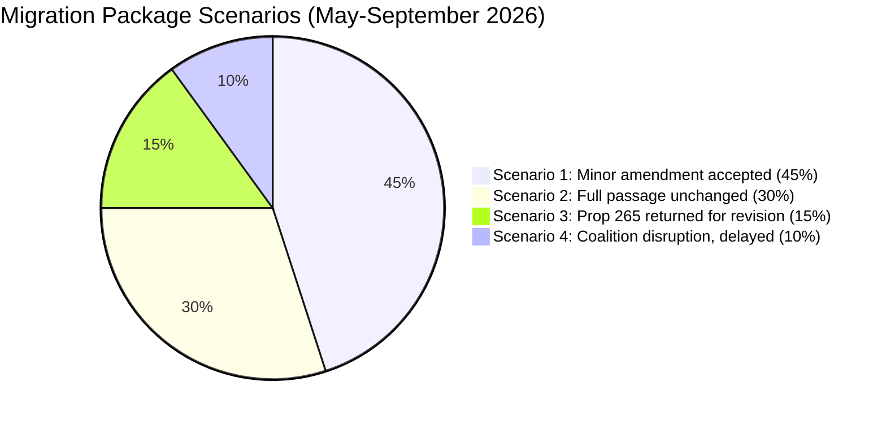

# Scenario Analysis — Migration Package Opposition 2026-05-14

**Author**: James Pether Sörling  
**Methodology**: `analysis/methodologies/scenario-analysis-methodology.md`  
**Scenarios**: 4 (probabilities sum to 100%)

---

## Scenario Framework

**Focal question**: What will be the legislative outcome of props 262–265 and the opposition motions by September 2026?

---

### Scenario 1: Package Passes with Minor Child-Safety Amendment (Most Likely — 45%)

**Description**: Government accepts C's HD024160 child detention safeguard (barnsäkrade facilities requirement) as a narrow constitutional concession to neutralise Lagrådet critique. All other elements of props 262–265 pass unchanged. S, C, and V record committee reservations (reservationer) in SfU betänkandet.

**Leading indicators**:
- Government accepts HD024160 language in committee review by June 2026
- SfU betänkande published with 3 reservations (S, C, V) and 1 government concession
- Riksdag vote: majority for passage with child-safety amendment

**Electoral consequence**: Government can claim it addressed constitutional concerns; opposition can claim a partial victory. Migration remains a top-3 election issue but HD024160 de-escalates the most emotionally salient element.

### Scenario 2: Package Passes Unchanged — Full Opposition Defeat (30%)

**Description**: Government uses its majority to pass all four propositions without amendments. Lagrådet's critique is noted but not acted upon. SfU committee process is fast-tracked to allow passage before summer recess.

**Leading indicators**:
- SfU announces fast-track schedule by 20 May
- No government concession signal by end of May
- SD explicitly rejects any rights-based amendments

**Electoral consequence**: Opposition has maximum attack surface entering the 2026 election. UNHCR/Amnesty criticism amplified. Risk of future ECtHR challenge if child detention proceeds without safeguards.

### Scenario 3: Props 262–265 Split — Prop 265 Returned for Revision (15%)

**Description**: Constitutional pressure around prop 265 (child detention) forces the government to withdraw or substantially revise that specific proposition. Props 262/263/264 proceed; prop 265 is returned to the Ministry of Justice for amendment incorporating child-safety requirements.

**Leading indicators**:
- Lagrådet issues supplementary opinion with stronger constitutional objection
- C announces it will vote against prop 265 in final vote (creating majority risk)
- Government signals withdrawal of prop 265 for revision by June

**Electoral consequence**: Significant institutional check demonstrated. C's rights-based approach vindicated. Government faces criticism for "bungled" legislation. Migration package partially delayed.

### Scenario 4: Coalition Disruption — Package Delayed to Next Riksmöte (10%)

**Description**: A broader political disruption (coalition crisis, confidence motion, or Riksdag procedural conflict) delays processing of the entire migration package until the 2025/26 session ends, pushing implementation to 2026/27.

**Leading indicators**:
- Major coalition disagreement on unrelated issue (budget, defence) destabilises scheduling
- SfU chair conflict causing committee process breakdown
- Government reshuffles migration minister before package processed

**Electoral consequence**: Migration package becomes a campaign promise for the 2026 election (if government wins: will be passed; if opposition wins: will be substantially revised or withdrawn).

## Scenario Probability Chart

## Leading Indicators per Scenario

| Scenario | Key Leading Indicator | Time Horizon |
|----------|----------------------|--------------|
| S1 | Government accepts HD024160 in committee | By 2026-06-15 |
| S2 | SfU fast-track announcement; SD rejects amendments | By 2026-05-20 |
| S3 | Supplementary Lagrådet opinion OR C votes against prop 265 | By 2026-06-01 |
| S4 | Coalition disruption signal | Ongoing |
