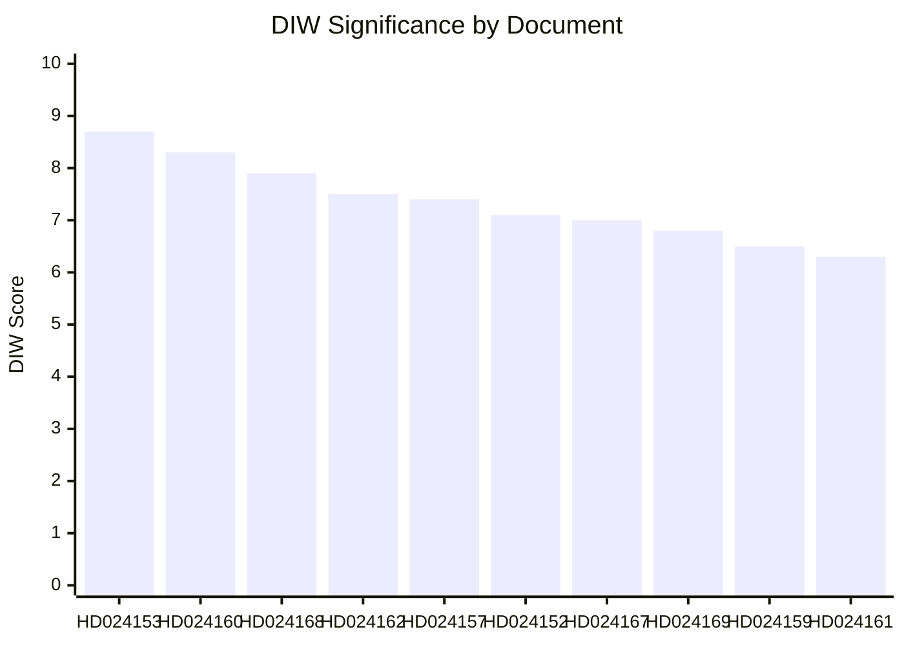

# Significance Scoring — Opposition Motions 2026-05-14

**Author**: James Pether Sörling  
**Methodology**: DIW (Depth × Impact × Width) per `analysis/methodologies/ai-driven-analysis-guide.md`

---

## DIW Scores per Document

| dok_id | Depth (1–10) | Impact (1–10) | Width (1–10) | DIW Score | Tier | Priority |
|--------|-------------|--------------|-------------|-----------|------|----------|
| HD024153 | 9 | 9 | 8 | 8.7 | L2+ Priority | 🔴 Critical |
| HD024160 | 9 | 8 | 8 | 8.3 | L2+ Priority | 🔴 Critical |
| HD024168 | 8 | 8 | 7.5 | 7.9 | L2 Strategic | 🟠 High |
| HD024162 | 8 | 7 | 7.5 | 7.5 | L2 Strategic | 🟠 High |
| HD024157 | 8 | 7 | 7 | 7.4 | L2 Strategic | 🟠 High |
| HD024152 | 7 | 7.5 | 7 | 7.1 | L2 Strategic | 🟠 High |
| HD024167 | 7 | 7 | 7 | 7.0 | L2 Strategic | 🟡 Medium |
| HD024169 | 7 | 7 | 6.5 | 6.8 | L2 | 🟡 Medium |
| HD024159 | 7 | 6.5 | 6 | 6.5 | L1 | 🟡 Medium |
| HD024161 | 6.5 | 6.5 | 6 | 6.3 | L1 | 🟡 Medium |
| HD024163 | 6 | 5.5 | 6 | 5.8 | L1 | 🟢 Low |
| HD024164 | 6 | 5.5 | 6 | 5.8 | L1 | 🟢 Low |
| HD024158 | 6 | 5.5 | 5 | 5.5 | L1 | 🟢 Low |
| HD024156 | 5.5 | 5 | 5 | 5.2 | L1 | 🟢 Low |
| HD024165 | 5 | 5 | 4 | 4.7 | L1 | 🟢 Low |

**DIW scoring formula**: D × 0.4 + I × 0.35 + W × 0.25

## Sensitivity Analysis

**If Lagrådet critique forces government withdrawal of prop 265 (child detention)**: HD024160 upgrades from L2+ Priority to L3 Intelligence-grade; its constitutional significance would be historically notable.

**If S's HD024153 reflects a broader S-V coalition formation signal**: DIW scores for all S motions upgrade by +0.5 as legislative strategy takes on a pre-electoral bloc-building dimension.

**If transport motions attract media framing as climate rollback evidence**: HD024162 upgrades to L2+ Priority given its electoral framing potential.

## Cluster Analysis

**Migration cluster** (SfU — props 262–265): 10 motions, aggregate DIW 7.1/10 — the highest-weighted daily cluster since the 2023 migration legislation. This cluster merits full L2+ treatment.

**Transport cluster** (TU — skr 259): 3 motions, aggregate DIW 6.4/10 — high for a government communication (skrivelse) response; S's climate framing makes this politically significant.

**Other clusters** (SoU, UbU, CU): 3 motions, aggregate DIW 5.1/10 — standard L1 processing.

