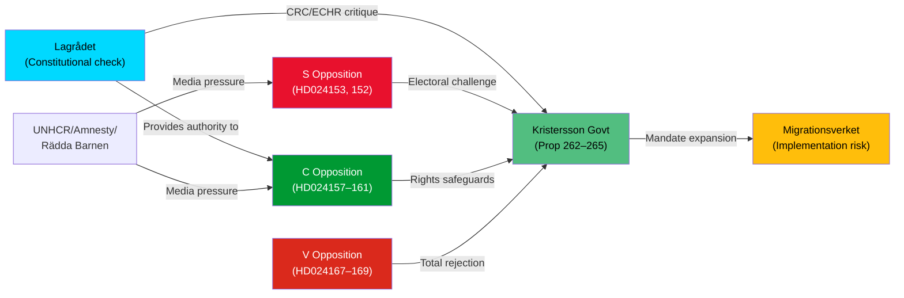

# Stakeholder Perspectives — Opposition Motions 2026-05-14

**Author**: James Pether Sörling  
**Methodology**: `analysis/methodologies/stakeholder-impact-methodology.md`

---

## 6-Lens Stakeholder Matrix

### Lens 1: Government / Executive

| Actor | Position | Interests | Influence |
|-------|----------|-----------|-----------|
| **PM Ulf Kristersson (M)** | Defends migration package as necessary; will accept only minimal amendments | Coalition stability; migration credibility vs. SD; 2026 election positioning | CRITICAL |
| **Maria Malmer Stenergard (M) — Migration Minister** | Package architect; will resist S's wholesale rejection of prop 262 | Policy coherence; EU pact compliance framing | HIGH |
| **Tidökoalitionen collective** | United front on migration; SD as coalition driver | Electoral base (SD constituent demand for tighter migration) | CRITICAL |

### Lens 2: Parliamentary Opposition

| Actor | Position | Interests | Influence |
|-------|----------|-----------|-----------|
| **Ida Karkiainen (S) — migration lead** | HD024153: Reject permanent permit abolition; accept proportional returns | S voter retention; differentiation from SD course | HIGH |
| **Niels Paarup-Petersen (C) — migration focus** | HD024157/160: Rights safeguards, children's detention | C's liberal brand; Lagrådet backing | HIGH |
| **Malcolm Momodou Jallow (V)** | HD024167–169: Total rejection across all four props | V left-flank voter retention; electoral differentiation from S | MEDIUM-HIGH |
| **Aylin Nouri (S) — transport lead** | HD024162: Climate integration in transport plan | Climate-forward S voter base; urban/suburban S voters | MEDIUM |

### Lens 3: Civil Society / NGOs

| Actor | Position | Interests | Impact |
|-------|----------|-----------|--------|
| **UNHCR Sweden** | Likely to criticise permanent permit abolition (prop 262) | International refugee protection norms | MEDIUM — media amplification |
| **Amnesty International Sweden** | Expected to support HD024160 child detention safeguards | CRC/ECHR compliance | MEDIUM |
| **Rädda Barnen (Save the Children)** | Strong support for C's HD024160 child safeguards | Child welfare mandate | MEDIUM-HIGH in media |
| **Swedish Bar Association** | Lagrådet-aligned: concerns on vandel definition (prop 264) | Rule of law; legal precision | MEDIUM |

### Lens 4: Administrative / Regulatory Bodies

| Actor | Position | Interests | Impact |
|-------|----------|-----------|--------|
| **Migrationsverket** | Concerns about implementation capacity for vandel reassessments and permit reclassifications | Operational feasibility | HIGH — implementation risk bearer |
| **Domstolsverket** | Concerned about court backlog increase from new appeal types | Administrative capacity | MEDIUM |
| **Lagrådet (Council on Legislation)** | Already issued constitutional critique; CRC Art. 37 + ECHR Art. 8 flagged | Constitutional rule of law | CRITICAL — authoritative external voice |

### Lens 5: Affected Populations

| Population | Impact | Scale |
|------------|--------|-------|
| **Long-term residents with permanent permits** | Affected by prop 262 reclassification | ~80,000–100,000 permit holders (estimate) |
| **Asylum seekers / temporary permit holders** | Affected by stricter return (prop 263) and vandel (prop 264) | Tens of thousands annually |
| **Children in migration detention** | Directly affected by prop 265 + HD024160 safeguards demand | Smaller cohort but extreme vulnerability |
| **General public** | Migration policy as top-3 election issue; high public salience | ~6 million eligible voters |

### Lens 6: International / EU Dimension

| Actor | Position | Impact |
|-------|----------|--------|
| **European Commission** | Monitoring Swedish AMR Pact implementation; no formal infringement yet | MEDIUM — potential EU scrutiny |
| **Nordic peers (NO, DK, FI)** | All have tightened migration; Sweden's package aligns with regional trend | LOW — no adverse reaction expected |
| **European Court of Human Rights (ECtHR)** | Future jurisdiction if child detention safeguards inadequate | HIGH — long-horizon legal risk if prop 265 passed without amendment |

## Influence Network (Key Actors)

