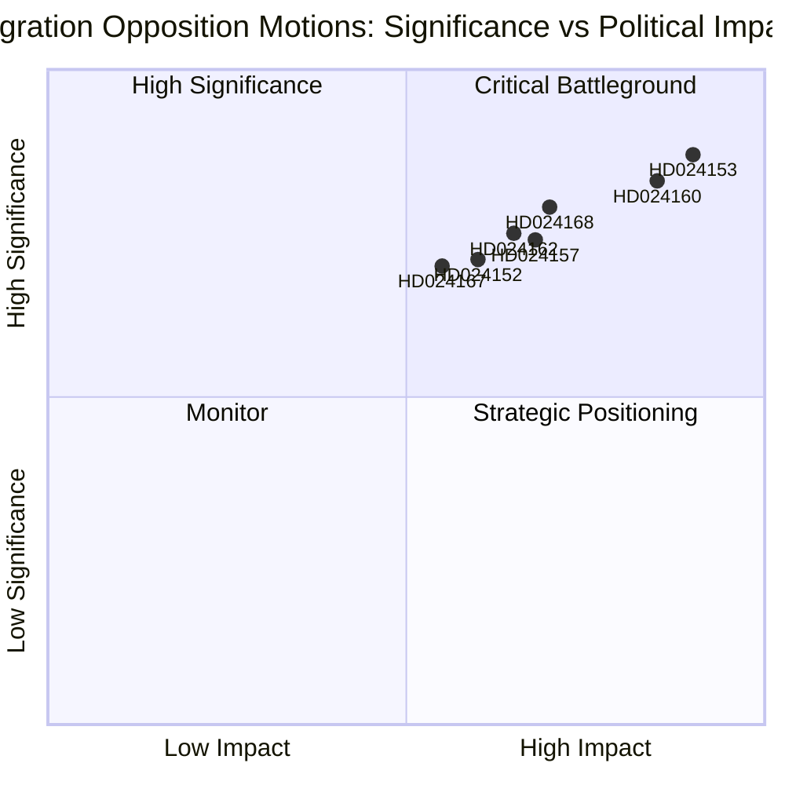

# Synthesis Summary — Sweden's Migration & Transport Opposition Motions, 14 May 2026

**Author**: James Pether Sörling  
**Date**: 2026-05-14  
**Confidence**: [B2] Probably True

---

## Lead Story

The simultaneous filing of 15 opposition motions on 2026-05-13 represents the broadest single-day parliamentary challenge to the Kristersson government's migration policy since the 2022 riksdag election. S, C, and V jointly contest four migration propositions (props 262–265) on distinct legal and values grounds — yet all agree the government has overreached on migrants' fundamental rights. This convergence does not constitute a formal opposition bloc (the three parties share no coalition agreement), but it signals that migration politics will dominate the SfU committee agenda through June 2026 and will feature prominently in the 2026 election campaign.

## DIW-Weighted Significance Ranking

| Rank | dok_id | Title | DIW Score | Tier |
|------|--------|-------|-----------|------|
| 1 | HD024153 | S: Abolish permanent residence abolition (Prop 262) | 8.7/10 | L2+ Priority |
| 2 | HD024160 | C: Child detention safeguards (Prop 265) | 8.3/10 | L2+ Priority |
| 3 | HD024168 | V: Reject vandel requirements entirely (Prop 264) | 7.9/10 | L2 Strategic |
| 4 | HD024162 | S: Transport infrastructure climate alignment | 7.5/10 | L2 Strategic |
| 5 | HD024157 | C: Reject permanent permit abolition (Prop 262) | 7.4/10 | L2 Strategic |
| 6 | HD024152 | S: Return activities (conditional support, Prop 263) | 7.1/10 | L2 Strategic |
| 7 | HD024167 | V: Reject detention/custody (Prop 265) | 7.0/10 | L2 Strategic |
| 8 | HD024169 | V: Reject return activities (Prop 263) | 6.8/10 | L2 |
| 9 | HD024159 | C: Return activities amendment | 6.5/10 | L1 Surface |
| 10 | HD024161 | C: Vandel requirements — reject | 6.3/10 | L1 Surface |
| 11–15 | Others | TU transport, SoU healthcare, UbU research ethics, CU land registry | 5–6/10 | L1 Surface |

## Integrated Intelligence Picture

**Migration cluster (DIW weight: HIGH)**

The government's migration package (props 262–265) is a coordinated effort to: (a) align Sweden with EU Asylum & Migration Pact (AMR) requirements by phasing out permanent residence permits; (b) strengthen deportation machinery; (c) tighten vandel-based permit revocations; (d) expand detention powers over migrants including children. The opposition motions reveal three analytically distinct challenges:

1. **Legitimacy challenge (S)**: S argues permanent permit abolition is not *required* by the EU pact — it is a government choice beyond EU minimum obligations. HD024153 (Ida Karkiainen et al.) frames the government as exploiting EU pact compliance as a pretext for maximally restrictive national policy. S supports strengthened returns in principle (HD024152) but insists on proportionality safeguards, particularly concerning unaccompanied minors.

2. **Rights-based challenge (C)**: Centerpartiet's motions cluster around specific human rights and rule-of-law concerns. HD024160 (Niels Paarup-Petersen et al.) is the most legally acute: C demands that children can only be placed in detention facilities that are child-proofed/child-safe, reflecting CRC Art. 37 and Lagrådet's constitutional critique. HD024161 challenges the *definition* of "vandel" as legally imprecise, citing Lagrådet's concerns. C does not oppose the policy direction but demands proportionality and rights safeguards throughout.

3. **Total rejection (V)**: Vänsterpartiet (Malcolm Momodou Jallow et al.) has filed rejection motions against all four propositions in their entirety. This is ideologically consistent with V's historical opposition to migration restrictions but also positions the party for a 2026 election campaign differentiating it clearly from S on migration.

**Transport cluster (DIW weight: MEDIUM)**

S (HD024162, Aylin Nouri et al.) and C (HD024163/164) challenge the government's national transport infrastructure plan for 2026–2037 on the basis that it lacks binding climate targets. S argues the transport sector's climate goal — a 70% emissions reduction by 2030 — requires explicit integration in the infrastructure plan, not aspirational language. Three C motions demand accelerated electrification, rail investments in sparsely populated areas, and faster return of specific removed projects. This transport cluster is lower-urgency than the migration package but connects to the broader debate on Sweden's climate credibility under the Kristersson government.

**Cross-cutting electoral reading**: All five SfU motions from S+C+V, if compiled as demands, would soften the migration package into something approximating pre-2022 Swedish policy. The government faces a choice: accept partial concessions (most likely on child detention — HD024160 — to neutralise the Lagrådet critique) or pass the package unchanged on coalition majority and absorb opposition attack in the election campaign.

