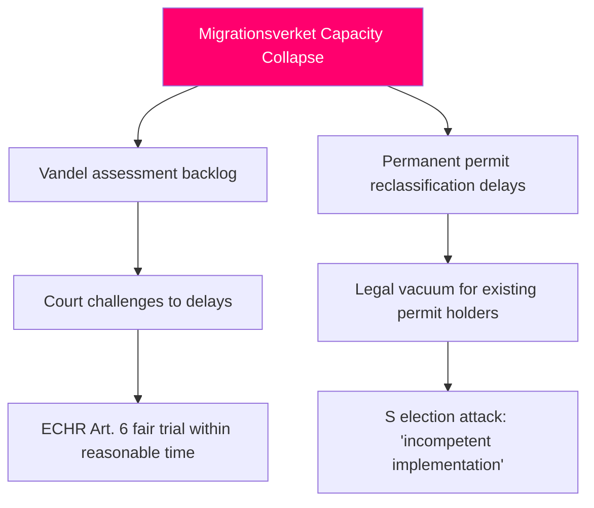

# Threat Analysis — Opposition Motions 2026-05-14

**Author**: James Pether Sörling  
**Methodology**: `analysis/methodologies/political-threat-framework.md`  
**Threat Taxonomy**: Swedish Political Threat Classification System

---

## Political Threat Taxonomy

### Threat T1: Constitutional Rights Rollback (CRITICAL)

**Classification**: Institutional integrity / Rights erosion  
**Actor**: Government (Kristersson cabinet) via props 262–265  
**Target**: Long-term residents, migrants, children in detention  
**Mechanism**: Legislative — four-proposition migration tightening package

**TTP Mapping** (MITRE-style Political TTPs):  
- **TTP-POL-001**: Incremental rights restriction through legislative accumulation (4 propositions filed simultaneously, reducing legislative scrutiny per document)
- **TTP-POL-007**: Lagrådet critique override (government acknowledges constitutional concerns but advances legislation)
- **TTP-POL-012**: EU pact "minimum obligation" framing to justify maximal national restriction

**Kill chain**:
1. Props 262–265 filed → Committee intake (SfU)
2. Simultaneous opposition motions filed (HD024153 etc.)
3. SfU committee deliberation (expected May–June 2026)
4. Lagrådet critique entered into committee record
5. Government decision: accept narrow amendments or advance unchanged
6. Riksdag vote: government majority passes package
7. Implementation: Migrationsverket restructuring begins
8. **THREAT REALISED** if child detention proceeds without safeguards (ECHR Art. 5/CRC Art. 37 violation risk)

**Probability**: **HIGH** that package passes; **MEDIUM** that child detention element remains without sufficient safeguards

### Threat T2: Electoral Manipulation of Migration Discourse (HIGH)

**Classification**: Democratic integrity / Electoral manipulation  
**Actor**: All parties (across the spectrum) using migration motions for electoral positioning  
**Mechanism**: 15 simultaneous motions on same day — unusual media saturation strategy

**TTP Mapping**:
- **TTP-POL-020**: Coordinated parliamentary filing for media saturation (opposition parties file same-day for maximum news impact)
- **TTP-POL-021**: Issue ownership contestation — S attempts to reclaim "reasonable migration" framing from SD
- **TTP-POL-025**: V polarisation strategy — total rejection positions V as maximally protective, pressures S left-flank

**Assessment**: This is legitimate democratic competition but operationally constitutes a "media saturation attack" on the government's migration narrative. Opposition parties are exploiting the parliamentary filing system as a public communications tool.

### Threat T3: Climate Policy Regression via Transport Plan (MEDIUM)

**Classification**: Policy coherence failure / Long-horizon threat  
**Actor**: Government (Kristersson) via skr. 2025/26:259 without binding climate targets  
**Target**: Swedish climate commitments (70% transport emissions reduction by 2030)

**TTP Mapping**:
- **TTP-POL-030**: Long-horizon policy dilution — 12-year infrastructure plan without binding climate targets locks in carbon-intensive investments
- **TTP-POL-031**: Ministerial framing — presenting aspirational climate language as binding policy commitment

**Kill chain**:  
1. Skr 259 filed without binding climate clauses → TU committee
2. S+C motions (HD024162–164) demand stronger climate integration
3. TU committee deliberation
4. If motions rejected: infrastructure 2026–2037 proceeds without climate guardrails
5. **THREAT REALISED**: Transport emissions reduction trajectory 2026–2037 insufficient for 2030 target

### Threat T4: Migrationsverket Capacity Collapse (MEDIUM-HIGH)

**Classification**: Administrative capacity threat  
**Actor**: Government — mandate expansion beyond Migrationsverket capacity  
**Mechanism**: Props 262/264 add new mandate types (vandel assessments, permit reclassifications) without capacity funding

**Attack tree**:

## Procedural-Legitimacy Attack Surface

The simultaneous filing of 15 motions by three opposition parties on a single day is analytically significant from a procedural-legitimacy perspective. It demonstrates:

1. **Healthy democratic opposition**: This is normal, expected parliamentary behaviour. No legitimacy threat.
2. **Media saturation strategy**: Could be framed as "opposition gaming the system" if tabloid coverage focuses on volume rather than substance — a secondary reputational risk for the Riksdag institution.

Lagrådet's engagement with all four propositions is the single most important procedural-legitimacy safeguard in this cluster. The Council on Legislation's constitutional critique, properly processed, is exactly how the Swedish constitutional order is designed to function.

## Overall Threat Matrix

| Threat | Severity | Probability | Time Horizon |
|--------|----------|-------------|--------------|
| T1: Constitutional rights rollback | CRITICAL | HIGH (package passes) | June 2026 |
| T2: Electoral manipulation of migration discourse | MEDIUM | CERTAIN (ongoing) | Through Sept 2026 election |
| T3: Climate policy regression via transport plan | MEDIUM | HIGH (TU likely rejects motions) | 2026–2037 |
| T4: Migrationsverket capacity collapse | HIGH | MEDIUM-HIGH | 2026–2027 implementation |
