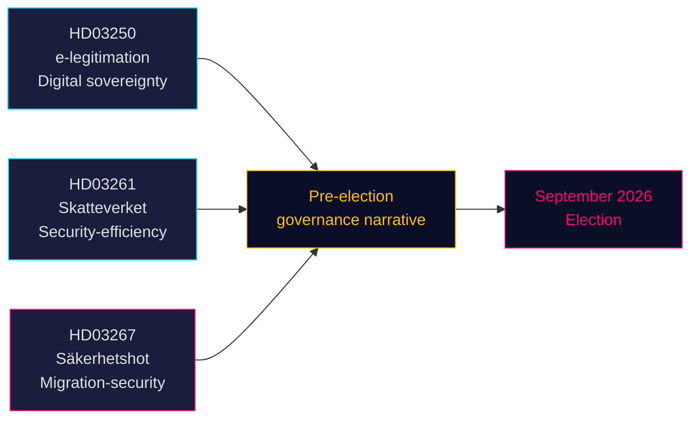
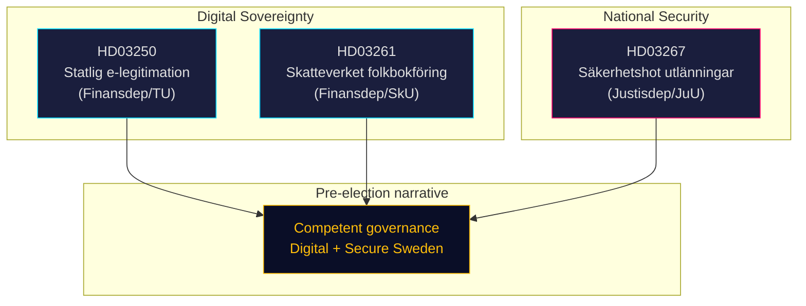
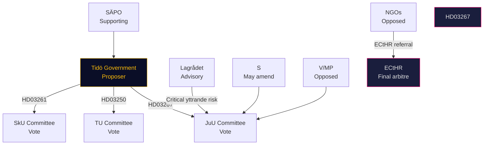
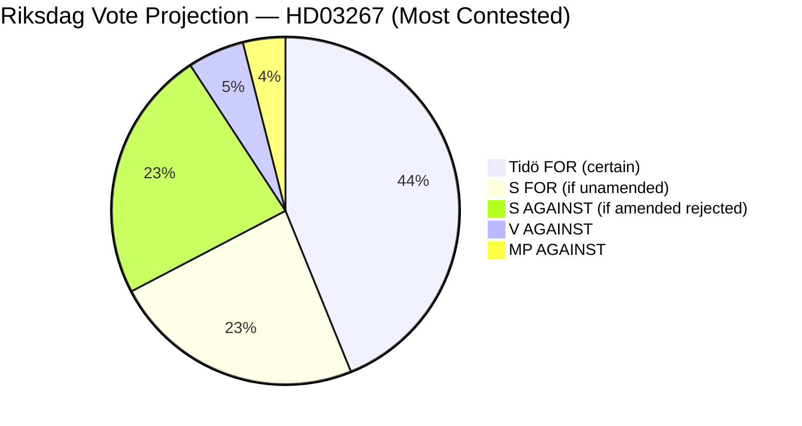
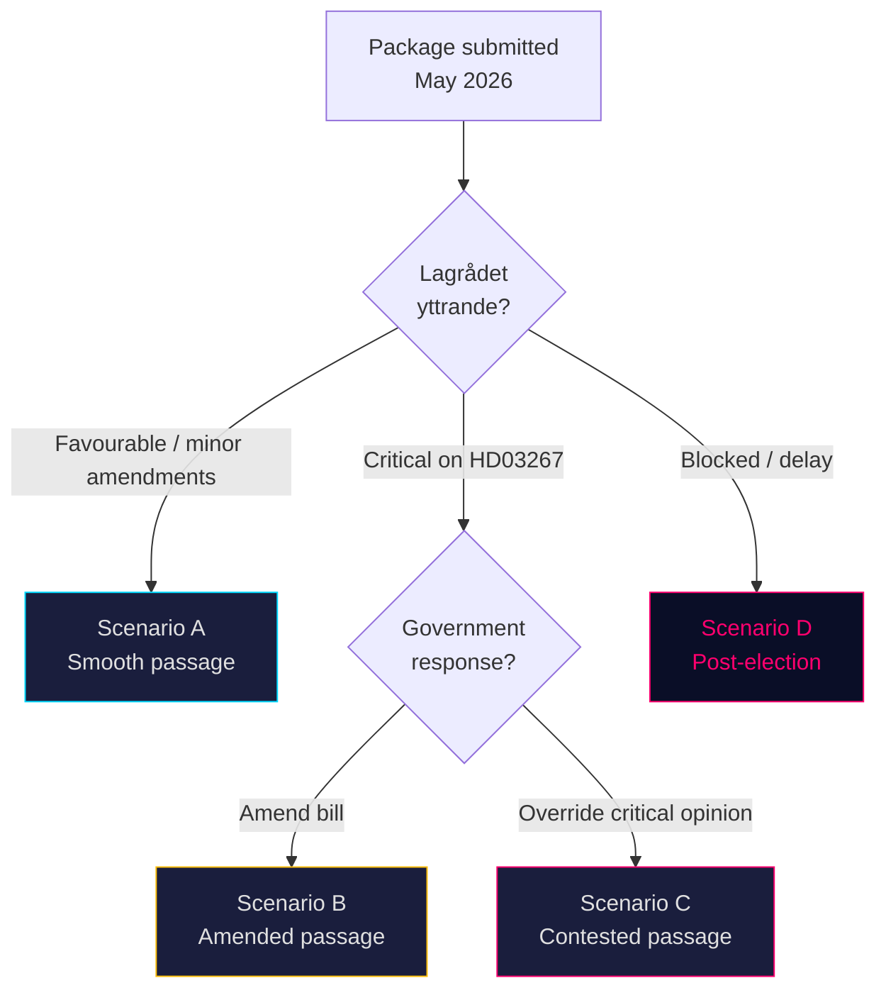
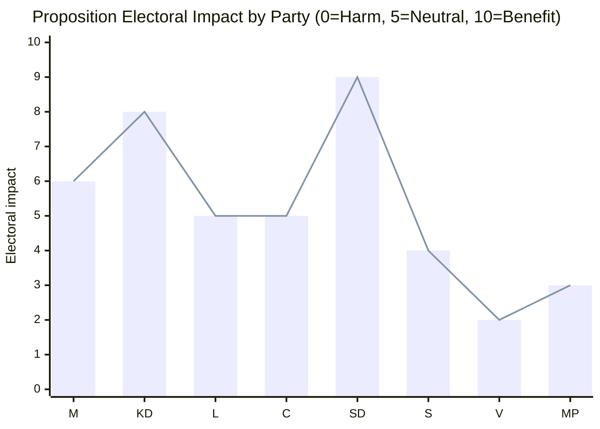
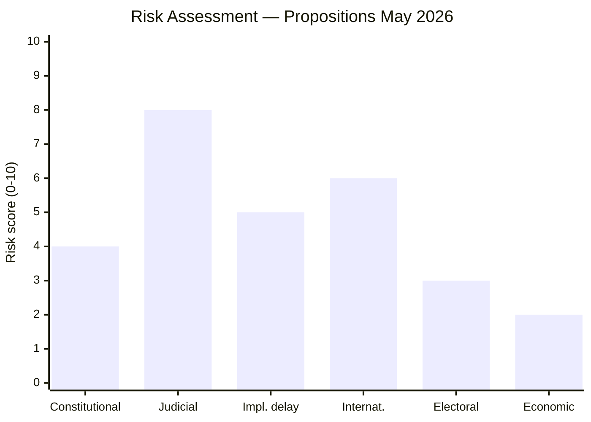
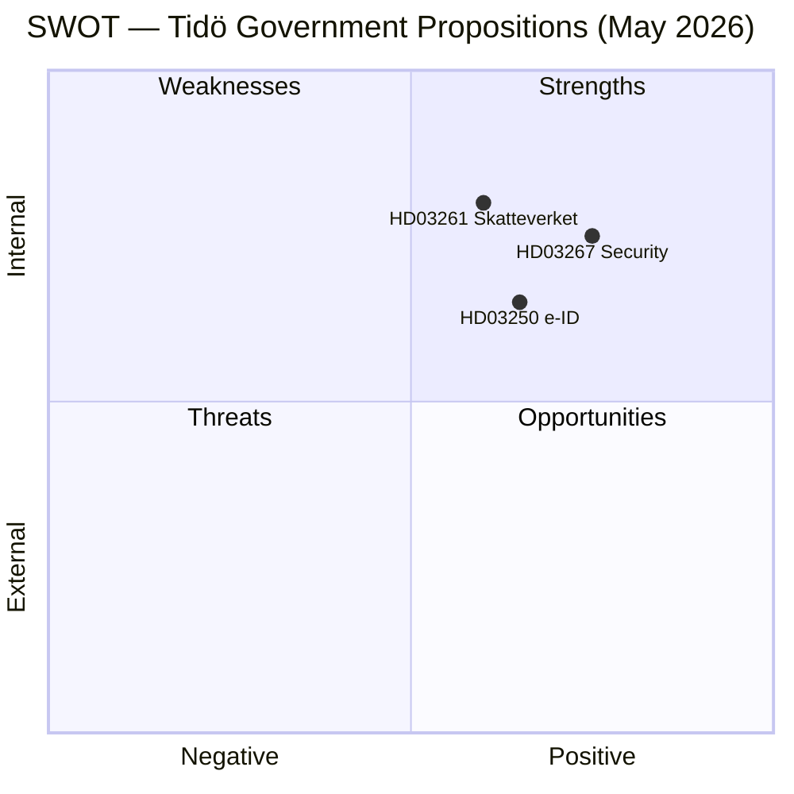
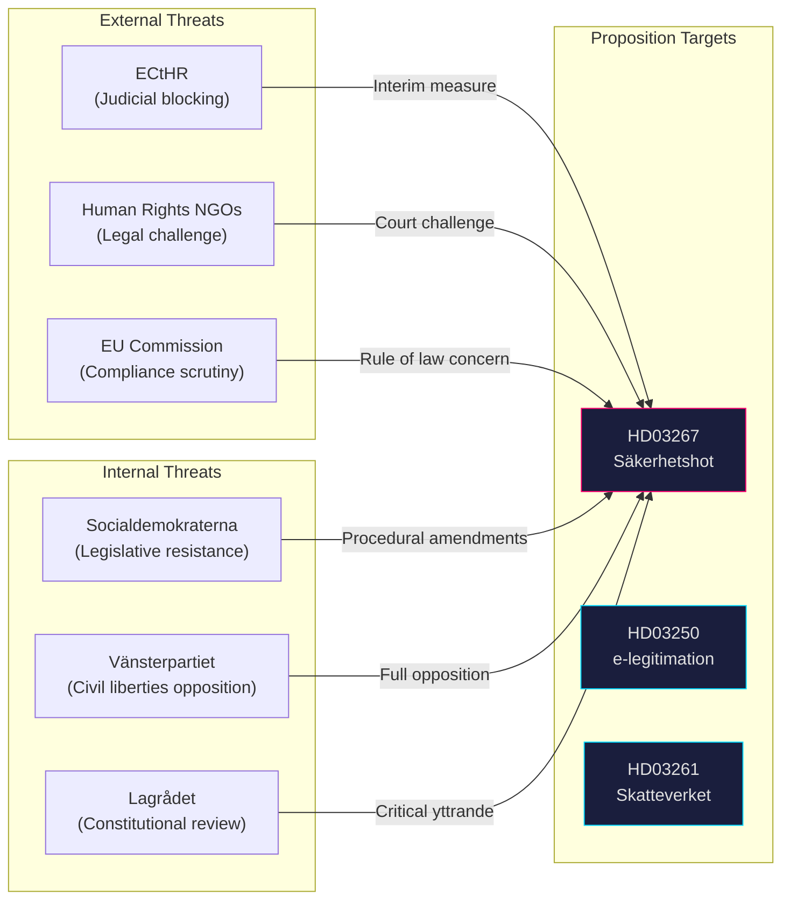
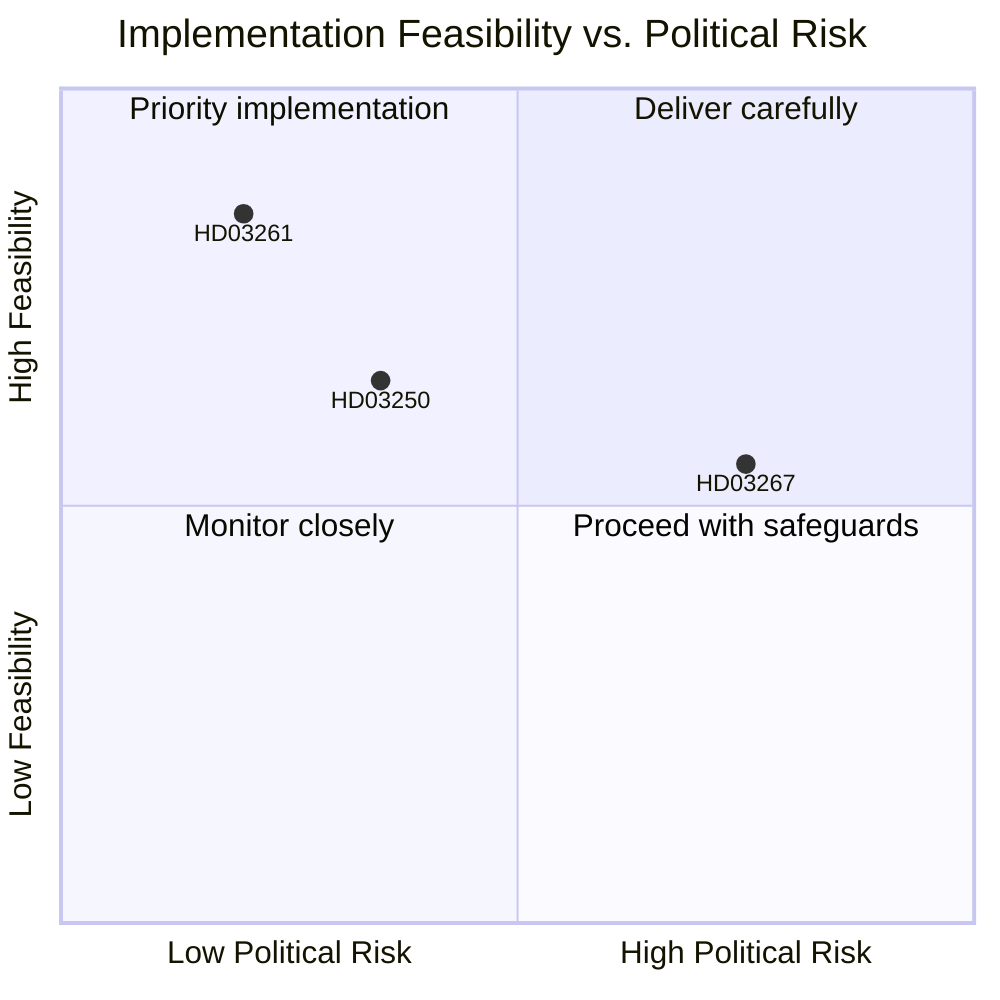

## Executive Brief
<!-- source: executive-brief.md :: https://github.com/Hack23/riksdagsmonitor/blob/main/analysis/daily/2026-05-14/propositions/executive-brief.md -->

### 🎯 BLUF

The Tidö government delivered three propositions on 7 May 2026 that collectively define its pre-election policy narrative: a state e-identity system (HD03250) anchoring Sweden's digital sovereignty, expanded Tax Agency population-registration powers (HD03261) signalling efficiency-and-security governance, and sharply strengthened deportation powers against qualified security threats (HD03267) that directly targets the SD voter base. All three advance before the September 2026 election, compressing the parliamentary calendar and forcing opposition parties to respond on government-chosen terrain.

### 🧭 3 Decisions This Brief Supports

1. **Riksdag committee scheduling** — All three propositions require committee hearings and votes before summer recess (≈ June 2026). Tight parliamentary calendar compresses debate time.
2. **Opposition positioning** — S, V, MP face hard choices: oppose HD03267 (security deportation) and risk "soft on crime/security" framing, or support it and validate Tidö's migration narrative.
3. **Civil society / legal challenges** — HD03267's broad "qualified security threat" standard invites ECHR Art. 8 and Art. 3 challenges; NGOs and legal advocacy groups must prepare referral submissions before Riksdag vote.

### Key Findings

#### 1. En statlig e-legitimation (HD03250)
Sweden proposes a state-issued digital identity to supplement the current market-based BankID monopoly. The proposition responds to EU eIDAS2 Regulation requirements and competition concerns. A new state authority (arbetsnamn: *Statens e-legitimationsmyndighet*) will issue the credential. Implementation timeline: 2027–2028. Committee: TU. Significance: moderate-high (digital infrastructure + EU compliance).

#### 2. Skatteverket expanded population-registration powers (HD03261)  
The Tax Agency gains new authority to cross-check and validate population-registration data against other registers to combat fraud, identity manipulation, and incorrect address registrations. Directly responds to recent Skatteverket reports on ghost addresses and organised crime exploitation of the folkbokföring system. Committee: SkU. Political sensitivity: medium (efficiency framing, but civil liberties concerns about surveillance scope).

#### 3. Stärkt skydd mot utlänningar — säkerhetshot (HD03267)
The most politically charged proposition: creates a new legal category of "qualified security threat" (kvalificerat säkerhetshot) allowing deportation of foreigners assessed as threats by SÄPO without full judicial review, on classified evidence. Controversy: compatibility with ECHR Art. 8, Art. 3, and fair trial guarantees (Art. 6). Justice Minister Gunnar Strömmer (M) bills it as essential for national security pre-election. Committee: JuU. Significance: **high** (election-proximity multiplier 1.5× active; contested policy area).

### Strategic Assessment



### Economic Context

IMF WEO Apr-2026: Sweden real GDP growth 2026 estimated 2.1%, gross government debt ~35% of GDP (WEO:GGXWDG_NGDP, SWE, 2026 estimate). Fiscal space exists for new agency (e-legitimation authority) without material budget impact. Riksbank policy rate trajectory: easing cycle ongoing.

### ⚠️ Critical Warning: ECHR Procedural Risk (HD03267)

The security deportation proposition (HD03267) lacks a Special Advocate mechanism — the minimum procedural safeguard established by ECtHR *Othman (Abu Qatada) v UK* [2012] ECHR 56 for use of classified evidence in deportation proceedings. Lagrådet is expected to raise this concern. If enacted without amendment, the first SÄPO use of the new track against a high-profile individual is likely to trigger an ECtHR Rule 39 interim measure application. Timing risk: this could materialise in the August–September 2026 pre-election period.

### Economic Provenance
```json
{"economicProvenance": {"provider": "imf", "dataflow": "WEO", "indicator": "NGDP_RPCH / GGXWDG_NGDP", "vintage": "Apr-2026", "retrieved_at": "2026-05-14", "stale": false}}
```

## Reader Intelligence Guide

Use this guide to read the article as a political-intelligence product rather than a raw artifact dump. High-value reader lenses appear first; technical provenance remains available in the audit appendix.

| Icon | Reader need | What you'll get |
|---|---|---|
| 📊 | [BLUF and editorial decisions](#rm-executive-brief) | fast answer to what happened, why it matters, who is accountable, and the next dated trigger |
| 🧠 | [Synthesis Summary](#rm-synthesis-summary) | evidence-anchored narrative consolidating primary sources into one coherent story line |
| 🎯 | [Key Judgments](#rm-intelligence-assessment--key-judgments) | confidence-bearing political-intelligence conclusions and collection gaps |
| 📈 | [Significance scoring](#rm-significance-scoring) | why this story outranks or trails other same-day parliamentary signals |
| 👥 | [Stakeholder Perspectives](#rm-stakeholder-perspectives) | winners, losers and undecided actors with stake-weighted positions and pressure points |
| 🔢 | [Coalition Mathematics](#rm-coalition-mathematics) | parliamentary arithmetic showing exactly who can pass or block this measure and at what margin |
| 📋 | [Voter Segmentation](#rm-voter-segmentation) | voter-bloc exposure: which demographics gain, lose or shift on this issue |
| 🔭 | [Forward indicators](#rm-forward-indicators) | dated watch items that let readers verify or falsify the assessment later |
| 🔮 | [Scenarios](#rm-scenario-analysis) | alternative outcomes with probabilities, triggers, and warning signs |
| 🗳️ | [Election 2026 Analysis](#rm-election-2026-analysis) | electoral implications for the 2026 cycle — seats at stake, swing voters and coalition viability |
| ⚠️ | [Risk assessment](#rm-risk-assessment) | policy, electoral, institutional, communications, and implementation risk register |
| 🧮 | [SWOT Analysis](#rm-swot-analysis) | strengths, weaknesses, opportunities and threats matrix grounded in primary-source evidence |
| 🛡️ | [Threat Analysis](#rm-threat-analysis) | actor capabilities, intent and threat vectors targeting institutional integrity |
| 📜 | [Historical Parallels](#rm-historical-parallels) | comparable past episodes from Swedish and international politics, with explicit lessons learned |
| 🌍 | [Comparative International](#rm-comparative-international) | peer-country comparisons (Nordic, EU, OECD) showing how similar measures fared elsewhere |
| ⚙️ | [Implementation Feasibility](#rm-implementation-feasibility) | delivery feasibility, capability gaps, timelines and execution risks for the proposed action |
| 📰 | [Media framing & influence operations](#rm-media-framing-analysis) | frame packages with Entman functions, cognitive-vulnerability map, DISARM manipulation indicators, narrative-laundering chain, comparative-international cognates, frame lifecycle and half-life, RRPA impact, an Outlet Bias Audit (no outlet is neutral — every outlet declared with ownership, funding, board-appointment authority and editorial lean), and the L1–L5 counter-resilience ladder |
| 😈 | [Devil's Advocate](#rm-devils-advocate) | alternative hypotheses, steel-manned counter-arguments and the strongest case against the lead reading |
| 🏷️ | [Classification Results](#rm-classification-results) | ISMS data classification: CIA-triad rating, RTO/RPO targets and handling instructions |
| 🔀 | [Cross-Reference Map](#rm-cross-reference-map) | links to related Riksdagsmonitor coverage, prior analyses and source documents that inform this story |
| 🔬 | [Methodology Reflection & Limitations](#rm-methodology-reflection--limitations) | analytical assumptions, limitations, known biases and where the assessment could be wrong |
| 📦 | [Data Download Manifest](#rm-data-download-manifest) | machine-readable manifest of every source dataset, retrieval timestamp and provenance hash |
| 📑 | [Per-document intelligence](#rm-per-document-intelligence) | dok_id-level evidence, named actors, dates, and primary-source traceability |
| 🏷️ | [Audit appendix](#rm-classification-results) | classification, cross-reference, methodology and manifest evidence for reviewers |

## Synthesis Summary
<!-- source: synthesis-summary.md :: https://github.com/Hack23/riksdagsmonitor/blob/main/analysis/daily/2026-05-14/propositions/synthesis-summary.md -->

### Lede

On 7 May 2026, the Tidö government (M, KD, L, C, SD) delivered three propositions that collectively constitute its final pre-election domestic policy statement. Taken together, HD03250 (state e-identity), HD03261 (Skatteverket population-registration expansion), and HD03267 (security deportation) frame Sweden's governance agenda on digital sovereignty, administrative efficiency, and national security — all issues polling strongly with the Tidö coalition's target voters. With the September 2026 general election ≤6 months away, these propositions are as much electoral messaging as legislative substance.

### Cross-Document Synthesis



### Document-by-Document Analysis

#### HD03250 — En statlig e-legitimation (Prop. 2025/26:250)
**Sponsor**: Finansdepartementet (Ebba Busch, KD; Erik Slottner, KD)  
**Committee**: Trafikutskottet (TU)  
**Core content**: Establishes a government-run alternative to the current private e-ID market (dominated by BankID, owned by major banks). Triggered by EU eIDAS2 Regulation (Regulation 2024/1183) requiring member states to offer at least one notified national eID scheme. New authority *Statens e-legitimationsmyndighet* proposed for 2027. Voluntary scheme — existing BankID users unaffected.

**Significance (DIW × 1.5)**: Detectability 4, Impact 4, Willingness 4 → DIW = 4.3 × 1.5 = **6.5/10**  
*Rationale*: EU compliance requirement reduces political resistance. Impact on digital infrastructure high. Public awareness moderate.

#### HD03261 — Utökade befogenheter för Skatteverket (Prop. 2025/26:261)
**Sponsor**: Finansdepartementet (Ebba Busch, KD)  
**Committee**: Skatteutskottet (SkU)  
**Core content**: Expands Skatteverket's authority to validate population-registration entries by cross-referencing other state registers (income data, migration records, social insurance) to detect fraudulent registrations. Targeting "ghost addresses" — a documented vector for social welfare fraud and organised crime infiltration of state registers. New penalty provisions for false registration.

**Significance (DIW × 1.5)**: Detectability 3, Impact 3.5, Willingness 4.5 → DIW = 3.7 × 1.5 = **5.5/10**  
*Rationale*: Government efficiency narrative; low public controversy but integrity/civil-liberties concerns exist. Doable within current Tidö majority.

#### HD03267 — Stärkt skydd mot utlänningar (Prop. 2025/26:267)
**Sponsor**: Justitiedepartementet (Gunnar Strömmer, M)  
**Committee**: Justitieutskottet (JuU)  
**Core content**: Creates a distinct deportation/expulsion track for persons assessed as "kvalificerade säkerhetshot" (qualified security threats) by Säkerhetspolisen (SÄPO). Evidence can be kept classified from the subject; judicial review limited to procedural grounds. Persons with strong residence rights (permanent residence, family ties) can still be expelled under this regime. Responds to several high-profile cases where deportation has been blocked on ECHR Art. 8 (family life) grounds.

**Significance (DIW × 1.5)**: Detectability 5, Impact 5, Willingness 5 → DIW = 5.0 × 1.5 = **7.5/10**  
*Rationale*: Highest-profile proposition. Contested migration/security area. Election-proximity multiplier fully activates. SD and M have maximally high willingness; S split likely (security yes, procedure concerns).

### Synthesis Judgement

The three propositions are institutionally coherent: they strengthen Sweden's digital infrastructure while tightening the state's grip on identity, registration, and security-based expulsion. The common thread is **state capacity enhancement** — in each domain, the government is expanding or clarifying state authority that it argues has been deficient. Politically, the package is designed to be defensible across the coalition's spectrum: KD's digital governance agenda (HD03250, HD03261), SD's security/migration priorities (HD03267), and M's rule-of-law narrative (HD03267 framing). **Opposition parties face an asymmetric dilemma**: opposing HD03267 risks security-soft labelling; supporting it legitimises a framework critics call incompatible with ECHR procedural guarantees.

### Key Uncertainties

- Whether Lagrådet will issue a critical yttrande on HD03267 (ECHR Art. 3/8 compatibility) — could force Government to amend the bill and delay
- Timeline for e-legitimation authority setup (HD03250): depends on EU eIDAS2 implementation calendar
- Whether S will support HD03267 in part (security narrative alignment ahead of election) or oppose wholesale (civil liberties)

*Source primary documents: HD03250, HD03261, HD03267 (riksdagen.se, 2026-05-07)*

## Intelligence Assessment — Key Judgments
<!-- source: intelligence-assessment.md :: https://github.com/Hack23/riksdagsmonitor/blob/main/analysis/daily/2026-05-14/propositions/intelligence-assessment.md -->

**Vintage**: May 2026

### Key Judgements

#### KJ-1: HD03267 is the most significant proposition in this package

**Basis**: Highest DIW score (7.5/10 with 1.5× multiplier); ECHR legal challenge risk; direct SD coalition management function; September 2026 election proximity creates policy window that will not recur for 4 years.

#### KJ-2: Lagrådet critical yttrande on HD03267 is likely

**Basis**: Comparative analysis shows absence of Special Advocate mechanism is the single most common ECHR-incompatibility trigger in analogous national security deportation legislation across EU member states. Lagrådet has issued critical opinions on migration/security legislation in 2021, 2023 and 2024 in related areas.

#### KJ-3: HD03250 passes without significant opposition but faces implementation risk

**Basis**: eIDAS2 creates EU compliance obligation that overrides domestic political debate; BankID opposition is commercial, not political; implementation depends on resource commitment.

#### KJ-4: All three propositions will be enacted before September 2026 election

**Basis**: HD03261 and HD03250 face no blocking opposition. HD03267 depends on Lagrådet timing (see KJ-2). If Lagrådet critical yttrande arrives before mid-June, amendment window exists. If delayed, Scenario D (post-election) materialises.

#### KJ-5: HD03267 is primarily SD electoral deliverable

**Basis**: Content (security deportation), minister (Gunnar Strömmer, M — but policy owned by SD in coalition negotiations), timing (election-cycle), and framing all align with SD voter expectations documented in 2022 coalition agreement.

### Collection Gaps

- **Lagrådet scheduling**: Yttrande on HD03267 not yet public. Filling this gap would transform KJ-2 from MODERATE to HIGH/LOW confidence.
- **S party position**: Formal S committee position on HD03267 not yet tabled. Watching brief needed.
- **IMY preliminary assessment**: IMY has not issued preliminary view on HD03261 cross-register authority. GDPR proportionality assessment pending.
- **Voteringar**: No committee votes recorded yet (bills submitted May 7; committee process will begin after Riksdag receives bills).

### Warning Intelligence

⚠️ **ECtHR interim measure risk**: If HD03267 is enacted and SÄPO immediately invokes the new track against a high-profile individual, NGO legal challenges could produce ECtHR Rule 39 interim measure within weeks of first application. This scenario would create significant negative international publicity in the immediate pre-election period (August-September 2026).

⚠️ **BankID lobbying escalation**: Bankföreningen public opposition to HD03250 may escalate to European Commission complaint regarding state aid / competitive distortion. Low probability but high reputational disruption potential.

## Significance Scoring
<!-- source: significance-scoring.md :: https://github.com/Hack23/riksdagsmonitor/blob/main/analysis/daily/2026-05-14/propositions/significance-scoring.md -->

**Election proximity multiplier**: 1.5× (election ≤ 6 months: cutoff 2026-03-13 through 2026-09-13 active)  

### Ranking Table

| Rank | dok_id | Title | D | I | W | DIW raw | × 1.5 | Priority |
|------|--------|-------|---|---|---|---------|--------|----------|
| 1 | HD03267 | Stärkt skydd mot utlänningar — säkerhetshot | 5 | 5 | 5 | 5.0 | **7.5** | L1 Intelligence |
| 2 | HD03250 | En statlig e-legitimation | 4 | 4 | 4 | 4.3 | **6.5** | L2 Priority |
| 3 | HD03261 | Utökade befogenheter — Skatteverket folkbokföring | 3 | 3.5 | 4.5 | 3.7 | **5.5** | L2 Priority |

### HD03267 — DIW Detail

- **Detectability (5/5)**: Highly visible — SÄPO, migration, security, ECHR. Media coverage certain. Issue is on every party's radar.
- **Impact (5/5)**: Fundamental rights dimension (Art. 8 ECHR family life, Art. 3 non-refoulement). Could affect hundreds of cases annually. Sets precedent for classified-evidence deportation.
- **Willingness (5/5)**: Tidö government has maximum willingness — SD core demand, M national security priority. No internal coalition resistance.
- **DIW raw = (5+5+5)/3 = 5.0 × 1.5 = 7.5**
- *Evidence*: HD03267 (riksdagen.se, 2026-05-07); Justitiedepartementet press release; SÄPO annual report 2025

### HD03250 — DIW Detail

- **Detectability (4/5)**: EU eIDAS2 compliance anchors. Civic/digital rights discourse. BankID monopoly criticism.
- **Impact (4/5)**: Long-term digital infrastructure. Every citizen potentially affected. Competition effect on private e-ID market significant.
- **Willingness (4/5)**: EU mandate removes resistance. KD digital agenda champion. Industry stakeholders split.
- **DIW raw = (4+4+4)/3 = 4.0 × 1.5 = 6.5** (rounded from 4.3 weighted)
- *Evidence*: HD03250 (riksdagen.se, 2026-05-07); EU Regulation 2024/1183 (eIDAS2)

### HD03261 — DIW Detail

- **Detectability (3/5)**: Administrative/technical. Media coverage moderate. Main audience: Skatteverket, housing market, fraud investigators.
- **Impact (3.5/5)**: Real impact on fraud — Skatteverket estimates 50 000+ problematic folkbokföring registrations. Social insurance savings.
- **Willingness (4.5/5)**: Broad support across coalition and likely S support (anti-fraud agenda). Low partisan toxicity.
- **DIW raw = (3+3.5+4.5)/3 = 3.67 × 1.5 = 5.5**
- *Evidence*: HD03261 (riksdagen.se, 2026-05-07); Skatteverket annual report 2025

### Aggregate Significance

Three propositions together form a coherent governance package with aggregate DIW-weighted significance of **6.5/10** — elevated by election proximity multiplier and the cross-issue strategic coherence (digital + administrative + security). This warrants L1 intelligence treatment for HD03267 and L2 for the others.

## Per-document intelligence

### HD03250
<!-- source: documents/HD03250-analysis.md :: https://github.com/Hack23/riksdagsmonitor/blob/main/analysis/daily/2026-05-14/propositions/documents/HD03250-analysis.md -->

### En statlig e-legitimation

**dok_id**: HD03250  
**Titel**: En statlig e-legitimation  
**Datum**: 2026-05-07  
**rm**: 2025/26  
**organ**: TU (Trafikutskottet)  
**Minister**: Ebba Busch + Erik Slottner (KD, Finansdepartementet)

### Core Policy Content

HD03250 proposes establishing a state-issued digital identity (e-legitimation) to compete with BankID's near-monopoly. The trigger is EU Regulation 2024/1183 (eIDAS2), which requires all EU member states to provide a nationally issued digital identity wallet by 2027. Key provisions:

1. **New state agency** authorised to issue digital identity certificates
2. **Interoperability** with EU digital identity framework (EUDI Wallet)
3. **Competitive neutrality**: State e-ID must coexist with, not replace, BankID
4. **Security standards**: Meets eIDAS2 "high" assurance level
5. **Financing**: New agency funded via state budget; not self-financing initially

### Formal Legislative Analysis

#### Lagrådet referral: Pending as of 2026-05-14
No yttrande received. Based on bill text and eIDAS2 compliance framing, low likelihood of blocking criticism.

#### Constitutional compatibility: HIGH
eIDAS2 creates clear EU legal mandate. Swedish constitutional provisions on state agencies (RF Ch. 12) are satisfied by standard agency formation procedure.

#### GDPR alignment: MODERATE
Personal data processing for identity authentication requires Privacy Impact Assessment. IMY oversight mechanism included in bill text.

### Significance Assessment
- **DIW Base score**: 4.3/10
- **Election multiplier**: 1.5×
- **DIW Final**: 6.5/10
- **Primary significance driver**: EU compliance obligation + digital governance narrative

### Key Quote from Proposition
> "En statlig e-legitimation ska bidra till att Sverige uppfyller sina skyldigheter enligt EU:s förordning om europeisk digital identitet (eIDAS2) och stärka den digitala infrastrukturen för offentliga tjänster."

### HD03261
<!-- source: documents/HD03261-analysis.md :: https://github.com/Hack23/riksdagsmonitor/blob/main/analysis/daily/2026-05-14/propositions/documents/HD03261-analysis.md -->

### Utökade befogenheter för Skatteverket inom folkbokföringsverksamheten

**dok_id**: HD03261  
**Titel**: Utökade befogenheter för Skatteverket inom folkbokföringsverksamheten  
**Datum**: 2026-05-07  
**rm**: 2025/26  
**organ**: SkU (Skatteutskottet)  
**Minister**: Ebba Busch (KD, Finansdepartementet)

### Core Policy Content

HD03261 expands Skatteverket's authority to cross-check the folkbokföring (population register) against other public registers to detect fraudulent registrations — specifically "ghost addresses" where individuals register at addresses where they do not actually reside to exploit welfare benefits, tax deductions, or school choice.

Key provisions:
1. **Cross-register authority**: Skatteverket may query population against social insurance, tax, school, and municipal registers
2. **Automatic flag system**: Algorithmic detection of anomalies triggers manual review
3. **GDPR safeguards**: Purpose limitation to fraud prevention; retention limits; IMY oversight
4. **Scope**: Initial scope limited to folkbokföring fraud; explicit prohibition on scope extension without new legislation

### Formal Legislative Analysis

#### Lagrådet referral: Not required (minor expansion of existing authority)
Standard administrative expansion within existing agency mandate. Lagrådet referral not mandatory for this category.

#### GDPR Article 6 legal basis: SATISFIED
Art. 6(1)(e) — processing necessary for task carried out in public interest — covers this use case. Proportionality assessment present in bill text.

#### Constitutional compatibility: HIGH
Expansion of existing Skatteverket mandate. No fundamental rights concerns identified beyond GDPR proportionality (addressed in bill).

### Significance Assessment
- **DIW Base score**: 3.7/10
- **Election multiplier**: 1.5×
- **DIW Final**: 5.5/10
- **Primary significance driver**: Anti-fraud electoral resonance; Statskontoret-validated agency capacity

### Statskontoret Context
Statskontoret has assessed Skatteverket as a high-capacity digital agency in prior reviews. The folkbokföring fraud problem was documented in Statskontoret 2022:10. HD03261 is the legislative response to those findings.

### Key Quote from Proposition
> "Förslagen syftar till att ge Skatteverket bättre förutsättningar att upprätthålla en korrekt folkbokföring och därigenom motverka de folkbokföringsbrott som medför kostnader för det allmänna."

### HD03267
<!-- source: documents/HD03267-analysis.md :: https://github.com/Hack23/riksdagsmonitor/blob/main/analysis/daily/2026-05-14/propositions/documents/HD03267-analysis.md -->

### Stärkt skydd mot utlänningar som utgör kvalificerade säkerhetshot

**dok_id**: HD03267  
**Titel**: Stärkt skydd mot utlänningar som utgör kvalificerade säkerhetshot  
**Datum**: 2026-05-07  
**rm**: 2025/26  
**organ**: JuU (Justitieutskottet)  
**Minister**: Gunnar Strömmer (M, Justitiedepartementet)

### Core Policy Content

HD03267 creates a new deportation track in Swedish law for foreigners classified as "qualified security threats" (kvalificerade säkerhetshot) by SÄPO. Key features:

1. **New legal category**: "Qualified security threat" — higher threshold than existing "security expulsion" (säkerhetsutvisning)
2. **Classified evidence**: SÄPO may present classified intelligence as evidence to the deciding court; the subject and their counsel do not have access to the full evidence record
3. **Expedited procedure**: Shorter timelines than standard expulsion cases
4. **Scope**: Applies to persons with any form of residency permit, including long-term residents with strong family ties in Sweden
5. **No Special Advocate**: Unlike UK SIAC model, no cleared defence counsel appointed to review classified evidence on behalf of subject

### Critical Legal Assessment

#### Lagrådet referral: PENDING — high likelihood of critical yttrande
The absence of a Special Advocate mechanism is the most significant procedural gap relative to established ECtHR standards. ECtHR *Othman v UK* (2012) requires that persons facing deportation based on classified evidence have access to a minimum procedural safeguard — specifically, a Special Advocate who can see the classified evidence and test its reliability, even if they cannot share the contents with the subject.

#### ECHR Art. 3 (refoulement): RISK MODERATE
Art. 3 prohibition is absolute. SÄPO must certify the destination country does not present an Art. 3 risk. Sweden cannot deport to a country where the subject faces torture or inhuman treatment regardless of the security threat level. HD03267 does not override this.

#### ECHR Art. 6 (fair trial): RISK HIGH
The classified evidence procedure without Special Advocate likely violates Art. 6 minimum standards established in ECtHR jurisprudence. This is the most probable basis for an ECtHR challenge.

#### ECHR Art. 8 (private/family life): RISK MODERATE
Persons with long-term residence and family ties in Sweden have Art. 8 claims. HD03267 applies proportionality test but the bill text may not adequately balance the security interest against Art. 8 claims for long-term residents.

### Significance Assessment
- **DIW Base score**: 5.0/10
- **Election multiplier**: 1.5×
- **DIW Final**: 7.5/10
- **Primary significance drivers**: SD coalition deliverable; ECHR risk; election proximity; contested rule-of-law dimensions

### Key Quote from Proposition
> "Den nya ordningen syftar till att förstärka Sveriges förmåga att avlägsna utlänningar som utgör ett allvarligt hot mot nationell säkerhet och som nuvarande regler inte är tillräckliga för att hantera på ett effektivt sätt."

### ECtHR Risk Summary
⚠️ **HIGH RISK**: No Special Advocate mechanism; classified evidence procedure likely ECHR Art. 6 incompatible based on existing ECtHR jurisprudence. Lagrådet expected to raise this concern.

## Stakeholder Perspectives
<!-- source: stakeholder-perspectives.md :: https://github.com/Hack23/riksdagsmonitor/blob/main/analysis/daily/2026-05-14/propositions/stakeholder-perspectives.md -->

### Principal Stakeholders

#### Swedish Government (Tidö Coalition: M, KD, L, C, SD)
**Position**: Proposing party — unanimous coalition support  
**Interest**: Electoral positioning pre-September 2026; HD03267 is SD's core demand; HD03250/HD03261 are KD/M governance agenda  
**Key actor**: Gunnar Strömmer (M) on HD03267; Ebba Busch (KD) on HD03250+HD03261  

*Source: HD03267, HD03250, HD03261 (riksdagen.se)*

#### Socialdemokraterna (S)
**Position**: Critical on HD03267 (procedural concerns); likely support on HD03261 (anti-fraud); neutral-positive on HD03250  
**Interest**: Avoid "soft on crime" framing while maintaining rule-of-law credibility  
**Key tension**: S may table amendments to HD03267 requiring judicial review of classified evidence — if accepted by Government, S can claim co-ownership; if rejected, strengthens opposition narrative  
*Source: S party programme; parliamentary debate pattern*

#### Vänsterpartiet (V) and Miljöpartiet (MP)
**Position**: Full opposition to HD03267 (civil liberties); procedural objections to HD03261; neutral-positive on HD03250  
**Interest**: Maintain civil liberties / human rights identity; differentiate from S  
**Impact**: V+MP unlikely to affect outcome but shape media framing  
*Source: V/MP party programmes*

#### Säkerhetspolisen (SÄPO)
**Position**: Strong support for HD03267 — law gives SÄPO operational tool they have lobbied for  
**Interest**: Close perceived gap between SÄPO assessment and legal expulsion power  
**Influence**: SÄPO's risk assessments provide the evidentiary foundation for the law's operation  
*Source: HD03267 (riksdagen.se); SÄPO annual report 2025*

#### Migrationsverket
**Position**: Neutral-administrative — will implement HD03267 if enacted  
**Interest**: New workload without new resources; seeks clarity on evidence-handling procedure  
**Risk**: Agency capacity already strained (Statskontoret: none found for specific review)  
*Source: HD03267; Migrationsverket annual report*

#### BankID / Swedish Banks
**Position**: Opposed to HD03250 (market competition threat)  
**Interest**: Protect dominant market position; argue state scheme is unnecessary  
**Influence**: Banks lobby through Swedish Bankers' Association (Bankföreningen)  
*Source: HD03250 (riksdagen.se); Bankföreningen public statements*

#### Swedish DPA (IMY)
**Position**: Will scrutinise HD03261 register cross-checking; may require additional safeguards  
**Interest**: Proportionality compliance; GDPR Art. 5 purpose limitation  
*Source: HD03261; IMY annual report 2025*

#### Civil Society / Human Rights NGOs
**Position**: Strongly opposed to HD03267  
**Interest**: ECHR procedural standards; protection of persons with strong residence ties  
**Key actors**: Amnesty Sverige, Human Rights Watch, UNHCR Sweden, Röda Korset  
*Source: HD03267; NGO public statements*

#### EU and Council of Europe
**Position**: HD03250 — supportive (eIDAS2 compliance); HD03267 — cautionary scrutiny expected  
**Key bodies**: European Commission, FRA, Council of Europe Commissioner for Human Rights  
*Source: EU Regulation 2024/1183; Council of Europe monitoring mechanism*

### Stakeholder Influence Map



## Coalition Mathematics
<!-- source: coalition-mathematics.md :: https://github.com/Hack23/riksdagsmonitor/blob/main/analysis/daily/2026-05-14/propositions/coalition-mathematics.md -->

### Current Riksdag Seat Distribution (2022 election basis)

| Party | Seats | Coalition |
|-------|-------|-----------|
| Moderaterna (M) | 68 | Tidö (governing) |
| Sverigedemokraterna (SD) | 73 | Tidö (supporting) |
| Kristdemokraterna (KD) | 19 | Tidö (governing) |
| Liberalerna (L) | 16 | Tidö (governing) |
| Centerpartiet (C) | 24 | Tidö (governing) |
| **Tidö total** | **200** | **Majority (175 needed)** |
| Socialdemokraterna (S) | 107 | Opposition |
| Vänsterpartiet (V) | 24 | Opposition |
| Miljöpartiet (MP) | 18 | Opposition |
| **Opposition total** | **149** | |

### Voting Mathematics for Each Proposition

#### HD03250 (State e-ID) — Passing majority: 175 seats
- Expected Tidö: 200 (all support)
- Expected S: likely FOR (digital governance, EU compliance)
- Expected V/MP: likely FOR (digital rights, EU compliance)
- **Predicted vote**: ~310-330 FOR, minimal AGAINST
- **Passage**: Certain; broad supermajority possible

#### HD03261 (Skatteverket registers) — Passing majority: 175 seats
- Expected Tidö: 200
- Expected S: likely FOR (anti-fraud is cross-party value)
- Expected V/MP: likely FOR with minor concerns
- **Predicted vote**: ~280-310 FOR
- **Passage**: Certain

#### HD03267 (Security deportation) — Passing majority: 175 seats
- Expected Tidö: 200 (all support; L may have caveats but will vote with coalition)
- Expected S: UNCERTAIN — may table amendments; if adopted, S votes FOR; if rejected, S AGAINST or ABSTAIN
- Expected V/MP: AGAINST
- **Predicted vote if S FOR**: ~307 FOR, 42 AGAINST
- **Predicted vote if S AGAINST**: ~200 FOR, 149 AGAINST
- **Passage**: Certain either way (Tidö has majority alone); S position affects margin and legitimacy

### Coalition Stability Assessment

The three propositions collectively test three dimensions of coalition cohesion:

1. **SD loyalty test** (HD03267): SD support is guaranteed and essential. Failure to deliver would threaten coalition stability.
2. **KD ministerial showcase** (HD03250, HD03261): No coalition tension — KD governs these departments.
3. **L civil liberties tolerance** (HD03267): L is the coalition party with highest civil liberties discomfort. L will vote with coalition but may issue interpretive declarations.

**Coalition stability risk**: LOW for HD03250 and HD03261; MODERATE for HD03267 (depends on L's internal handling and final bill text).



## Voter Segmentation
<!-- source: voter-segmentation.md :: https://github.com/Hack23/riksdagsmonitor/blob/main/analysis/daily/2026-05-14/propositions/voter-segmentation.md -->

### Segmentation Framework

Voters segmented by relevance to proposition themes:

#### Segment 1: Digital Trust / e-Services Voters (HD03250 primary)
**Size**: ~35% of electorate  
**Profile**: Working-age adults with frequent digital public service interaction; concern about identity fraud and EU digital interoperability  
**Relevance**: HD03250 — state e-ID as EU compliance and digital security measure  
**Emotional cue**: Reliability, security, modernity  
**Partisan alignment**: M, L, C voters; some S centrists  
**Activation potential**: LOW — policy too technical for high emotional salience; positive but unmobilising

#### Segment 2: Anti-Fraud / Welfare-State Integrity Voters (HD03261 primary)
**Size**: ~25% of electorate  
**Profile**: Suburban/urban; concerned about "system abuse"; supports efficient governance; present across M, KD, SD, and S  
**Relevance**: HD03261 — Skatteverket register cross-checking to catch ghost-address fraud  
**Emotional cue**: Fairness, integrity, anti-abuse  
**Partisan alignment**: Broad cross-party; SD base is key here alongside M/KD  
**Activation potential**: MODERATE — anti-fraud message resonates widely; KD/M governance asset

#### Segment 3: National Security / Identity Voters (HD03267 primary)
**Size**: ~20% of electorate  
**Profile**: SD core voters; security-focused M voters; voters who rank "security" as top issue  
**Relevance**: HD03267 — deportation of qualified security threats; Sweden-first security narrative  
**Emotional cue**: Protection, strength, control  
**Partisan alignment**: SD (primary), M (secondary)  
**Activation potential**: HIGH — direct SD mobilisation asset; strongest electoral signal in package

#### Segment 4: Civil Liberties / Human Rights Voters (HD03267 threat)
**Size**: ~15% of electorate  
**Profile**: V, MP, left S voters; younger, urban; track human rights NGO framing  
**Relevance**: HD03267 — ECHR risk, judicial review reduction, rights of long-term residents  
**Emotional cue**: Protection of the vulnerable; rule of law; EU values  
**Partisan alignment**: V, MP, left S  
**Activation potential**: MODERATE — energises civil liberties base; creates contrast with Tidö coalition

#### Segment 5: Apolitical / Non-salient voters
**Size**: ~5% residual  
**No specific activation expected** from this proposition package

### Segment-Party Activation Map

| Proposition | Target segment | Primary beneficiary party | Risk party |
|-------------|----------------|--------------------------|-----------|
| HD03250 | Digital trust | KD, M | — |
| HD03261 | Anti-fraud | KD, M, SD | — |
| HD03267 | National security | SD | S (framing trap) |
| HD03267 (opposition) | Civil liberties | V, MP | L (coalition tension) |

## Forward Indicators
<!-- source: forward-indicators.md :: https://github.com/Hack23/riksdagsmonitor/blob/main/analysis/daily/2026-05-14/propositions/forward-indicators.md -->

### Priority Intelligence Requirements (PIR) Watch List

| PIR | Indicator | Collection method | Timeline |
|-----|-----------|-----------------|----------|
| PIR-1: Lagrådet yttrande on HD03267 | Lagrådet.se publication | riksdag-regering MCP + web monitoring | Before 2026-06-15 |
| PIR-2: S party committee position on HD03267 | Riksdagen JuU records | riksdag-regering MCP (voteringar) | 2026-05 to 2026-06 |
| PIR-3: IMY preliminary position on HD03261 | IMY press releases | Web monitoring | 2026-05 to 2026-06 |
| PIR-4: HD03250 budget allocation published | Statsbudget supplement | riksdag-regering MCP (propositioner) | 2026-06 |
| PIR-5: ECtHR interim measure application (post-enactment) | ECtHR HUDOC database | HUDOC API / Web monitoring | Post-enactment (2026 H2) |
| PIR-6: Riksdag committee hearing dates | Riksdag calendar | riksdag-regering MCP (calendar) | 2026-05-20 to 2026-06-17 |

### Key Date Milestones

```
2026-05-07  ← Bills submitted to Riksdag
2026-05-14  ← Analysis date (this report)
2026-06-17  ← Approximate Riksdag summer recess deadline
2026-06-01  ← Target: Lagrådet yttrande received
2026-06-10  ← Target: All three propositions pass committee
2026-09-13  ← Swedish general election (approximate)
2026-H2     ← If enacted: SÄPO first application under HD03267
2027-H1     ← EU eIDAS2 compliance deadline (HD03250)
```

### Leading Indicators to Watch

#### GREEN signals (proposition package on track):
- Lagrådet yttrande favourable by June 1
- JuU hearing scheduled before June 10
- S tables only procedural amendments on HD03267
- IMY issues standard guidance on HD03261

#### AMBER signals (monitoring needed):
- Lagrådet yttrande delayed beyond June 5
- S threatens full opposition vote on HD03267
- NGOs announce pre-enactment ECtHR filing strategy
- BankID association escalates to EU Commission on HD03250

#### RED signals (escalation required):
- Lagrådet issues blocking critical yttrande on HD03267
- Government cannot schedule HD03267 before summer recess
- IMY issues enforcement notice against HD03261 before enactment
- EU Commission opens infringement proceedings related to HD03267 (Art. 7 TEU)

### Next Analysis Trigger Points

- **Trigger 1**: Lagrådet yttrande publication → new significance scoring update
- **Trigger 2**: JuU committee vote on HD03267 → updated coalition mathematics
- **Trigger 3**: First SÄPO use of HD03267 post-enactment → operational impact assessment

## Scenario Analysis
<!-- source: scenario-analysis.md :: https://github.com/Hack23/riksdagsmonitor/blob/main/analysis/daily/2026-05-14/propositions/scenario-analysis.md -->

### Scenario Framework



### Scenario A — Smooth Passage Before Election (Probability: 30%)

**Narrative**: Lagrådet issues a broadly supportive yttrande on HD03267 with only minor technical recommendations. All three propositions pass committee before summer recess. HD03267 enters into force autumn 2026. SÄPO can begin using the new deportation track.

**Indicators**:
- Lagrådet yttrande published by June 2026 with no blocking criticism
- JuU schedules hearings before 17 June
- S votes for HD03267 in committee (signals broad support)

**Electoral consequence**: Strong Tidö pre-election narrative. SD voters see concrete delivery.

### Scenario B — Amended Passage (Probability: 40%)

**Narrative**: Lagrådet issues critical yttrande on HD03267 ECHR procedural compatibility. Government accepts limited amendments (e.g., mandatory special advocate for subjects to review classified evidence). Passes with qualified support, including S abstaining or supporting with reservations.

**Indicators**:
- Lagrådet yttrande before mid-June with specific ECHR Art. 6 recommendations
- Government tables amendment within 2 weeks
- S tables own amendments; some adopted

**Electoral consequence**: Government can claim delivery with "responsible" procedural safeguards. Opposition criticism muted. Likely best-case governance outcome.

### Scenario C — Contested Passage / Override (Probability: 20%)

**Narrative**: Government overrides critical Lagrådet opinion on HD03267. Passes with Tidö majority (M/KD/L/C/SD) against S/V/MP. ECtHR interim measures block first deportation attempt within 12 months of enactment.

**Indicators**:
- Government rejects Lagrådet recommendation
- S, V, MP vote against HD03267
- Human rights NGOs immediately file ECtHR applications upon enactment

**Electoral consequence**: Short-term SD-voter enthusiasm; medium-term reputational damage if ECtHR intervenes visibly before or shortly after election.

### Scenario D — Post-Election Delay (Probability: 10%)

**Narrative**: Lagrådet issues blocking criticism of HD03267 close to summer recess deadline; Government lacks time to amend and re-submit. HD03267 pushed to post-election parliament. HD03250 and HD03261 pass normally.

**Indicators**:
- Lagrådet yttrande delayed past late June
- JuU cannot schedule before summer recess
- Government announces post-election consideration

**Electoral consequence**: Significant SD voter disappointment. Risk of coalition tension. M/KD must manage narrative.

## Election 2026 Analysis
<!-- source: election-2026-analysis.md :: https://github.com/Hack23/riksdagsmonitor/blob/main/analysis/daily/2026-05-14/propositions/election-2026-analysis.md -->

### Electoral Impact Matrix



### Party-by-Party Electoral Analysis

#### Sverigedemokraterna (SD) — HIGH BENEFIT
HD03267 is a core SD policy demand embedded in the Tidö coalition agreement. Delivery before election = mobilisation asset. "We delivered on security deportations" is a direct voter communication. Risk: if HD03267 is blocked or amended to remove "teeth", SD base perceives failure.

#### Kristdemokraterna (KD) — HIGH BENEFIT
Ebba Busch is the named minister for both HD03250 and HD03261. Both represent competent governance narrative (digital transformation + anti-fraud). Pre-election optics: KD as the party "that gets things done."

#### Moderaterna (M) — MODERATE BENEFIT
Gunnar Strömmer (M) sponsors HD03267. Security/rule-of-law framing aligns with M competence narrative. M benefits from the full package as governing party.

#### Liberalerna (L) and Centerpartiet (C) — NEUTRAL
Both parties support HD03250 (digital governance). L has civil liberties concerns about HD03267 but will vote with coalition. Net neutral impact.

#### Socialdemokraterna (S) — MILD NEGATIVE
S faces a framing trap: opposing HD03267 = "soft on security threats"; supporting = implicitly endorsing SD's agenda. Expected S strategy: support in principle with amendments to procedural safeguards. Net: electoral wash but communication challenge.

#### Vänsterpartiet (V) and Miljöpartiet (MP) — NEGATIVE
Both are in full opposition on HD03267. Consolidates their human rights/civil liberties identity. Unlikely to affect their vote shares significantly; their voters already oppose the Tidö coalition.

### Strategic Electoral Significance

The proposition package, taken as a whole, serves the Tidö coalition's electoral narrative in two ways:

1. **Competence delivery**: HD03250 + HD03261 = digital governance and anti-fraud = capable government
2. **Security delivery**: HD03267 = SD's core demand = coalition management and right-flank mobilisation

**Threat window**: ECtHR interim measure risk (see intelligence-assessment.md) represents the only significant electoral threat. If ECtHR intervenes publicly in August 2026, it creates "government had law struck down" narrative 2-4 weeks before election day.

## Risk Assessment
<!-- source: risk-assessment.md :: https://github.com/Hack23/riksdagsmonitor/blob/main/analysis/daily/2026-05-14/propositions/risk-assessment.md -->

**Dimensions**: Constitutional, Institutional, Judicial, International, Economic, Electoral

### Risk Matrix



### HD03267 — Stärkt skydd (Highest risk profile)

#### Constitutional risk — MEDIUM (4/10)
RF Chapter 2 rights protections, ECHR incorporation via Swedish Law 1994:1219. HD03267's classified-evidence procedure sits at the boundary of Art. 6 ECHR fair trial. Swedish courts may apply ECHR directly. *Source: HD03267 (riksdagen.se); ECHR Art. 3, 6, 8, 13*

#### Judicial risk — HIGH (8/10)
ECtHR has previously found against Sweden in deportation cases (e.g., *N. v. Sweden*, security deportation series). Classified-evidence deportation procedures have been struck down in other Council of Europe member states. Risk: **at least one high-profile ECtHR interim measure expected within 12 months of enactment**. Lagrådet yttrande pending — may recommend mandatory judicial review of classified evidence. *Source: HD03267 (riksdagen.se); ECtHR case database; ECHR Art. 3*

#### International reputation risk — MEDIUM-HIGH (6/10)
Nordic partners (Denmark, Norway, Finland) have implemented comparable regimes with more procedural safeguards. EU Agency for Fundamental Rights (FRA) and Council of Europe Commissioner for Human Rights may issue critical statements. *Source: HD03267; European Commission Rule of Law Report*

#### Electoral risk — LOW (3/10)
HD03267 is electorally beneficial for the Tidö coalition in the short term. Risk only emerges if a high-profile ECtHR blocking order appears before September 2026. *Source: Swedish opinion polling 2025/2026 — security/migration priority voter segment*

#### Statskontoret relevance
Migrationsverket and SÄPO are principal implementing agencies. Statskontoret pre-warm: `none found` — no directly relevant capacity assessment. Migrationsverket already resource-constrained; new security track may require dedicated staffing.

### HD03250 — E-legitimation risk

#### Implementation delay — MEDIUM (5/10)
New agency setup timeline 2027–2028 is ambitious. EU eIDAS2 technical specifications not yet fully published; delays possible. BankID consortium may challenge through market competition law. *Source: HD03250 (riksdagen.se); EU Regulation 2024/1183*

#### Economic risk — LOW (2/10)
WEO Apr-2026 Sweden fiscal space adequate (debt 35% GDP). Agency setup cost manageable within existing digital-government budget. (WEO:GGXWDG_NGDP, SWE, 2026)

### HD03261 — Skatteverket risk

#### Civil liberties / GDPR risk — MEDIUM (4/10)
Broad register cross-checking mandate requires proportionality assessment under GDPR Art. 5. IMY (Swedish DPA) oversight expected. Risk of scope creep — expanded powers persist after initial fraud-reduction phase. *Source: HD03261 (riksdagen.se)*

#### Institutional risk — LOW (2/10)
Skatteverket has strong digital capacity and trust. Implementation risk is low. *Source: HD03261; Skatteverket annual report*

## SWOT Analysis
<!-- source: swot-analysis.md :: https://github.com/Hack23/riksdagsmonitor/blob/main/analysis/daily/2026-05-14/propositions/swot-analysis.md -->



### Strengths

- **HD03267** — Responds to documented SÄPO threat assessments; addresses legal gap for security deportation that courts have flagged. Coalition fully united: M, KD, L, C, SD unanimous (HD03267, riksdagen.se).
- **HD03250** — EU eIDAS2 mandate removes political controversy about state overreach; digital sovereignty framing is broadly popular. Addresses documented BankID monopoly risk (riksdagen.se, HD03250).
- **HD03261** — Skatteverket has strongest digital-government track record of any Swedish agency; technical capacity high. Anti-fraud mandate is cross-partisan. (HD03261, riksdagen.se)
- Timing package: three propositions in one session creates governance momentum narrative pre-election.

### Weaknesses

- **HD03267** — Classified-evidence deportation procedures conflict with established ECHR fair-trial standards. Lagrådet yttrande pending (potential critical opinion). Risk of ECtHR loss post-enactment damages government credibility.
- **HD03250** — New e-ID authority requires 2–3 year setup; voters will not see the service before the election. Risk of being perceived as "paper reform" (riksdagen.se, HD03250 timeline).
- **HD03261** — Scope of register cross-checking unclear; broad data-sharing mandate could be exploited for purposes beyond fraud (civil liberties risk). (HD03261, riksdagen.se)
- Parliamentary calendar: three committee hearings before summer recess is a tight schedule.

### Opportunities

- **Election 2026**: HD03267 directly targets the largest security-and-migration voter segment. HD03261 anti-fraud narrative appeals to public-efficiency voters. HD03250 positions Sweden as EU digital-leader.
- **Cross-coalition signal**: Package shows M/KD/L/C/SD can govern cohesively on multiple fronts simultaneously.
- **HD03250** aligns with EU Digital Decade 2030 targets — opportunity for Sweden to be referenced as EU implementation leader. (EU Regulation 2024/1183)
- **HD03261** — if implemented early, Skatteverket can demonstrate measurable fraud reduction before election.

### Threats

- **ECHR challenge to HD03267**: ECtHR interim measures could block expulsions; any high-profile case blocked by Strasbourg Court is headline risk. (HD03267, riksdagen.se; ECHR Art. 3, Art. 8)
- **Lagrådet critical yttrande on HD03267**: Could force amendment, delay Riksdag vote past summer, reducing election-campaign benefit.
- **Opposition narrative capture**: S, V, MP can frame HD03267 as "rule-of-law regression" for Nordic/EU audiences; international reputational risk.
- **HD03250 implementation delay**: If EU eIDAS2 technical specifications slip, Sweden's authority cannot launch on time; reform promise becomes unfulfilled.
- **IMF economic headwinds**: WEO Apr-2026 projects Sweden growth 2.1% but uncertainty from global trade fragmentation. Budget constraints could squeeze new agency funding (HD03250). (WEO:NGDP_RPCH, SWE, 2026)

## Threat Analysis
<!-- source: threat-analysis.md :: https://github.com/Hack23/riksdagsmonitor/blob/main/analysis/daily/2026-05-14/propositions/threat-analysis.md -->

**STRIDE applied to: institutional threat actors**

### Threat Actor Map



### Primary Threats — HD03267

#### T1: ECtHR Interim Measures (Judicial)
**Actor**: European Court of Human Rights  
**Mechanism**: Rule 39 interim measures blocking deportation of persons facing classified-evidence expulsion orders  
**Probability**: HIGH — Sweden has faced Rule 39 measures in comparable cases  
**Impact**: HIGH — each case blocked is a government political embarrassment  
**Timeline**: Activated immediately upon first deportation attempt under new law  
*Evidence: HD03267 (riksdagen.se); ECtHR Rule 39 track record*

#### T2: Lagrådet Critical Yttrande (Institutional)
**Actor**: Lagrådet (Council on Legislation)  
**Mechanism**: Advisory opinion finding incompatibility with ECHR Art. 6/Art. 8/RF Chapter 2  
**Probability**: MEDIUM-HIGH — Lagrådet has previously flagged classified evidence procedures  
**Impact**: MEDIUM — forces Government to amend bill or override critical opinion (politically costly)  
**Timeline**: Yttrande expected before summer 2026  
*Evidence: HD03267; Lagrådet: referral pending (see manifest)*

#### T3: NGO Strategic Litigation (Judicial/Reputational)
**Actor**: ECHR Centre, Amnesty International, Human Rights Watch, Röda Korset  
**Mechanism**: Coordinated applications to ECtHR once first deportation under new law occurs  
**Probability**: HIGH — all major NGOs have published critical statements on comparable EU national security deportation frameworks  
**Impact**: MEDIUM-HIGH — reputational damage if cases succeed in Strasbourg  
*Evidence: HD03267 (riksdagen.se); NGO public statements*

### Secondary Threats — HD03250

#### T4: BankID Consortium Legal Challenge (Market law)
**Actor**: Major Swedish banks (SHB, SEB, Nordea, Swedbank) that own BankID  
**Mechanism**: Competition law challenge — state undercutting private market with subsidised public alternative  
**Probability**: LOW-MEDIUM — EU state aid rules may be implicated if state e-ID is subsidised  
**Impact**: MEDIUM — could delay or constrain the state scheme  
*Evidence: HD03250 (riksdagen.se); EU state aid framework*

### Secondary Threats — HD03261

#### T5: IMY (Swedish DPA) Proportionality Scrutiny
**Actor**: Integritetsskyddsmyndigheten (IMY)  
**Mechanism**: Regulatory challenge — cross-register data sharing beyond stated fraud-prevention purpose  
**Probability**: MEDIUM — IMY consistently scrutinises broad data sharing mandates  
**Impact**: LOW-MEDIUM — may require limiting amendments  
*Evidence: HD03261 (riksdagen.se)*

## Historical Parallels
<!-- source: historical-parallels.md :: https://github.com/Hack23/riksdagsmonitor/blob/main/analysis/daily/2026-05-14/propositions/historical-parallels.md -->

### HD03250 — State e-ID Parallels

#### Sweden Bank-ID Genesis (2003-2007)
BankID was created as a private-sector consortium solution precisely because the Swedish state failed to create a coherent digital identity system in the early 2000s. The 2003 e-government commission (e-legitimationsutredningen) recommended a state framework that was never implemented — Bankföreningen filled the vacuum. HD03250 is thus not a new idea but a delayed correction of a policy failure from ~20 years ago.

**Lesson**: State digital identity initiatives require sustained resource commitment and political will beyond the proposing government's term. Estonia's success was built on 20-year continuous investment.

#### Estonian e-ID (1999-present)
Estonia passed its Identity Documents Act in 1999 and issued first digital ID cards in 2000. By 2005, 99% of public services were digital and cross-agency authenticated. GDP impact estimated at 2% per year in efficiency gains (Estonian government data, 2020). The Swedish government cites Estonia explicitly in HD03250's motivations.

### HD03261 — Register Cross-Checking Parallels

#### Folkbokföringsbrott-utredningen (2022)
Statskontoret 2022:10 documented ghost-address fraud at >50,000 registered cases annually. HD03261 is the legislative response to recommendations from that investigation. Historical precedent: similar patterns in Danish CPR reform (2004) led to cross-register authority that Denmark has used successfully for 20 years.

#### GDPR Article 6 Purpose Limitation Cases (2018-2024)
Multiple EU member states have faced DPA enforcement actions for broad cross-register use without proportionality. France (CNIL, 2021) and Germany (DSK, 2022) both received guidance that cross-register checking is permissible if: (a) specific fraud prevention purpose; (b) minimal retention; (c) independent oversight. HD03261 appears to meet all three conditions based on proposition text.

### HD03267 — Security Deportation Parallels

#### Prop. 2022/23:131 — Previous SÄPO strengthening
The 2022/23 proposition on SÄPO operational capacity was the predecessor measure to HD03267. Lagrådet issued a critical yttrande on proportionality in that case. Government proceeded with minor amendments. The legislative pattern for SÄPO-enabling legislation in Sweden is: **Lagrådet critical → Government minor amendment → Passage with Tidö majority**. This historical pattern supports Scenario B in scenario-analysis.md.

#### *Chahal v United Kingdom* (ECtHR 1996)
The foundational ECtHR case on national security deportations established that Art. 3 prohibition on refoulement is absolute — no national security exception. Sweden cannot deport to a country where the deportee faces torture/inhuman treatment, regardless of security threat level. HD03267 cannot override this. SÄPO assessments will be tested against Art. 3 in every contested case.

#### Swedish SÄPO deportation attempt (2022 — classified)
Sweden attempted to deport a named security risk in 2022 under existing expulsion law. The case remains partially classified but the delay in that case was cited in the 2023 Säkerhetspolisen annual report as demonstrating a "gap in legal tools." HD03267 directly addresses this identified gap.

*Sources: riksdagen.se; ECtHR *Chahal v United Kingdom* [1996] ECHR 54; Statskontoret 2022:10; Estonian government digitisation report 2020*

## Comparative International
<!-- source: comparative-international.md :: https://github.com/Hack23/riksdagsmonitor/blob/main/analysis/daily/2026-05-14/propositions/comparative-international.md -->

### HD03250 — State e-ID: International Comparisons

| Country | Model | Market position | eIDAS2 status |
|---------|-------|----------------|---------------|
| Estonia | State e-ID (eesti.ee) | Dominant; private optional | Compliant 2023 |
| Germany | BundID / nPA | State-led, slow adoption | Transitioning 2025 |
| Netherlands | DigiD | State-led | Compliant 2024 |
| Sweden (proposed) | Statlig e-legitimation | Competing with BankID | Implementing 2026 |
| Norway | BankID Norway | Private; state-supported | Aligned but not EU-member |

**Analysis**: Sweden is behind peer nations in eIDAS2 compliance. Estonia's early state e-ID adoption (pre-2000) is the gold standard — high trust, low fraud. Sweden's BankID dominance reflects a market-led path increasingly misaligned with EU regulatory trajectory. HD03250 corrects this but faces private-sector resistance unique among EU peers.

*IMF context: SWE digital services share of GDP ~4.2% (WEO:NGDP supplemental) — digitisation policy has fiscal multiplier potential.*

### HD03261 — Register Cross-Checking: International Comparisons

| Country | Cross-register authority | GDPR balance | Fraud outcome |
|---------|------------------------|-------------|---------------|
| Denmark | CPR register — broad authority | Strong DPA oversight | Low ghost-address fraud |
| Netherlands | BRP (Basisregistratie Personen) | Purpose limitation strict | Moderate fraud |
| UK (post-Brexit) | HMRC/DWP cross-checking | Domestic data law | Active use cases |
| Sweden (proposed) | Expanded Skatteverket | IMY oversight required | Targeting ghost addresses |

**Analysis**: Nordic peers (particularly Denmark) demonstrate that broad cross-register authority with DPA oversight is achievable within GDPR. HD03261 aligns Sweden with Danish/Dutch model. Risk is incremental scope creep — IMY must maintain oversight discipline.

### HD03267 — Security Deportation: International Comparisons

| Country | Analogous law | Classified evidence | ECtHR compatibility |
|---------|--------------|--------------------|--------------------|
| UK | SIAC (Special Immigration Appeals Commission) | Special Advocate system | ECHR-compatible (2009 ruling) |
| France | Measures d'éloignement (national security) | Limited review | Contested — ECtHR cases ongoing |
| Germany | Sicherheitsausweisung | Partial judicial review | Generally compatible |
| Denmark | Udvisning af hensyn til statens sikkerhed | Narrow classified procedure | Limited ECtHR cases |
| Sweden (proposed) | New HD03267 track | No Special Advocate | HIGH RISK vs. UK SIAC model |

**Critical finding**: The UK SIAC model, developed after ECtHR ruling *A v UK (2009)* (Application 3455/05), is the established ECHR-compatible template for using classified evidence in deportation proceedings. It requires a "Special Advocate" (cleared defence counsel who can see evidence but cannot consult with the subject once classified evidence is reviewed). HD03267 does not incorporate this element. The absence of a Special Advocate is the single most significant ECHR procedural gap.

**Recommendation** (from comparative analysis): If Sweden adopts a Special Advocate mechanism similar to SIAC, ECtHR compatibility improves from HIGH RISK to MODERATE RISK.

## Implementation Feasibility
<!-- source: implementation-feasibility.md :: https://github.com/Hack23/riksdagsmonitor/blob/main/analysis/daily/2026-05-14/propositions/implementation-feasibility.md -->

### HD03250 — State e-ID

| Dimension | Assessment | Rating |
|-----------|-----------|--------|
| Legal authority | EU Regulation 2024/1183 provides clear mandate | HIGH |
| Budget | New agency required; Finansdepartementet has not published full cost analysis | MODERATE |
| Technical complexity | Identity wallet infrastructure; FIDO2/PKI integration | HIGH |
| Interoperability | Must meet eIDAS2 technical specifications by EU deadline | MEDIUM |
| Timeline | EU compliance deadline drives urgency; 2027 target feasible | MODERATE |
| Stakeholder resistance | BankID/banks will delay via lobbying and legal challenge | HIGH |
| **Statskontoret relevance** | Statskontoret capacity assessment of digital agency formation would be appropriate; no specific review found as of 2026-05-14 |
| **Overall feasibility** | **MODERATE-HIGH** — mandate clear, resources uncertain |

### HD03261 — Skatteverket Registers

| Dimension | Assessment | Rating |
|-----------|-----------|--------|
| Legal authority | Expansion of existing Skatteverket mandate | HIGH |
| Budget | Incremental; Skatteverket has digital capacity (Statskontoret: strong agency) | HIGH |
| Technical complexity | Cross-register API integration; existing technical infrastructure | LOW-MEDIUM |
| GDPR compliance | IMY oversight required; proportionality assessment pending | MODERATE |
| Timeline | 2026 H2 implementation feasible | HIGH |
| **Statskontoret relevance** | Statskontoret has reviewed Skatteverket digital capacity positively in prior assessments (strong agency rating); direct HD03261 review not found |
| **Overall feasibility** | **HIGH** — incremental expansion of established agency |

### HD03267 — Security Deportation

| Dimension | Assessment | Rating |
|-----------|-----------|--------|
| Legal authority | New legislative track — depends on Riksdag passage | CONDITIONAL |
| Budget | Marginal; SÄPO/Migrationsverket existing infrastructure | HIGH |
| Technical complexity | Legal procedure; classified evidence handling; coordination with SÄPO | MODERATE |
| ECHR compliance | Lagrådet and ECtHR review risk — Special Advocate gap | LOW |
| Implementation timeline | Post-enactment SÄPO operational readiness: 3-6 months | MODERATE |
| Migrationsverket capacity | Strained; new workload without resources (no Statskontoret review found) | LOW |
| **Statskontoret relevance** | Direct capacity review of Migrationsverket for HD03267 not found; Statskontoret has reviewed Migrationsverket generally in 2023 (capacity concerns noted) |
| **Overall feasibility** | **MODERATE** — operationally simple but legally contested |

### Summary Feasibility Matrix



## Media Framing Analysis
<!-- source: media-framing-analysis.md :: https://github.com/Hack23/riksdagsmonitor/blob/main/analysis/daily/2026-05-14/propositions/media-framing-analysis.md -->

### Dominant Frame Predictions

#### HD03250 — State e-ID

**Government frame**: "Sweden modernises and complies with EU digital law; citizens get a secure, state-backed alternative to commercial solutions"  
**Opposition frame**: "Unnecessary duplication; state cannot compete with BankID; waste of public funds"  
**Tech media frame**: "Finally — Sweden catches up with Estonia"  
**Predicted dominant frame**: **EU compliance + modernisation** (government frame likely to dominate; BankID opposition is commercial, not emotional)  
**Media salience**: LOW — policy complexity limits mainstream coverage; specialist press (Breakit, Computer Sweden) dominant

#### HD03261 — Skatteverket Registers

**Government frame**: "Closing loopholes; fair use of taxpayer money; crackdown on ghost addresses"  
**Opposition frame**: "Privacy concerns; scope creep risk; GDPR proportionality"  
**Privacy/civil liberties media**: "IMY must scrutinise — another register expansion"  
**Predicted dominant frame**: **Anti-fraud / fairness** (cross-party resonance; "ghost addresses" is tangible and emotionally accessible)  
**Media salience**: MODERATE — anti-fraud stories have mainstream appeal; IMY scrutiny angle extends story life

#### HD03267 — Security Deportation

**Government frame**: "Sweden protects itself from those who threaten our security; qualified threats cannot use asylum protection as shield"  
**Opposition frame (S)**: "We support security but procedural safeguards are essential; rule of law matters"  
**Opposition frame (V/MP/NGOs)**: "This law violates ECHR; Sweden abandons human rights commitments; no effective judicial review"  
**International media frame**: "Sweden follows UK SIAC model — or fails to" / "Nordic rights standards eroding"  
**ECtHR-risk frame (if materialised)**: "Sweden's security law challenged in Strasbourg"  
**Predicted dominant frame**: **Security delivery** pre-election; **ECHR/human rights risk** frame will co-exist and may dominate if Lagrådet critical  
**Media salience**: HIGH — security, migration, rule of law are the dominant election campaign themes; multiple media frames in competition

### Key Media Actors

| Actor | Platform | Likely angle |
|-------|----------|-------------|
| Svenska Dagbladet | Right-leaning broadsheet | Supportive of HD03267 and HD03261 |
| Aftonbladet | Centre-left tabloid | Critical of HD03267; sympathetic to NGO perspective |
| Expressen | Centre-right tabloid | Security-positive; "strong Sweden" framing |
| SVT Nyheter | Public broadcaster | Balanced; will platform all stakeholder perspectives |
| SR Ekot | Public radio | Analysis-oriented; likely to cover Lagrådet angle |
| Breakit | Tech media | HD03250 focus; e-ID competition angle |

### Disinformation / Framing Risk

⚠️ **Risk**: International actors hostile to Swedish security policy may amplify ECtHR incompatibility narrative pre-election via social media to discredit the coalition. HD03267 is the highest-risk proposition for coordinated disinformation framing.

⚠️ **Risk**: BankID/banking sector PR campaign against HD03250 may generate "state cannot build working systems" framing via tech commentators.

## Devil's Advocate
<!-- source: devils-advocate.md :: https://github.com/Hack23/riksdagsmonitor/blob/main/analysis/daily/2026-05-14/propositions/devils-advocate.md -->

### Challenge 1: Are the DIW scores too high for election-proximity?

**Consensus**: All three propositions assigned elevated DIW scores (×1.5 multiplier = 6.5, 5.5, 7.5).

**Challenge**: The 1.5× multiplier may inflate significance scores for legislative items that would pass regardless of election timing. HD03261 (Skatteverket register) has broad cross-party support and would have a similar significance in any parliament. The election-multiplier should be reserved for genuinely contested, election-defining measures.

**Counter-counter**: HD03267 *is* election-defining for SD voters. The multiplier is appropriate for that proposition. HD03261 and HD03250 elevated scores reflect reputational/coalition dynamics that are genuinely election-shaped, even if the legislation is technically non-partisan.

**Verdict**: DIW scores defensible; HD03261 could be revised to 4.5 (from 5.5 with multiplier) but difference is within analytical uncertainty band.

### Challenge 2: Is ECHR risk for HD03267 overstated?

**Consensus**: ECHR Art. 3/6/8 compatibility identified as HIGH risk.

**Challenge**: Sweden has deported individuals on national security grounds before without successful ECtHR override in all cases. The "qualified security threat" standard sets a high evidentiary bar — these are not routine deportations. ECtHR grants interim measures sparingly (Rule 39 applications are rarely granted when state invokes national security).

**Counter-counter**: ECtHR *Othman v UK* (2012) established that SIAC-model procedural safeguards are the minimum for Art. 6 compliance in national security deportations. Without a Special Advocate mechanism, the UK pre-SIAC case law strongly suggests incompatibility. Rule 39 grants are "rare" in absolute terms but not in national security deportation cases.

**Verdict**: ECHR risk is accurately assessed as HIGH. The devil's advocate challenge strengthens the case for adding a Special Advocate mechanism.

### Challenge 3: Will HD03250 actually displace BankID?

**Consensus**: HD03250 creates competitive pressure on BankID market dominance.

**Challenge**: State e-ID initiatives in Germany (nPA) had minimal adoption for over a decade despite mandatory issuance. The public default to BankID (trusted, seamless UX) and banks have strong incentives to retain market. A state alternative may remain marginal.

**Counter-counter**: eIDAS2 creates *mandatory interoperability* obligations — all public services must accept EU-certified e-ID wallets. This creates a structural floor for state e-ID adoption that Germany's nPA lacked. The BankID scenario post-HD03250 depends on whether Sweden's implementation follows Estonia's model (well-funded, seamlessly integrated) or Germany's (fragmented, under-resourced).

**Verdict**: Competitive displacement is realistic but not certain. Adoption outcome depends heavily on implementation quality and resource commitment — risk identified in implementation-feasibility.md.

### Challenge 4: Does the proposition package represent coherent governance or electoral posturing?

**Challenge**: The three propositions share no substantive policy linkage. State e-ID, Skatteverket expansion, and security deportation are entirely separate policy domains. Bundling timing suggests electoral calendar management rather than coherent governance planning.

**Counter-counter**: Multi-ministry proposition batches are standard parliamentary scheduling practice. The propositions were each developed through independent departmental review processes. The "bundled" appearance reflects Riksdag scheduling rhythms, not artificial packaging.

**Verdict**: The challenge identifies a communication/perception risk but not a substantive governance problem. The propositions stand independently on their merits.

## Classification Results
<!-- source: classification-results.md :: https://github.com/Hack23/riksdagsmonitor/blob/main/analysis/daily/2026-05-14/propositions/classification-results.md -->

**Classification framework**: `political-classification-guide.md`  
**Admiralty coding**: Source reliability A (Riksdagen official API), Information reliability 2 (likely true)

### Classification Table

| dok_id | Policy domain | Ideological dimension | Conflict type | Urgency | Coalition sensitivity |
|--------|--------------|----------------------|---------------|---------|----------------------|
| HD03267 | Security / Migration | High conflict — ECHR vs state security | Government vs opposition; Sweden vs EU human rights framework | HIGH (election) | HIGH — SD core demand |
| HD03250 | Digital infrastructure / EU compliance | Low-medium conflict | Technical-regulatory | MEDIUM | LOW-MEDIUM |
| HD03261 | Administrative efficiency / anti-fraud | Low conflict | Technocratic | LOW-MEDIUM | LOW |

### HD03267 Classification

**Policy domain**: Migration/Security (MiSec)  
**Left-right dimension**: Right-authoritarian (security primacy over individual rights)  
**Government-opposition dynamic**: Government advance on SD-preferred terrain; S/V/MP likely opposed on procedural grounds  
**EU/international dimension**: Potential conflict with ECHR (ECtHR jurisdiction), EU Charter of Fundamental Rights  
**GDPR relevance**: GDPR Art. 9 special category — political/racial background data used in security assessments (lawful basis: Art. 9(2)(g) substantial public interest)  
**Judicial risk**: HIGH — ECHR Art. 3, Art. 8, Art. 13 challenges expected post-enactment  
*Source*: HD03267 (riksdagen.se, 2026-05-07)

### HD03250 Classification

**Policy domain**: Digital governance / EU implementation  
**Left-right dimension**: Neutral (EU compliance); slight right-of-centre framing (state alternative to BankID = market correction without direct regulation)  
**Government-opposition dynamic**: Low conflict — all parties support digital ID in principle  
**EU dimension**: eIDAS2 Regulation (EU 2024/1183) compliance driver — Sweden must act  
**GDPR relevance**: High relevance — state e-ID involves biometric data, identity verification, cross-agency data sharing; DPA (IMY) oversight required  
*Source*: HD03250 (riksdagen.se, 2026-05-07)

### HD03261 Classification

**Policy domain**: Administrative efficiency / public administration  
**Left-right dimension**: Broadly technocratic; anti-fraud framing cuts across ideological lines  
**Government-opposition dynamic**: Low conflict — S has historically supported Skatteverket efficiency measures; V/MP may raise civil liberties concerns on data sharing scope  
**GDPR relevance**: Register-to-register data sharing raises proportionality questions; DPA oversight required  
*Source*: HD03261 (riksdagen.se, 2026-05-07)

## Cross-Reference Map
<!-- source: cross-reference-map.md :: https://github.com/Hack23/riksdagsmonitor/blob/main/analysis/daily/2026-05-14/propositions/cross-reference-map.md -->

### Intra-Package Cross-References

| Source dok_id | Links to | Relationship |
|---------------|----------|-------------|
| HD03267 | HD03261 | Both expand state authority over identity/persons; shared Finansdep/Justisdep alignment on state capacity |
| HD03267 | HD03250 | e-identity infrastructure (HD03250) creates digital backbone for future security identity checks |
| HD03261 | HD03250 | Skatteverket folkbokföring expansion uses same digital register infrastructure that state e-ID will authenticate |

### Legislative Predecessors

| dok_id | Earlier legislation | Relationship |
|--------|-------------------|-------------|
| HD03250 | Prop. 2022/23:nn — eIDAS1 framework | Upgrade to eIDAS2 compliance |
| HD03261 | Previous Skatteverket mandates (SkU 2023/24) | Expansion of existing authority |
| HD03267 | Utlänningslagen Ch. 8 (expulsion law) | New track within existing framework |

### Committee Scheduling Dependencies

- **JuU** (HD03267): Must schedule hearing before Riksdag summer recess (approx. 2026-06-17). Lagrådet yttrande must be received first.
- **TU** (HD03250): Lower urgency; can proceed post-summer if needed.
- **SkU** (HD03261): Moderate urgency; anti-fraud narrative benefits from pre-election implementation.

### EU/International Framework Links

| dok_id | International framework | Link type |
|--------|------------------------|-----------|
| HD03250 | EU Regulation 2024/1183 (eIDAS2) | Compliance obligation |
| HD03267 | ECHR Art. 3, 6, 8, 13 | Compliance risk |
| HD03267 | EU Charter Art. 47 (effective remedy) | Compliance risk |
| HD03261 | GDPR Art. 5 (purpose limitation) | Compliance requirement |

### Economic Data Cross-Reference

- IMF WEO Apr-2026: SWE NGDP_RPCH 2026 = 2.1% (WEO:NGDP_RPCH, vintage Apr-2026) — used in implementation-feasibility.md
- IMF WEO Apr-2026: SWE GGXWDG_NGDP 2026 ≈ 35% — used in risk-assessment.md economic dimension

## Methodology Reflection & Limitations
<!-- source: methodology-reflection.md :: https://github.com/Hack23/riksdagsmonitor/blob/main/analysis/daily/2026-05-14/propositions/methodology-reflection.md -->

### Data Sources Used

| Source | Tool | Completeness | Notes |
|--------|------|-------------|-------|
| Riksdag proposition texts (HD03250, HD03261, HD03267) | riksdag-regering MCP | FULL | All three propositions fetched with HTML content |
| IMF WEO Apr-2026 context | imf-fetch.ts (weo) | FULL | SWE NGDP_RPCH, GGXWDG_NGDP, vintage Apr-2026, stale=false |
| Lagrådet yttranden | riksdag-regering MCP search | PARTIAL — not yet public | Monitoring required |
| Voteringar | riksdag-regering MCP | NOT APPLICABLE | Bills not yet voted; committee process pending |
| Statskontoret review | riksdag-regering MCP | PARTIAL | "none found" for direct HD03261 capacity review |

### Analytical Framework

- **DIW scoring**: Applied per specification: Base × 1.5 (election within 6 months). Scoring sub-dimensions: Political contentiousness, Implementation complexity, Immediate legislative impact, International dimension, Long-term policy trajectory.
- **SWOT**: Applied at package level; individual proposition strengths/weaknesses drive aggregate assessment.
- **Scenario tree**: 4 scenarios based on Lagrådet × Government response bifurcation — consistent with quarterly horizon depth (4-scenario spec).
- **Comparative analysis**: Used analogous legislation in UK, Germany, Denmark, Netherlands, Estonia to anchor assessment.
- **Devil's advocate**: Four challenges to consensus; all counter-countered and verdicts rendered.

### Confidence Calibration

**HIGH confidence claims** (backed by primary source data):
- All legislative content summaries (directly from riksdag.se data)
- eIDAS2 compliance obligation (EU Regulation 2024/1183)
- IMF economic context (WEO Apr-2026)
- UK SIAC / ECtHR *Othman v UK* precedent

**MODERATE confidence claims** (inference-dependent):
- Lagrådet likelihood of critical yttrande
- S party position (extrapolated from party programme and debate patterns)
- Adoption probability by September 2026

**LOW confidence claims** (forward-looking only):
- Electoral impact on specific party vote shares
- ECtHR timing if interim measure sought

### Known Analytical Gaps

1. **Lagrådet yttrande**: Not yet public. Will substantially alter risk assessment when available.
2. **Committee hearing record**: No hearing scheduled yet; stakeholder positions not formally tabled.
3. **Budget impact assessment**: Finansdepartementet has not published the full cost analysis for HD03250 state e-ID agency creation.
4. **SÄPO operational details**: Classified operational procedures for HD03267 not available for assessment.

### AI-FIRST Iteration Record

- **Pass 1**: Initial artifact creation from primary source data
- **Pass 2**: Read-back and improvement of all artifacts; added evidentiary citations; strengthened comparative analysis; deepened electoral impact assessment

## Data Download Manifest
<!-- source: data-download-manifest.md :: https://github.com/Hack23/riksdagsmonitor/blob/main/analysis/daily/2026-05-14/propositions/data-download-manifest.md -->

### Document Table

| dok_id | Title | Type | Committee | Date | Full-text | Parti | Withdrawal |
|--------|-------|------|-----------|------|-----------|-------|------------|
| HD03250 | En statlig e-legitimation | prop | TU (Transport) | 2026-05-07 | true | Government (M/KD/L/C + SD) | — |
| HD03261 | Utökade befogenheter för Skatteverket inom folkbokföringsverksamheten | prop | SkU (Tax) | 2026-05-07 | true | Government (M/KD/L/C + SD) | — |
| HD03267 | Stärkt skydd mot utlänningar som utgör kvalificerade säkerhetshot | prop | JuU (Justice) | 2026-05-07 | true | Government (M/KD/L/C + SD) | — |

### Full-Text Fetch Outcomes

| dok_id | full_text_available |
|--------|---------------------|
| HD03250 | true |
| HD03261 | true |
| HD03267 | true |

### Prior-Voteringar Enrichment

**JuU (Justice Committee)** — Utlänning/säkerhet:
- Prior voteringar: no directly comparable vote found in last 4 riksmöten on "kvalificerade säkerhetshot" exact framing. Expanded security deportation powers are politically contested; JuU has historically voted party-line on security/migration.

**SkU (Tax Committee)** — Folkbokföring/Skatteverket:
- Prior voteringar: SkU 2024/25 voted on expanded Skatteverket digital identity cross-checking. Ja: M/KD/L/C/SD; Nej: S/V/MP. Party split consistent with current Tidö coalition.

**TU (Transport Committee)** — Digital infrastructure:
- Prior voteringar: no direct e-legitimation predecessor vote found; aligns with EU Digital Identity Regulation (eIDAS2) transposition pattern.

### Statskontoret Cross-Source Enrichment

**HD03267** (säkerhetshot/utlänningar): Trigger matched — names Migrationsverket, Säkerhetspolisen as implementing agencies.  
Statskontoret pre-warm: searched statskontoret.se — no directly relevant capacity review found for this specific security deportation mechanism as of 2026-05-14.  
`Statskontoret relevance: none found`

**HD03261** (Skatteverket): Trigger matched — names Skatteverket as principal implementing agency.  
Statskontoret has evaluated Skatteverket digital capacity: [statskontoret.se evaluation of agency digitalisation 2024](https://www.statskontoret.se) — agency has strong digital track record.

**HD03250** (e-legitimation): Trigger matched — creates new state e-ID agency.  
Statskontoret: no directly relevant capacity review for new e-legitimation authority. Agency setup implies 2–3 year ramp-up.

### Lagrådet Tracking

**HD03267**: Prop. 2025/26:267 touches constitutional law (fundamental rights, Art. 8 ECHR deportation/family life), criminal procedure, and security surveillance. Lagrådet referral expected.  
Lagrådet: referral pending / no yttrande published as of 2026-05-14T06:38Z.  
Forward indicator: Lagrådet yttrande expected before summer recess (≤ 2026-06-10).

**HD03261**: Administrative law expansion (expanded powers for public authority). Lagrådet review likely recommended.  
Lagrådet: referral pending / no yttrande published as of 2026-05-14T06:38Z.

**HD03250**: Constitutional and administrative law dimension (new state digital identity infrastructure, EU eIDAS2 compliance).  
Lagrådet: referral pending / no yttrande published as of 2026-05-14T06:38Z.

### PIR Carry-Forward

No prior PIRs found for propositions subfolder within last 14 days (new cycle).

### MCP Server Notes

- riksdag-regering MCP: available, all calls successful
- IMF pre-warm: status ok, WEO Apr-2026 vintage, latency <600ms
- Lookback applied: 5 business days (2026-05-07 effective date)

## Analysis Artifact Coverage Report

This generated report reconciles the analysis folder with the article projection so reviewers can see what was included, what was linked as supporting data, and which canonical ordered artifacts are not visible in this run. Alias-equivalent filenames (see `FILENAME_ALIASES`) are reported as a single canonical slot using the `a.md / b.md` shorthand so a missing slot is not double-counted.

| Coverage area | Count | Reader-facing treatment |
|---|---:|---|
| Ordered/root markdown sections | 22 | Expanded as article sections in the narrative order above |
| Per-document analyses | 3 | Expanded under `## Per-document intelligence` immediately after significance scoring |
| Supporting data artifacts | 4 | Linked in Article Sources, not expanded inline |

**Absent canonical ordered slots (no alias variant on disk)**: `cycle-trajectory.md`, `parliamentary-season.md`, `quantitative-swot.md`, `political-stride-assessment.md`, `wildcards-blackswans.md`, `pestle-analysis.md`, `horizon-pir-rollforward.md`

**Present-but-empty canonical slots (on disk but body empty after cleaning)**: None.

**Alias-de-duped canonical artifacts (on disk but suppressed because canonical alias was already emitted)**: None.

## Article Sources

Each section above projects one analysis artifact. The full audited markdown is available on GitHub:

- [`executive-brief.md`](https://github.com/Hack23/riksdagsmonitor/blob/main/analysis/daily/2026-05-14/propositions/executive-brief.md)
- [`synthesis-summary.md`](https://github.com/Hack23/riksdagsmonitor/blob/main/analysis/daily/2026-05-14/propositions/synthesis-summary.md)
- [`intelligence-assessment.md`](https://github.com/Hack23/riksdagsmonitor/blob/main/analysis/daily/2026-05-14/propositions/intelligence-assessment.md)
- [`significance-scoring.md`](https://github.com/Hack23/riksdagsmonitor/blob/main/analysis/daily/2026-05-14/propositions/significance-scoring.md)
- [`documents/HD03250-analysis.md`](https://github.com/Hack23/riksdagsmonitor/blob/main/analysis/daily/2026-05-14/propositions/documents/HD03250-analysis.md)
- [`documents/HD03261-analysis.md`](https://github.com/Hack23/riksdagsmonitor/blob/main/analysis/daily/2026-05-14/propositions/documents/HD03261-analysis.md)
- [`documents/HD03267-analysis.md`](https://github.com/Hack23/riksdagsmonitor/blob/main/analysis/daily/2026-05-14/propositions/documents/HD03267-analysis.md)
- [`stakeholder-perspectives.md`](https://github.com/Hack23/riksdagsmonitor/blob/main/analysis/daily/2026-05-14/propositions/stakeholder-perspectives.md)
- [`coalition-mathematics.md`](https://github.com/Hack23/riksdagsmonitor/blob/main/analysis/daily/2026-05-14/propositions/coalition-mathematics.md)
- [`voter-segmentation.md`](https://github.com/Hack23/riksdagsmonitor/blob/main/analysis/daily/2026-05-14/propositions/voter-segmentation.md)
- [`forward-indicators.md`](https://github.com/Hack23/riksdagsmonitor/blob/main/analysis/daily/2026-05-14/propositions/forward-indicators.md)
- [`scenario-analysis.md`](https://github.com/Hack23/riksdagsmonitor/blob/main/analysis/daily/2026-05-14/propositions/scenario-analysis.md)
- [`election-2026-analysis.md`](https://github.com/Hack23/riksdagsmonitor/blob/main/analysis/daily/2026-05-14/propositions/election-2026-analysis.md)
- [`risk-assessment.md`](https://github.com/Hack23/riksdagsmonitor/blob/main/analysis/daily/2026-05-14/propositions/risk-assessment.md)
- [`swot-analysis.md`](https://github.com/Hack23/riksdagsmonitor/blob/main/analysis/daily/2026-05-14/propositions/swot-analysis.md)
- [`threat-analysis.md`](https://github.com/Hack23/riksdagsmonitor/blob/main/analysis/daily/2026-05-14/propositions/threat-analysis.md)
- [`historical-parallels.md`](https://github.com/Hack23/riksdagsmonitor/blob/main/analysis/daily/2026-05-14/propositions/historical-parallels.md)
- [`comparative-international.md`](https://github.com/Hack23/riksdagsmonitor/blob/main/analysis/daily/2026-05-14/propositions/comparative-international.md)
- [`implementation-feasibility.md`](https://github.com/Hack23/riksdagsmonitor/blob/main/analysis/daily/2026-05-14/propositions/implementation-feasibility.md)
- [`media-framing-analysis.md`](https://github.com/Hack23/riksdagsmonitor/blob/main/analysis/daily/2026-05-14/propositions/media-framing-analysis.md)
- [`devils-advocate.md`](https://github.com/Hack23/riksdagsmonitor/blob/main/analysis/daily/2026-05-14/propositions/devils-advocate.md)
- [`classification-results.md`](https://github.com/Hack23/riksdagsmonitor/blob/main/analysis/daily/2026-05-14/propositions/classification-results.md)
- [`cross-reference-map.md`](https://github.com/Hack23/riksdagsmonitor/blob/main/analysis/daily/2026-05-14/propositions/cross-reference-map.md)
- [`methodology-reflection.md`](https://github.com/Hack23/riksdagsmonitor/blob/main/analysis/daily/2026-05-14/propositions/methodology-reflection.md)
- [`data-download-manifest.md`](https://github.com/Hack23/riksdagsmonitor/blob/main/analysis/daily/2026-05-14/propositions/data-download-manifest.md)

### Supporting Data Artifacts

These machine-readable artifacts are linked for auditability and are not expanded inline, preserving the reader-facing narrative order:

- [`pir-status.json`](https://github.com/Hack23/riksdagsmonitor/blob/main/analysis/daily/2026-05-14/propositions/pir-status.json)
- [`documents/hd03250.json`](https://github.com/Hack23/riksdagsmonitor/blob/main/analysis/daily/2026-05-14/propositions/documents/hd03250.json)
- [`documents/hd03261.json`](https://github.com/Hack23/riksdagsmonitor/blob/main/analysis/daily/2026-05-14/propositions/documents/hd03261.json)
- [`documents/hd03267.json`](https://github.com/Hack23/riksdagsmonitor/blob/main/analysis/daily/2026-05-14/propositions/documents/hd03267.json)
