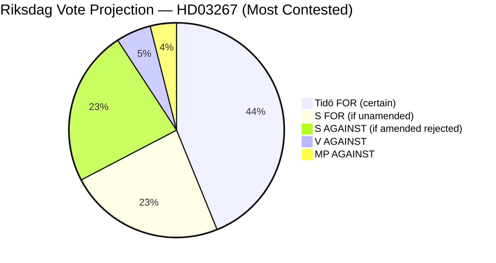

# Coalition Mathematics — Government Propositions 2026-05-07

## Current Riksdag Seat Distribution (2022 election basis)

| Party | Seats | Coalition |
|-------|-------|-----------|
| Moderaterna (M) | 68 | Tidö (governing) |
| Sverigedemokraterna (SD) | 73 | Tidö (supporting) |
| Kristdemokraterna (KD) | 19 | Tidö (governing) |
| Liberalerna (L) | 16 | Tidö (governing) |
| Centerpartiet (C) | 24 | Tidö (governing) |
| **Tidö total** | **200** | **Majority (175 needed)** |
| Socialdemokraterna (S) | 107 | Opposition |
| Vänsterpartiet (V) | 24 | Opposition |
| Miljöpartiet (MP) | 18 | Opposition |
| **Opposition total** | **149** | |

## Voting Mathematics for Each Proposition

### HD03250 (State e-ID) — Passing majority: 175 seats
- Expected Tidö: 200 (all support)
- Expected S: likely FOR (digital governance, EU compliance)
- Expected V/MP: likely FOR (digital rights, EU compliance)
- **Predicted vote**: ~310-330 FOR, minimal AGAINST
- **Passage**: Certain; broad supermajority possible

### HD03261 (Skatteverket registers) — Passing majority: 175 seats
- Expected Tidö: 200
- Expected S: likely FOR (anti-fraud is cross-party value)
- Expected V/MP: likely FOR with minor concerns
- **Predicted vote**: ~280-310 FOR
- **Passage**: Certain

### HD03267 (Security deportation) — Passing majority: 175 seats
- Expected Tidö: 200 (all support; L may have caveats but will vote with coalition)
- Expected S: UNCERTAIN — may table amendments; if adopted, S votes FOR; if rejected, S AGAINST or ABSTAIN
- Expected V/MP: AGAINST
- **Predicted vote if S FOR**: ~307 FOR, 42 AGAINST
- **Predicted vote if S AGAINST**: ~200 FOR, 149 AGAINST
- **Passage**: Certain either way (Tidö has majority alone); S position affects margin and legitimacy

## Coalition Stability Assessment

The three propositions collectively test three dimensions of coalition cohesion:

1. **SD loyalty test** (HD03267): SD support is guaranteed and essential. Failure to deliver would threaten coalition stability.
2. **KD ministerial showcase** (HD03250, HD03261): No coalition tension — KD governs these departments.
3. **L civil liberties tolerance** (HD03267): L is the coalition party with highest civil liberties discomfort. L will vote with coalition but may issue interpretive declarations.

**Coalition stability risk**: LOW for HD03250 and HD03261; MODERATE for HD03267 (depends on L's internal handling and final bill text).

*Source: Riksdag seat data; HD03267 (riksdagen.se); coalition agreement 2022*
