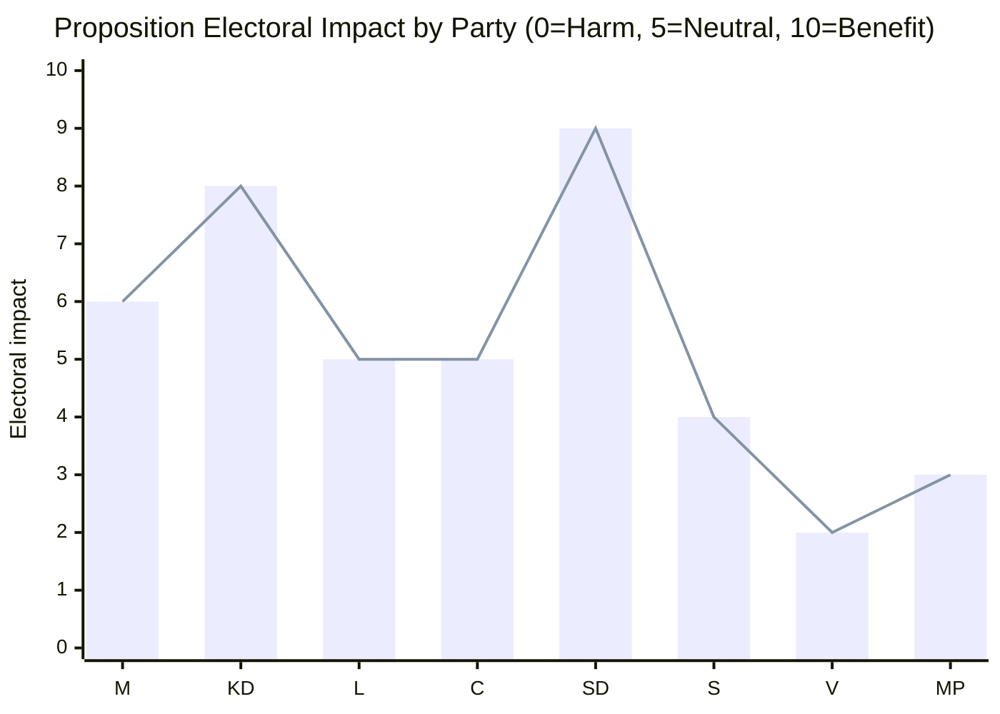

# Election 2026 Analysis — Government Propositions 2026-05-07

**Election date**: September 2026 (scheduled; ≤6 months horizon active)  
**Methodology**: Proposition-to-electoral-impact mapping

## Electoral Impact Matrix

## Party-by-Party Electoral Analysis

### Sverigedemokraterna (SD) — HIGH BENEFIT
HD03267 is a core SD policy demand embedded in the Tidö coalition agreement. Delivery before election = mobilisation asset. "We delivered on security deportations" is a direct voter communication. Risk: if HD03267 is blocked or amended to remove "teeth", SD base perceives failure.

### Kristdemokraterna (KD) — HIGH BENEFIT
Ebba Busch is the named minister for both HD03250 and HD03261. Both represent competent governance narrative (digital transformation + anti-fraud). Pre-election optics: KD as the party "that gets things done."

### Moderaterna (M) — MODERATE BENEFIT
Gunnar Strömmer (M) sponsors HD03267. Security/rule-of-law framing aligns with M competence narrative. M benefits from the full package as governing party.

### Liberalerna (L) and Centerpartiet (C) — NEUTRAL
Both parties support HD03250 (digital governance). L has civil liberties concerns about HD03267 but will vote with coalition. Net neutral impact.

### Socialdemokraterna (S) — MILD NEGATIVE
S faces a framing trap: opposing HD03267 = "soft on security threats"; supporting = implicitly endorsing SD's agenda. Expected S strategy: support in principle with amendments to procedural safeguards. Net: electoral wash but communication challenge.

### Vänsterpartiet (V) and Miljöpartiet (MP) — NEGATIVE
Both are in full opposition on HD03267. Consolidates their human rights/civil liberties identity. Unlikely to affect their vote shares significantly; their voters already oppose the Tidö coalition.

## Strategic Electoral Significance

The proposition package, taken as a whole, serves the Tidö coalition's electoral narrative in two ways:

1. **Competence delivery**: HD03250 + HD03261 = digital governance and anti-fraud = capable government
2. **Security delivery**: HD03267 = SD's core demand = coalition management and right-flank mobilisation

**Threat window**: ECtHR interim measure risk (see intelligence-assessment.md) represents the only significant electoral threat. If ECtHR intervenes publicly in August 2026, it creates "government had law struck down" narrative 2-4 weeks before election day.

*Source: riksdagen.se HD03267, HD03250, HD03261; election date: September 2026 per Swedish Constitution Ch. 3 §3*
