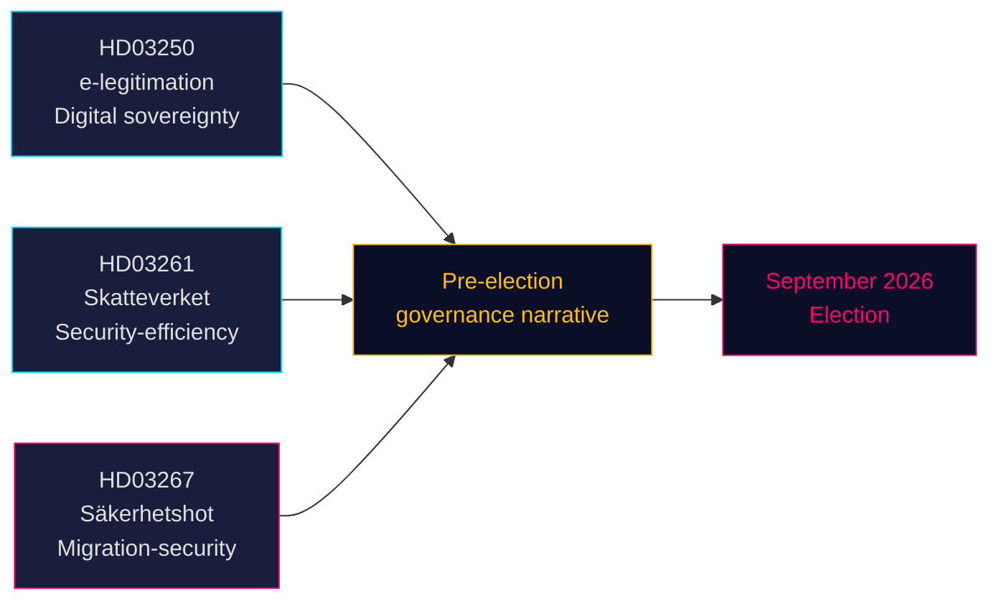

# Three Propositions Signal Pre-Election Security and Digital Governance Push

**Author**: James Pether Sörling  
**Date**: 2026-05-14 (effective: 2026-05-07)  
**Classification**: PUBLIC | **Confidence**: HIGH [B2]  
**Election proximity**: ≤6 months (September 2026)

## 🎯 BLUF

The Tidö government delivered three propositions on 7 May 2026 that collectively define its pre-election policy narrative: a state e-identity system (HD03250) anchoring Sweden's digital sovereignty, expanded Tax Agency population-registration powers (HD03261) signalling efficiency-and-security governance, and sharply strengthened deportation powers against qualified security threats (HD03267) that directly targets the SD voter base. All three advance before the September 2026 election, compressing the parliamentary calendar and forcing opposition parties to respond on government-chosen terrain.

## 🧭 3 Decisions This Brief Supports

1. **Riksdag committee scheduling** — All three propositions require committee hearings and votes before summer recess (≈ June 2026). Tight parliamentary calendar compresses debate time.
2. **Opposition positioning** — S, V, MP face hard choices: oppose HD03267 (security deportation) and risk "soft on crime/security" framing, or support it and validate Tidö's migration narrative.
3. **Civil society / legal challenges** — HD03267's broad "qualified security threat" standard invites ECHR Art. 8 and Art. 3 challenges; NGOs and legal advocacy groups must prepare referral submissions before Riksdag vote.

## Key Findings

### 1. En statlig e-legitimation (HD03250)
Sweden proposes a state-issued digital identity to supplement the current market-based BankID monopoly. The proposition responds to EU eIDAS2 Regulation requirements and competition concerns. A new state authority (arbetsnamn: *Statens e-legitimationsmyndighet*) will issue the credential. Implementation timeline: 2027–2028. Committee: TU. Significance: moderate-high (digital infrastructure + EU compliance).

### 2. Skatteverket expanded population-registration powers (HD03261)  
The Tax Agency gains new authority to cross-check and validate population-registration data against other registers to combat fraud, identity manipulation, and incorrect address registrations. Directly responds to recent Skatteverket reports on ghost addresses and organised crime exploitation of the folkbokföring system. Committee: SkU. Political sensitivity: medium (efficiency framing, but civil liberties concerns about surveillance scope).

### 3. Stärkt skydd mot utlänningar — säkerhetshot (HD03267)
The most politically charged proposition: creates a new legal category of "qualified security threat" (kvalificerat säkerhetshot) allowing deportation of foreigners assessed as threats by SÄPO without full judicial review, on classified evidence. Controversy: compatibility with ECHR Art. 8, Art. 3, and fair trial guarantees (Art. 6). Justice Minister Gunnar Strömmer (M) bills it as essential for national security pre-election. Committee: JuU. Significance: **high** (election-proximity multiplier 1.5× active; contested policy area).

## Strategic Assessment



## Economic Context

IMF WEO Apr-2026: Sweden real GDP growth 2026 estimated 2.1%, gross government debt ~35% of GDP (WEO:GGXWDG_NGDP, SWE, 2026 estimate). Fiscal space exists for new agency (e-legitimation authority) without material budget impact. Riksbank policy rate trajectory: easing cycle ongoing.

## ⚠️ Critical Warning: ECHR Procedural Risk (HD03267)

The security deportation proposition (HD03267) lacks a Special Advocate mechanism — the minimum procedural safeguard established by ECtHR *Othman (Abu Qatada) v UK* [2012] ECHR 56 for use of classified evidence in deportation proceedings. Lagrådet is expected to raise this concern. If enacted without amendment, the first SÄPO use of the new track against a high-profile individual is likely to trigger an ECtHR Rule 39 interim measure application. Timing risk: this could materialise in the August–September 2026 pre-election period.

## Economic Provenance
```json
{"economicProvenance": {"provider": "imf", "dataflow": "WEO", "indicator": "NGDP_RPCH / GGXWDG_NGDP", "vintage": "Apr-2026", "retrieved_at": "2026-05-14", "stale": false}}
```
