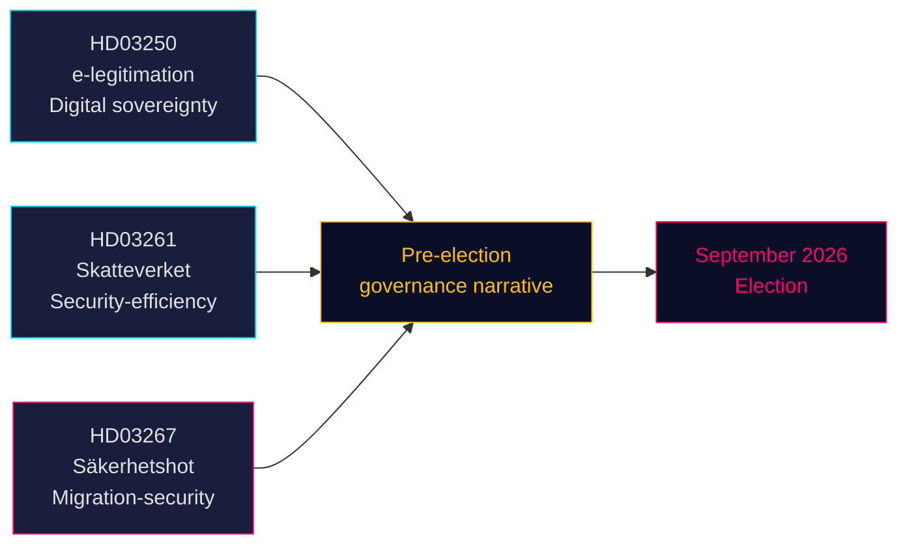

<!-- dir: rtl -->
# ثلاثة مقترحات تُشير إلى توجه ما قبل الانتخابات نحو الأمن والحوكمة الرقمية

**المؤلف**: جيمس بيثر سورلينغ  
**التاريخ**: 2026-05-14 (سارٍ من: 2026-05-07)  
**التصنيف**: عام | **درجة الثقة**: عالية [B2]  
**القرب الانتخابي**: ≤6 أشهر (سبتمبر 2026)

## 🎯 الخلاصة التنفيذية

قدّمت حكومة تيدو في 7 مايو 2026 ثلاثة مقترحات قانونية تُحدّد مجتمعةً روايتها السياسية ما قبل الانتخابية: نظام هوية إلكترونية حكومية (HD03250) يُرسّخ السيادة الرقمية السويدية، وصلاحيات موسّعة لتسجيل السكان لدائرة الضرائب (HD03261) تُشير إلى حوكمة الكفاءة والأمن، وصلاحيات ترحيل معززة بشكل حادّ ضد التهديدات الأمنية المؤهَّلة (HD03267) التي تستهدف مباشرةً قاعدة ناخبي حزب SD. تتقدم الاقتراحات الثلاثة قبل انتخابات سبتمبر 2026، مما يُضيّق الجدول الزمني البرلماني ويُلزم أحزاب المعارضة بالرد على أرضية اختارتها الحكومة.

## 🧭 3 قرارات يدعمها هذا الوثيق

1. **جدولة لجان الريكسداغ** — تستلزم الاقتراحات الثلاثة جلسات لجنة وتصويتاً قبل عطلة الصيف (≈ يونيو 2026). الجدول البرلماني الضيق يُضيّق وقت المناقشة.
2. **تموضع المعارضة** — تواجه S و V و MP خيارات صعبة: معارضة HD03267 (الترحيل الأمني) والمخاطرة بإطار "التساهل مع الجريمة/الأمن"، أو دعمه وتحقيق رواية تيدو للهجرة.
3. **المجتمع المدني / الطعون القانونية** — معيار "التهديد الأمني المؤهَّل" الواسع في HD03267 يُفتح الباب أمام طعون ECHR المادة 8 والمادة 3؛ يجب على المنظمات غير الحكومية ومجموعات المناصرة القانونية إعداد مذكراتها قبل تصويت الريكسداغ.

## النتائج الرئيسية

### 1. هوية إلكترونية حكومية — En statlig e-legitimation (HD03250)
تقترح السويد هوية رقمية صادرة عن الدولة لتكملة احتكار BankID القائم على السوق. يستجيب المقترح لمتطلبات لائحة eIDAS2 الأوروبية ومخاوف المنافسة. ستُصدر هيئة حكومية جديدة (الاسم العمل: *Statens e-legitimationsmyndighet*) هذه البطاقة. الجدول الزمني للتنفيذ: 2027–2028. اللجنة: TU. الأهمية: معتدلة-عالية (بنية تحتية رقمية + امتثال للاتحاد الأوروبي).

### 2. صلاحيات تسجيل السكان الموسّعة لـ Skatteverket (HD03261)
تحصل دائرة الضرائب على صلاحية جديدة للترابط والتحقق من بيانات تسجيل السكان مقابل سجلات أخرى لمكافحة الاحتيال وتلاعب الهوية والتسجيل الخاطئ للعناوين. يستجيب مباشرةً لتقارير Skatteverket الأخيرة عن العناوين الوهمية واستغلال الجريمة المنظمة لنظام folkbokföring. اللجنة: SkU. الحساسية السياسية: متوسطة (إطار الكفاءة، لكن مع مخاوف الحريات المدنية حول نطاق المراقبة).

### 3. الحماية المعززة ضد الأجانب — التهديدات الأمنية — Stärkt skydd mot utlänningar — säkerhetshot (HD03267)
المقترح الأكثر إثارةً للجدل السياسي: ينشئ فئة قانونية جديدة من "التهديد الأمني المؤهَّل" (kvalificerat säkerhetshot) تتيح ترحيل الأجانب الذين تُقيّمهم SÄPO بوصفهم تهديدات دون مراجعة قضائية كاملة، استناداً إلى أدلة سرية. الجدل: التوافق مع ECHR المادة 8 والمادة 3 وضمانات المحاكمة العادلة (المادة 6). يصفه وزير العدل غونار ستروميه (M) بأنه ضروري للأمن القومي قبيل الانتخابات. اللجنة: JuU. الأهمية: **عالية** (معامل القرب الانتخابي 1.5× نشط؛ مجال سياسة مثير للجدل).

## التقييم الاستراتيجي



## السياق الاقتصادي

صندوق النقد الدولي WEO إبريل 2026: نمو الناتج المحلي الإجمالي الحقيقي للسويد 2026 مُقدَّر بـ 2.1%، الدين الحكومي الإجمالي ~35% من الناتج المحلي الإجمالي (WEO:GGXWDG_NGDP, SWE, تقدير 2026). الهامش المالي متاح لهيئة جديدة (هيئة الهوية الإلكترونية) دون تأثير ماديّ على الميزانية. مسار سعر الفائدة في Riksbank: دورة تيسير جارية.

## ⚠️ تحذير حاسم: خطر إجرائي في ECHR (HD03267)

يفتقر مقترح الترحيل الأمني (HD03267) إلى آلية محامٍ خاص — الضمان الإجرائي الأدنى الذي رسّخته المحكمة الأوروبية لحقوق الإنسان في قضية *Othman (Abu Qatada) ضد المملكة المتحدة* [2012] ECHR 56 لاستخدام الأدلة السرية في إجراءات الترحيل. من المتوقع أن يثير Lagrådet هذه المخاوف. في حال إقرار المقترح دون تعديل، فمن المرجح أن يؤدي أول استخدام لـ SÄPO للمسار الجديد ضد فرد بارز إلى تقديم طلب تدابير مؤقتة بموجب قاعدة ECHR 39. مخاطر التوقيت: قد يتجلى هذا في الفترة السابقة للانتخابات بين أغسطس وسبتمبر 2026.

## بيانات المصدر الاقتصادي
```json
{"economicProvenance": {"provider": "imf", "dataflow": "WEO", "indicator": "NGDP_RPCH / GGXWDG_NGDP", "vintage": "Apr-2026", "retrieved_at": "2026-05-14", "stale": false}}
```

<!-- source-sha: 13fb01dbf19848515cc9696908bf9f099436e97c -->
