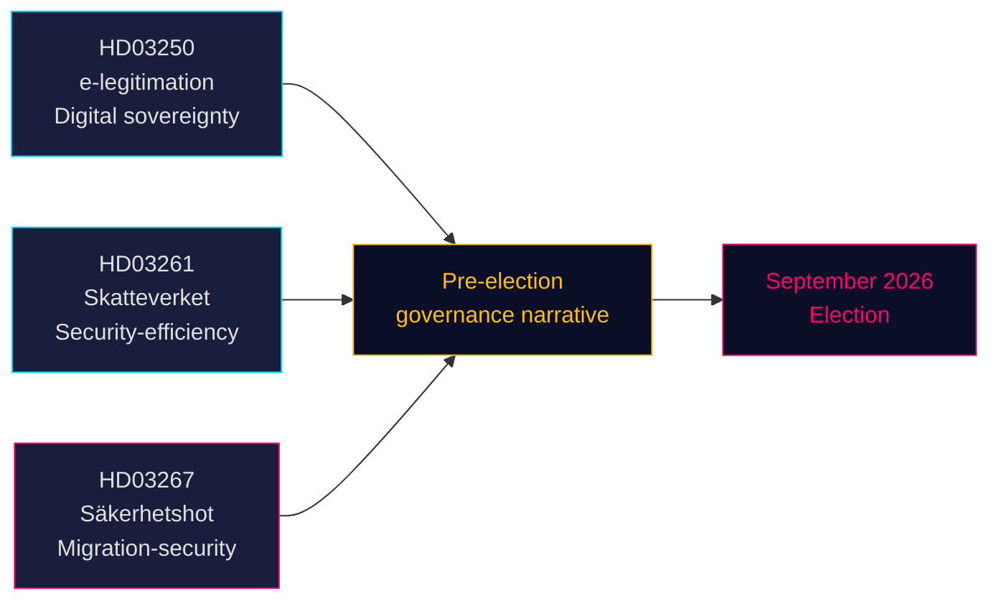

# Tre propositioner signalerer valgdrevne satsninger på sikkerhed og digital forvaltning

**Forfatter**: James Pether Sörling  
**Dato**: 2026-05-14 (gælder fra: 2026-05-07)  
**Klassificering**: OFFENTLIG | **Konfidensgrad**: HØJ [B2]  
**Valnærhed**: ≤6 måneder (september 2026)

## 🎯 BLUF

Tidö-regeringen fremlagde tre propositioner den 7. maj 2026, som tilsammen definerer regeringens prævalgsfortælling: et statsligt e-identitetssystem (HD03250) der forankrer Sveriges digitale suverænitet, udvidede folkebokføringsbeføjelser til Skatteverket (HD03261) der signalerer effektivitets- og sikkerhedsforvaltning, samt kraftigt styrkede udvisningsbeføjelser mod kvalificerede sikkerhedstrusler (HD03267) der direkte retter sig mod SD's vælgerbasis. Alle tre propositioner behandles inden valget i september 2026, hvilket komprimerer den parlamentariske kalender og tvinger oppositionspartierne til at reagere på regerings valgte terrain.

## 🧭 3 Beslutninger dette dokument understøtter

1. **Riksdagsudvalgets planlægning** — Alle tre propositioner kræver udvalgsbehandling og afstemning inden sommerferien (≈ juni 2026). Den stramme parlamentariske kalender komprimerer debatstiden.
2. **Oppositionens positionering** — S, V, MP står over for svære valg: modsætte sig HD03267 (sikkerhedsudvisning) og risikere "blød over for kriminalitet/sikkerhed"-framing, eller støtte den og validere Tidös migrationsfortælling.
3. **Civilsamfund / retlige anfægtelser** — HD03267's brede standard "kvalificeret sikkerhedstrussel" indbyder til ECHR Art. 8- og Art. 3-udfordringer; NGO'er og rettighedsadvokater skal forberede indlæg inden riksdagsafstemningen.

## Centrale observationer

### 1. En statlig e-legitimation (HD03250)
Sverige foreslår en statsudstedt digital identitet som supplement til det nuværende markedsbaserede BankID-monopol. Propositionen svarer på EU's eIDAS2-forordning og konkurrencemæssige bekymringer. En ny statslig myndighed (arbejdsnavn: *Statens e-legitimationsmyndighet*) skal udstede legitimationen. Implementeringstidsplan: 2027–2028. Udvalg: TU. Betydning: moderat-høj (digital infrastruktur + EU-overholdelse).

### 2. Skatteverkets udvidede folkebokføringsbeføjelser (HD03261)
Skatteverket får ny beføjelse til at krydstjekke og validere folkebokføringsdata mod andre registre for at bekæmpe bedrageri, identitetsmanipulation og forkerte adresseregistreringer. Svarer direkte på Skatteverkets seneste rapporter om spøkeadresser og organiseret kriminalitets udnyttelse af folkebokføringssystemet. Udvalg: SkU. Politisk følsomhed: middel (effektivitetsframing, men borgerretlige bekymringer om overvågningens omfang).

### 3. Stärkt skydd mot utlänningar — säkerhetshot (HD03267)
Den mest politisk ladede proposition: opretter en ny juridisk kategori "kvalificeret sikkerhedstrussel" (kvalificerat säkerhetshot) der muliggør udvisning af udlændinge, der af SÄPO vurderes som trusler, uden fuld domstolsprøvelse, på grundlag af klassificerede beviser. Kontrovers: forenelighed med ECHR Art. 8, Art. 3 og retten til retfærdig rettergang (Art. 6). Justitsminister Gunnar Strömmer (M) betegner det som nødvendigt for national sikkerhed inden valget. Udvalg: JuU. Betydning: **høj** (valnærhedskoefficient 1,5× aktiv; omstridt politikområde).

## Strategisk vurdering



## Økonomisk kontekst

IMF WEO apr-2026: Sveriges reale BNP-vækst 2026 estimeres til 2,1 %, bruttogæld ~35 % af BNP (WEO:GGXWDG_NGDP, SWE, 2026 estimat). Finanspolitisk råderum til ny myndighed (e-legitimationsmyndighed) uden materiel budgetpåvirkning. Riksbankens rentebane: igangværende lempelsescyklus.

## ⚠️ Kritisk advarsel: ECHR-procesrisiko (HD03267)

Propositionen om sikkerhedsudvisning (HD03267) mangler en specialadvokatordning — den minimale proceduremæssige garanti fastlagt af EMD i *Othman (Abu Qatada) mod Storbritannien* [2012] ECHR 56 for brug af klassificerede beviser i udvisningssager. Lagrådet forventes at rejse dette spørgsmål. Vedtages propositionen uden ændring, vil SÄPO's første anvendelse af det nye spor mod en profileret person sandsynligvis udløse en ansøgning om foreløbig foranstaltning efter ECHR regel 39. Tidrisikovurdering: dette kan materialisere sig i perioden august–september 2026 op til valget.

## Økonomisk proveniensdata
```json
{"economicProvenance": {"provider": "imf", "dataflow": "WEO", "indicator": "NGDP_RPCH / GGXWDG_NGDP", "vintage": "Apr-2026", "retrieved_at": "2026-05-14", "stale": false}}
```

<!-- source-sha: 13fb01dbf19848515cc9696908bf9f099436e97c -->
