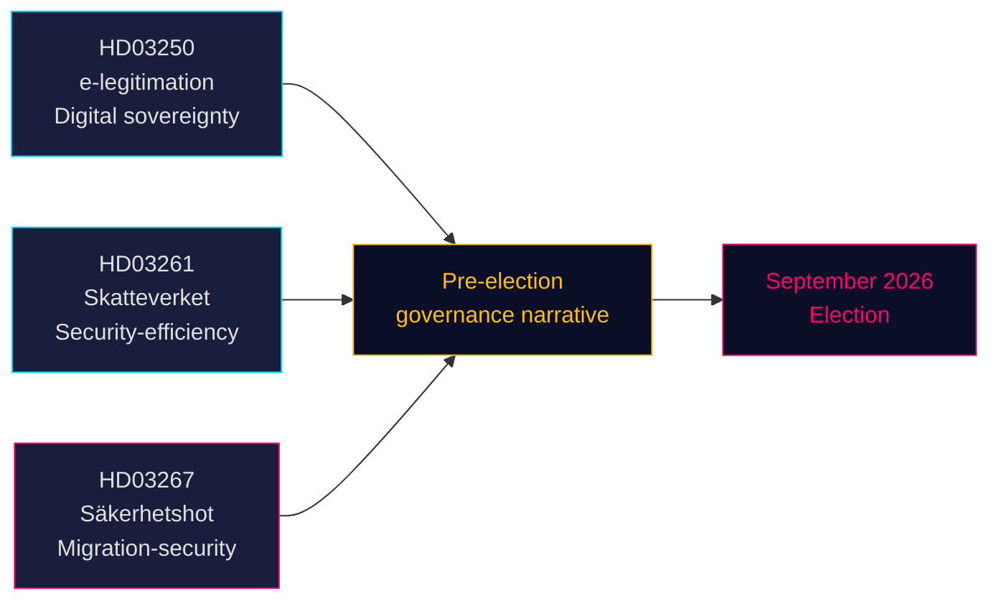

# Drei Gesetzentwürfe signalisieren wahlkampfgetriebenen Kurs bei Sicherheit und digitaler Verwaltung

**Autor**: James Pether Sörling  
**Datum**: 2026-05-14 (gültig ab: 2026-05-07)  
**Klassifizierung**: ÖFFENTLICH | **Konfidenzgrad**: HOCH [B2]  
**Wahlnähe**: ≤6 Monate (September 2026)

## 🎯 BLUF

Die Tidö-Regierung legte am 7. Mai 2026 drei Gesetzentwürfe vor, die zusammen die Vorwahl-Politikstrategie definieren: ein staatliches E-Identitätssystem (HD03250) als Anker schwedischer digitaler Souveränität, erweiterte Meldewesenskompetenzen für das Finanzamt (HD03261) als Signal für Effizienz- und Sicherheitsgovernance sowie massiv gestärkte Abschiebebefugnisse gegen qualifizierte Sicherheitsbedrohungen (HD03267), die direkt auf die SD-Wählerschaft abzielt. Alle drei Gesetzentwürfe werden vor der Wahl im September 2026 behandelt, was den parlamentarischen Kalender verdichtet und die Oppositionsparteien zwingt, auf vom Regierungslager gewähltem Terrain zu reagieren.

## 🧭 3 Entscheidungen, die dieses Dokument unterstützt

1. **Reichstagsausschuss-Terminplanung** — Alle drei Gesetzentwürfe erfordern Ausschussberatungen und Abstimmungen vor der Sommerpause (≈ Juni 2026). Der enge Parlamentskalender verdichtet die Debattenzeit.
2. **Oppositionspositionierung** — S, V, MP stehen vor schwierigen Entscheidungen: HD03267 (Sicherheitsabschiebung) ablehnen und das Risiko einer „weich gegenüber Kriminalität/Sicherheit"-Rahmung eingehen, oder ihr zustimmen und das Tidö-Migrationsnarrativ validieren.
3. **Zivilgesellschaft / rechtliche Anfechungen** — Der breite Standard „qualifizierte Sicherheitsbedrohung" in HD03267 lädt zu ECHR Art. 8- und Art. 3-Herausforderungen ein; NGOs und Rechtsanwaltsorganisationen müssen Stellungnahmen vor der Riksdag-Abstimmung vorbereiten.

## Hauptbefunde

### 1. En statlig e-legitimation (HD03250)
Schweden schlägt eine staatlich ausgestellte digitale Identität als Ergänzung zum aktuellen marktbasierten BankID-Monopol vor. Der Gesetzentwurf reagiert auf die EU eIDAS2-Verordnung und Wettbewerbsbedenken. Eine neue staatliche Behörde (Arbeitsname: *Statens e-legitimationsmyndighet*) soll den Ausweis ausstellen. Umsetzungszeitplan: 2027–2028. Ausschuss: TU. Bedeutung: moderat-hoch (digitale Infrastruktur + EU-Konformität).

### 2. Erweiterte Meldewesenskompetenzen des Finanzamts (HD03261)
Das Finanzamt erhält neue Befugnis zum Abgleich und zur Validierung von Meldewesendaten mit anderen Registern zur Bekämpfung von Betrug, Identitätsmanipulation und falschen Adressregistrierungen. Reagiert direkt auf jüngste Berichte des Finanzamts über Geisteradressen und die Ausnutzung des Folkebokföring-Systems durch die organisierte Kriminalität. Ausschuss: SkU. Politische Sensibilität: mittel (Effizienz-Rahmung, aber Bürgerrechtsbedenken hinsichtlich des Umfangs der Überwachung).

### 3. Stärkt skydd mot utlänningar — säkerhetshot (HD03267)
Der politisch brisanteste Gesetzentwurf: schafft eine neue Rechtskategorie „qualifizierte Sicherheitsbedrohung" (kvalificerat säkerhetshot), die die Abschiebung von Ausländern ermöglicht, die von SÄPO als Bedrohungen eingestuft werden, ohne vollständige gerichtliche Prüfung, auf der Grundlage von Verschlusssachen. Kontroverse: Vereinbarkeit mit ECHR Art. 8, Art. 3 und Garantien eines fairen Verfahrens (Art. 6). Justizminister Gunnar Strömmer (M) bezeichnet es als unabdingbar für die nationale Sicherheit vor der Wahl. Ausschuss: JuU. Bedeutung: **hoch** (Wahlnähe-Koeffizient 1,5× aktiv; umstrittener Politikbereich).

## Strategische Bewertung



## Wirtschaftlicher Kontext

IWF WEO Apr-2026: Schwedisches reales BIP-Wachstum 2026 geschätzt auf 2,1 %, Bruttoverschuldung ~35 % des BIP (WEO:GGXWDG_NGDP, SWE, 2026 Schätzung). Fiskalischer Spielraum für neue Behörde (E-Identitätsbehörde) ohne materielle Haushaltsauswirkungen. Riksbank-Zinspfad: laufender Lockerungszyklus.

## ⚠️ Kritische Warnung: ECHR-Verfahrensrisiko (HD03267)

Dem Gesetzentwurf zur Sicherheitsabschiebung (HD03267) fehlt ein Sonderanwalts-Mechanismus — die von EGMR in *Othman (Abu Qatada) gegen Vereinigtes Königreich* [2012] ECHR 56 etablierte minimale Verfahrensgarantie für die Verwendung von Verschlusssachen in Abschiebeverfahren. Es wird erwartet, dass der Lagrådet diese Bedenken äußert. Wird der Gesetzentwurf ohne Änderung verabschiedet, ist davon auszugehen, dass die erste Anwendung des neuen Verfahrens durch SÄPO gegen eine hochprofilierte Person einen Antrag auf einstweilige Maßnahme gemäß ECHR Regel 39 auslösen wird. Zeitrisiko: dies könnte sich in der Vorwahlzeit August–September 2026 manifestieren.

## Wirtschaftliche Herkunftsdaten
```json
{"economicProvenance": {"provider": "imf", "dataflow": "WEO", "indicator": "NGDP_RPCH / GGXWDG_NGDP", "vintage": "Apr-2026", "retrieved_at": "2026-05-14", "stale": false}}
```

<!-- source-sha: 13fb01dbf19848515cc9696908bf9f099436e97c -->
