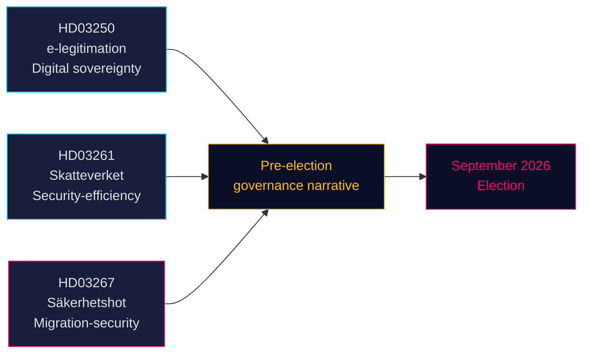

# Tres propuestas señalan un rumbo preelectoral hacia la seguridad y la gobernanza digital

**Autor**: James Pether Sörling  
**Fecha**: 2026-05-14 (vigente desde: 2026-05-07)  
**Clasificación**: PÚBLICO | **Nivel de confianza**: ALTO [B2]  
**Proximidad electoral**: ≤6 meses (septiembre de 2026)

## 🎯 BLUF

El gobierno Tidö presentó el 7 de mayo de 2026 tres proposiciones que en conjunto definen su narrativa política preelectoral: un sistema de identidad electrónica estatal (HD03250) que ancla la soberanía digital de Suecia, competencias ampliadas de registro de población para la Agencia Tributaria (HD03261) que señalan una gobernanza orientada a la eficiencia y la seguridad, y poderes de expulsión considerablemente reforzados contra amenazas de seguridad cualificadas (HD03267) dirigidos directamente al electorado del SD. Las tres proposiciones avanzan antes de las elecciones de septiembre de 2026, comprimiendo el calendario parlamentario y obligando a los partidos de la oposición a responder en el terreno elegido por el gobierno.

## 🧭 3 Decisiones que apoya este documento

1. **Calendario de comisiones del Riksdag** — Las tres proposiciones requieren audiencias y votaciones en comisión antes del receso veraniego (≈ junio de 2026). El ajustado calendario parlamentario comprime el tiempo de debate.
2. **Posicionamiento de la oposición** — S, V, MP enfrentan decisiones difíciles: oponerse a HD03267 (expulsión por seguridad) y arriesgarse a ser enmarcados como «blandos con el crimen/seguridad», o apoyarla y validar el relato migratorio de Tidö.
3. **Sociedad civil / impugnaciones jurídicas** — El amplio estándar de «amenaza de seguridad cualificada» de HD03267 invita a impugnaciones al amparo del art. 8 y el art. 3 del CEDH; las ONG y los grupos de defensa jurídica deben preparar sus alegaciones antes de la votación en el Riksdag.

## Hallazgos clave

### 1. En statlig e-legitimation (HD03250)
Suecia propone una identidad digital emitida por el Estado para complementar el actual monopolio de mercado BankID. La proposición responde a los requisitos del Reglamento eIDAS2 de la UE y a preocupaciones de competencia. Una nueva autoridad estatal (nombre de trabajo: *Statens e-legitimationsmyndighet*) emitirá la credencial. Calendario de implementación: 2027–2028. Comisión: TU. Significación: moderada-alta (infraestructura digital + cumplimiento UE).

### 2. Competencias ampliadas de registro de población de Skatteverket (HD03261)
La Agencia Tributaria adquiere nuevas facultades para cotejar y validar datos de empadronamiento frente a otros registros con el fin de combatir el fraude, la manipulación de identidades y los registros de domicilio incorrectos. Responde directamente a los recientes informes de Skatteverket sobre direcciones fantasma y la explotación del sistema folkbokföring por parte de la delincuencia organizada. Comisión: SkU. Sensibilidad política: media (encuadre de eficiencia, pero preocupaciones por las libertades civiles respecto al alcance de la vigilancia).

### 3. Stärkt skydd mot utlänningar — säkerhetshot (HD03267)
La proposición políticamente más cargada: crea una nueva categoría jurídica de «amenaza de seguridad cualificada» (kvalificerat säkerhetshot) que permite la expulsión de extranjeros evaluados como amenazas por la SÄPO sin revisión judicial completa, basándose en pruebas clasificadas. Controversia: compatibilidad con los art. 8, art. 3 y las garantías de juicio justo (art. 6) del CEDH. El ministro de Justicia Gunnar Strömmer (M) lo califica de esencial para la seguridad nacional antes de las elecciones. Comisión: JuU. Significación: **alta** (multiplicador de proximidad electoral 1,5× activo; área política controvertida).

## Evaluación estratégica



## Contexto económico

FMI WEO abr-2026: crecimiento del PIB real sueco 2026 estimado en 2,1 %, deuda pública bruta ~35 % del PIB (WEO:GGXWDG_NGDP, SWE, estimación 2026). Margen fiscal disponible para la nueva agencia (autoridad de e-identidad) sin impacto presupuestario significativo. Trayectoria del tipo de interés del Riksbank: ciclo de relajación en curso.

## ⚠️ Advertencia crítica: riesgo procesal CEDH (HD03267)

La proposición de expulsión por seguridad (HD03267) carece de un mecanismo de abogado especial — la garantía procesal mínima establecida por el TEDH en *Othman (Abu Qatada) c. Reino Unido* [2012] CEDH 56 para el uso de pruebas clasificadas en procedimientos de expulsión. Se espera que el Lagrådet plantee esta preocupación. Si se adopta sin enmienda, la primera aplicación por parte de la SÄPO del nuevo procedimiento contra un individuo de alto perfil probablemente desencadenará una solicitud de medida cautelar en virtud de la Regla 39 del CEDH. Riesgo temporal: esto podría materializarse durante el período preelectoral de agosto-septiembre de 2026.

## Datos de procedencia económica
```json
{"economicProvenance": {"provider": "imf", "dataflow": "WEO", "indicator": "NGDP_RPCH / GGXWDG_NGDP", "vintage": "Apr-2026", "retrieved_at": "2026-05-14", "stale": false}}
```

<!-- source-sha: 13fb01dbf19848515cc9696908bf9f099436e97c -->
