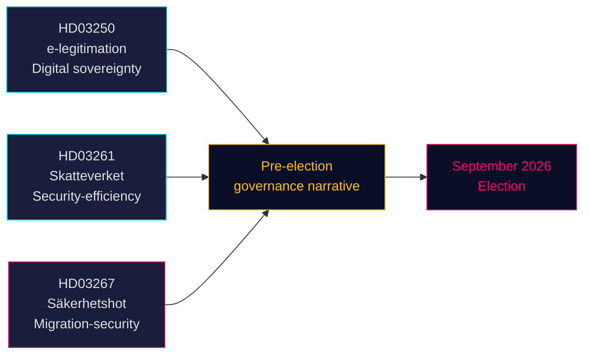

# Kolme esitystä merkitsevät vaalilähtöistä panostusta turvallisuuteen ja digitaaliseen hallintoon

**Tekijä**: James Pether Sörling  
**Päivämäärä**: 2026-05-14 (voimassa: 2026-05-07 alkaen)  
**Luokittelu**: JULKINEN | **Luotettavuusaste**: KORKEA [B2]  
**Vaalietäisyys**: ≤6 kuukautta (syyskuu 2026)

## 🎯 BLUF

Tidö-hallitus jätti kolme esitystä 7. toukokuuta 2026, jotka yhdessä määrittelevät hallituksen vaalienedellisen politiikkakertomuksen: valtiollinen sähköinen henkilöllisyysjärjestelmä (HD03250) vahvistaa Ruotsin digitaalista suvereniteettia, laajennetut väestörekisterivelvollisuudet Verohallinnolle (HD03261) viestivät tehokkuus- ja turvallisuushallinnosta, ja merkittävästi vahvistettu karkottamisvalta kvalifioituja turvallisuusuhkia vastaan (HD03267) kohdistuu suoraan SD:n äänestäjäkuntaan. Kaikki kolme esitystä käsitellään ennen syyskuun 2026 vaaleja, mikä tiivistää parlamentaarista kalenteria ja pakottaa oppositiopuolueet reagoimaan hallituksen valitsemalla maaperällä.

## 🧭 3 Päätöstä, joita tämä dokumentti tukee

1. **Riksdagin valiokunnan aikataulu** — Kaikki kolme esitystä vaativat valiokuntakäsittelyn ja äänestyksen ennen kesätaukoa (≈ kesäkuu 2026). Tiukka parlamentaarinen kalenteri tiivistää keskusteluaikaa.
2. **Opposition asemointi** — S, V, MP kohtaavat vaikeita valintoja: vastustaa HD03267:ää (turvallisuuskarkotus) ja riskeerata "pehmeä rikosta/turvallisuutta kohtaan" -kehystäminen, tai tukea sitä ja vahvistaa Tidön maahanmuuttokertomusta.
3. **Kansalaisyhteiskunta / oikeudelliset haasteet** — HD03267:n laaja "kvalifioitu turvallisuusuhka" -standardi kutsuu ECHR art. 8- ja art. 3 -haasteisiin; kansalaisjärjestöjen ja oikeudellisten edunvalvontaryhmien on valmisteltava lausuntonsa ennen riksdagsäänestystä.

## Keskeiset havainnot

### 1. En statlig e-legitimation (HD03250)
Ruotsi ehdottaa valtion myöntämää digitaalista henkilöllisyyttä täydentämään nykyistä markkinapohjaista BankID-monopolia. Esitys vastaa EU:n eIDAS2-asetukseen ja kilpailukysymyksiin. Uusi virasto (työnimike: *Statens e-legitimationsmyndighet*) myöntää tunnisteen. Toteutusaikataulu: 2027–2028. Valiokunta: TU. Merkitys: kohtalainen-korkea (digitaalinen infrastruktuuri + EU-vaatimustenmukaisuus).

### 2. Verohallinnon laajennetut väestörekisterivelvollisuudet (HD03261)
Verohallinto saa uuden toimivallan ristiintarkistaa ja validoida väestörekisteritietoja muita rekistereitä vastaan petosten, henkilöllisyyden manipuloinnin ja väärien osoiterekisteröintien torjumiseksi. Vastaa suoraan Verohallinnon viimeaikaisiin raportteihin haamuosoitteista ja järjestäytyneen rikollisuuden hyödyntämisestä väestörekisterijärjestelmässä. Valiokunta: SkU. Poliittinen herkkyys: kohtalainen (tehokkuuskehystäminen, mutta kansalaisvapauksiin liittyvät huolet valvonnan laajuudesta).

### 3. Stärkt skydd mot utlänningar — säkerhetshot (HD03267)
Poliittisesti latautunein esitys: luo uuden oikeudellisen kategorian "kvalifioitu turvallisuusuhka" (kvalificerat säkerhetshot), joka mahdollistaa ulkomaalaisten karkottamisen SÄPO:n arvioitua heidät uhiksi ilman täyttä tuomioistuinvalvontaa, salaisiin todisteisiin perustuen. Kiistakohta: yhteensopivuus ECHR art. 8:n, art. 3:n ja oikeudenmukaiseen oikeudenkäyntiin liittyvien takuiden (art. 6) kanssa. Oikeusministeri Gunnar Strömmer (M) pitää sitä välttämättömänä kansalliselle turvallisuudelle ennen vaaleja. Valiokunta: JuU. Merkitys: **korkea** (vaalietäisyyskerroin 1,5× aktiivinen; kiistelty politiikka-alue).

## Strateginen arviointi



## Taloudellinen konteksti

IMF WEO huhti-2026: Ruotsin reaalinen BKT-kasvu 2026 arvioitu 2,1 prosentiksi, bruttovaltionvelka ~35 % BKT:stä (WEO:GGXWDG_NGDP, SWE, 2026 arvio). Finanssipoliittinen liikkumavara uudelle virastolle (sähköisen henkilöllisyyden virasto) ilman merkittävää budjettivaikutusta. Riksbankenin korkokehitys: käynnissä oleva kevennyskierto.

## ⚠️ Kriittinen varoitus: ECHR-menettelyllinen riski (HD03267)

Turvallisuuskarkottamisesityksestä (HD03267) puuttuu erityisasiamiehen mekanismi — EIT:n asiassa *Othman (Abu Qatada) v. Yhdistynyt kuningaskunta* [2012] ECHR 56 vahvistama vähimmäismenettelyllinen suojatoimenpide salaisten todisteiden käyttämiselle karkottamismenettelyissä. Lagråderin odotetaan nostavan tämän huolen esiin. Jos esitys hyväksytään ilman muutoksia, on todennäköistä, että SÄPO:n ensimmäinen korkean profiilin henkilöön kohdistuva uuden menettelyn soveltaminen johtaa väliaikaistoimenpidehakemukseen ECHR säännön 39 nojalla. Ajoitusriski: tämä voi konkretisoitua vaaleja edeltävänä aikana elokuusta syyskuuhun 2026.

## Taloudellinen provenanssitieto
```json
{"economicProvenance": {"provider": "imf", "dataflow": "WEO", "indicator": "NGDP_RPCH / GGXWDG_NGDP", "vintage": "Apr-2026", "retrieved_at": "2026-05-14", "stale": false}}
```

<!-- source-sha: 13fb01dbf19848515cc9696908bf9f099436e97c -->
