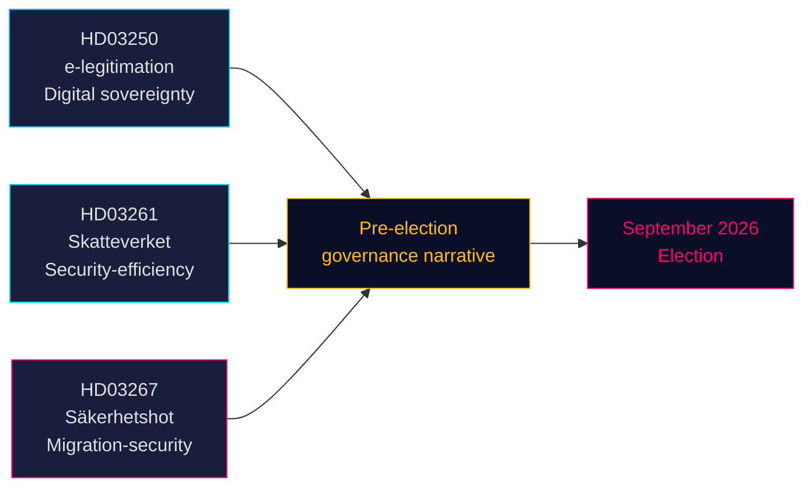

# Trois propositions signalent une orientation pré-électorale vers la sécurité et la gouvernance numérique

**Auteur** : James Pether Sörling  
**Date** : 2026-05-14 (en vigueur : 2026-05-07)  
**Classification** : PUBLIC | **Degré de confiance** : ÉLEVÉ [B2]  
**Proximité électorale** : ≤6 mois (septembre 2026)

## 🎯 BLUF

Le gouvernement Tidö a déposé le 7 mai 2026 trois propositions qui, ensemble, définissent son récit politique pré-électoral : un système d'identité électronique étatique (HD03250) ancrant la souveraineté numérique de la Suède, des compétences élargies d'enregistrement de la population pour l'Agence fiscale (HD03261) signalant une gouvernance axée sur l'efficacité et la sécurité, ainsi que des pouvoirs d'expulsion considérablement renforcés contre les menaces sécuritaires qualifiées (HD03267) ciblant directement l'électorat du SD. Les trois propositions avancent avant les élections de septembre 2026, comprimant le calendrier parlementaire et obligeant les partis d'opposition à répondre sur un terrain choisi par le gouvernement.

## 🧭 3 Décisions soutenues par ce document

1. **Planification des commissions du Riksdag** — Les trois propositions nécessitent des auditions et des votes en commission avant la pause estivale (≈ juin 2026). Le calendrier parlementaire serré réduit le temps de débat.
2. **Positionnement de l'opposition** — S, V, MP font face à des choix difficiles : s'opposer à HD03267 (expulsion sécuritaire) et risquer un cadrage « mou sur la criminalité/sécurité », ou la soutenir et valider le récit migratoire de Tidö.
3. **Société civile / recours juridiques** — La large norme de « menace sécuritaire qualifiée » de HD03267 invite à des contestations au titre de l'art. 8 et de l'art. 3 de la CEDH ; les ONG et groupes d'advocacy juridique doivent préparer leurs mémoires avant le vote au Riksdag.

## Principales constatations

### 1. En statlig e-legitimation (HD03250)
La Suède propose une identité numérique délivrée par l'État pour compléter l'actuel monopole de marché BankID. La proposition répond aux exigences du règlement eIDAS2 de l'UE et aux préoccupations concurrentielles. Une nouvelle autorité étatique (nom de travail : *Statens e-legitimationsmyndighet*) délivrera le titre d'identité. Calendrier de mise en œuvre : 2027–2028. Commission : TU. Importance : modérée-élevée (infrastructure numérique + conformité UE).

### 2. Pouvoirs élargis d'enregistrement de la population pour Skatteverket (HD03261)
L'Agence fiscale acquiert de nouveaux pouvoirs pour recouper et valider les données d'état civil avec d'autres registres afin de lutter contre la fraude, la manipulation d'identité et les enregistrements d'adresses incorrects. Répond directement aux récents rapports de Skatteverket sur les adresses fantômes et l'exploitation du système folkbokföring par la criminalité organisée. Commission : SkU. Sensibilité politique : moyenne (cadrage efficacité, mais préoccupations en matière de libertés civiles quant à la portée de la surveillance).

### 3. Stärkt skydd mot utlänningar — säkerhetshot (HD03267)
La proposition la plus politiquement chargée : crée une nouvelle catégorie juridique de « menace sécuritaire qualifiée » (kvalificerat säkerhetshot) permettant l'expulsion d'étrangers évalués comme des menaces par la SÄPO sans examen judiciaire complet, sur la base de preuves classifiées. Controverse : compatibilité avec les art. 8, art. 3 et les garanties d'un procès équitable (art. 6) de la CEDH. Le ministre de la Justice Gunnar Strömmer (M) la présente comme essentielle à la sécurité nationale avant les élections. Commission : JuU. Importance : **élevée** (multiplicateur de proximité électorale 1,5× actif ; domaine politique contesté).

## Évaluation stratégique



## Contexte économique

FMI WEO avr-2026 : croissance du PIB réel suédois 2026 estimée à 2,1 %, dette publique brute ~35 % du PIB (WEO:GGXWDG_NGDP, SWE, estimation 2026). Marge budgétaire disponible pour la nouvelle agence (autorité e-identité) sans impact budgétaire significatif. Trajectoire du taux directeur de la Riksbank : cycle d'assouplissement en cours.

## ⚠️ Avertissement critique : risque procédural CEDH (HD03267)

La proposition d'expulsion sécuritaire (HD03267) ne prévoit pas de mécanisme d'avocat spécial — la garantie procédurale minimale établie par la CEDH dans *Othman (Abu Qatada) c. Royaume-Uni* [2012] CEDH 56 pour l'utilisation de preuves classifiées dans les procédures d'expulsion. Le Lagrådet devrait soulever cette préoccupation. En cas d'adoption sans amendement, la première utilisation par la SÄPO de la nouvelle procédure contre une personne profilée déclenchera probablement une demande de mesure provisoire au titre de la règle 39 de la CEDH. Risque temporel : cela pourrait se matérialiser durant la période pré-électorale d'août–septembre 2026.

## Données de provenance économique
```json
{"economicProvenance": {"provider": "imf", "dataflow": "WEO", "indicator": "NGDP_RPCH / GGXWDG_NGDP", "vintage": "Apr-2026", "retrieved_at": "2026-05-14", "stale": false}}
```

<!-- source-sha: 13fb01dbf19848515cc9696908bf9f099436e97c -->
