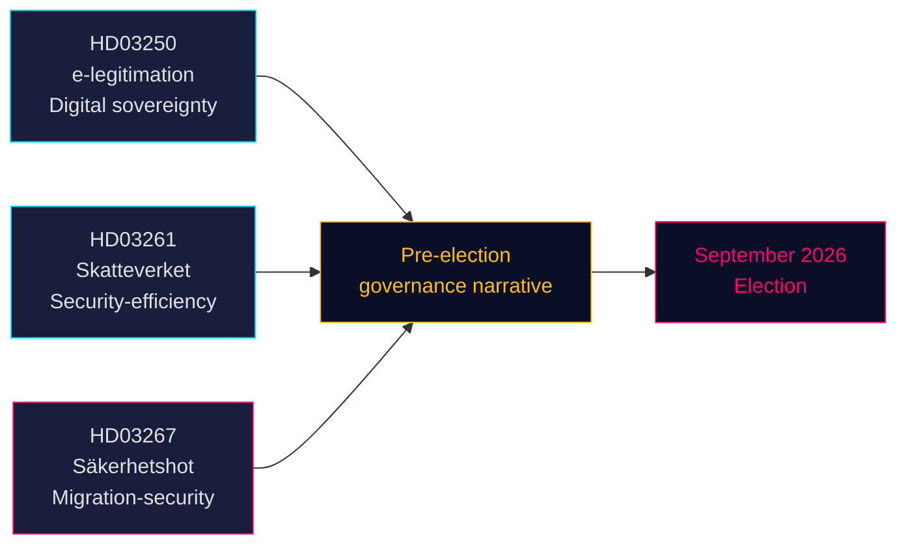

<!-- dir: rtl -->
# שלושה הצעות חוק מסמנות קורס טרום-בחירתי לעבר ביטחון וממשל דיגיטלי

**מחבר**: ג'יימס פת'ר סורלינג  
**תאריך**: 2026-05-14 (בתוקף מ: 2026-05-07)  
**סיווג**: ציבורי | **רמת אמינות**: גבוהה [B2]  
**קרבה לבחירות**: ≤6 חודשים (ספטמבר 2026)

## 🎯 תמצית ביצועית

ממשלת טידו הגישה ב-7 במאי 2026 שלוש הצעות חוק המגדירות יחדיו את הנרטיב הפוליטי שלה לפני הבחירות: מערכת זהות דיגיטלית ממלכתית (HD03250) העוגנת את הריבונות הדיגיטלית של שוודיה, הרחבת סמכויות רישום האוכלוסיה לרשות המסים (HD03261) המאותתת על ממשל יעילות-ביטחון, וחיזוק חד של סמכויות גירוש נגד איומי ביטחון מוסמכים (HD03267) המכוון ישירות לבסיס הבוחרים של SD. שלוש ההצעות מתקדמות לפני בחירות ספטמבר 2026, מה שמכביד על לוח הזמנים הפרלמנטרי ומאלץ את מפלגות האופוזיציה להגיב על שטח שבחרה הממשלה.

## 🧭 3 החלטות שמסמך זה תומך בהן

1. **תזמון ועדות הריקסדאג** — שלוש ההצעות דורשות דיוני ועדה והצבעות לפני הפסקת הקיץ (≈ יוני 2026). לוח הזמנים הפרלמנטרי הצפוף מקצץ בזמן הוויכוח.
2. **מיצוב האופוזיציה** — S, V, MP מתמודדות עם בחירות קשות: להתנגד ל-HD03267 (גירוש ביטחוני) ולסכן מסגור "רך על פשע/ביטחון", או לתמוך בו ולאשר את הנרטיב ההגירתי של טידו.
3. **חברה אזרחית / ערעורים משפטיים** — הסטנדרט הרחב של "איום ביטחוני מוסמך" ב-HD03267 מזמין אתגרים לפי ECHR סעיף 8 וסעיף 3; ארגוני NGO וקבוצות עורכי דין לזכויות חייבות להכין הגשות לפני הצבעת הריקסדאג.

## ממצאים עיקריים

### 1. זהות אלקטרונית ממלכתית — En statlig e-legitimation (HD03250)
שוודיה מציעה זהות דיגיטלית שתנופק על ידי המדינה כתוספת למונופול BankID מבוסס השוק הנוכחי. ההצעה מגיבה לדרישות תקנת eIDAS2 של האיחוד האירופי ולחששות תחרות. רשות ממלכתית חדשה (שם עבודה: *Statens e-legitimationsmyndighet*) תנפק את האישור. ציר זמן יישום: 2027–2028. ועדה: TU. משמעות: בינונית-גבוהה (תשתית דיגיטלית + ציות לאיחוד האירופי).

### 2. סמכויות רישום אוכלוסיה מורחבות של Skatteverket (HD03261)
רשות המסים מקבלת סמכות חדשה להצלבה ואימות נתוני רישום אוכלוסיה מול מרשמים אחרים לצורך מאבק בהונאה, מניפולציית זהות ורישום כתובות שגוי. מגיבה ישירות לדוחות האחרונים של Skatteverket על כתובות פיקטיביות וניצול מערכת ה-folkbokföring על ידי הפשע המאורגן. ועדה: SkU. רגישות פוליטית: בינונית (מסגור יעילות, אך חששות חירויות אזרחיות לגבי היקף המעקב).

### 3. הגנה מחוזקת נגד זרים — איומי ביטחון — Stärkt skydd mot utlänningar — säkerhetshot (HD03267)
הצעת החוק הטעונה ביותר פוליטית: יוצרת קטגוריה משפטית חדשה של "איום ביטחוני מוסמך" (kvalificerat säkerhetshot) המאפשרת גירוש זרים שה-SÄPO מעריכה כאיום ללא ביקורת שיפוטית מלאה, על סמך ראיות חסויות. מחלוקת: תאימות עם ECHR סעיף 8, סעיף 3 וערובות משפט הוגן (סעיף 6). שר המשפטים גונר סטרומר (M) מכנה זאת חיונית לביטחון לאומי לפני הבחירות. ועדה: JuU. משמעות: **גבוהה** (מקדם קרבה לבחירות 1.5× פעיל; תחום מדיניות שנוי במחלוקת).

## הערכה אסטרטגית



## הקשר כלכלי

קרן המטבע הבינלאומית WEO אפריל 2026: צמיחת תמ"ג ריאלי של שוודיה ל-2026 מוערכת ב-2.1%, חוב ממשלתי ברוטו ~35% מהתמ"ג (WEO:GGXWDG_NGDP, SWE, הערכת 2026). מרחב פיסקלי זמין לרשות חדשה (רשות הזהות האלקטרונית) ללא השפעה תקציבית מהותית. מסלול ריבית ה-Riksbank: מחזור הרחבה מתמשך.

## ⚠️ אזהרה קריטית: סיכון פרוצדורלי של ECHR (HD03267)

הצעת הגירוש הביטחוני (HD03267) חסרת מנגנון עורך דין מיוחד — ההגנה הפרוצדורלית המינימלית שנקבעה על ידי בית הדין האירופי לזכויות אדם בפרשת *Othman (Abu Qatada) נגד בריטניה* [2012] ECHR 56 לשימוש בראיות חסויות בהליכי גירוש. ה-Lagrådet צפוי להעלות חשש זה. אם תתקבל ללא תיקון, השימוש הראשון של SÄPO בנתיב החדש נגד אדם בעל פרופיל גבוה עשוי להוביל לבקשה לצו זמני לפי כלל ECHR 39. סיכון תזמון: עשוי להתממש בתקופה שלפני הבחירות אוגוסט–ספטמבר 2026.

## נתוני מקור כלכלי
```json
{"economicProvenance": {"provider": "imf", "dataflow": "WEO", "indicator": "NGDP_RPCH / GGXWDG_NGDP", "vintage": "Apr-2026", "retrieved_at": "2026-05-14", "stale": false}}
```

<!-- source-sha: 13fb01dbf19848515cc9696908bf9f099436e97c -->
