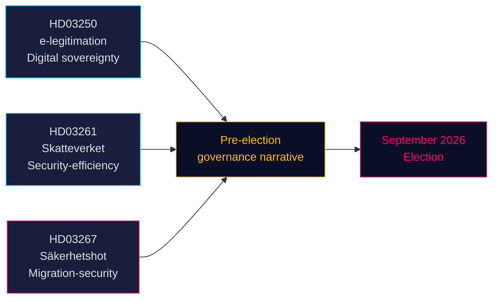

# 3つの法案が選挙前の安全保障・デジタルガバナンス路線を示す

**著者**：ジェームズ・ペター・ソーリング  
**日付**：2026-05-14（有効日：2026-05-07）  
**分類**：公開 | **信頼度**：高 [B2]  
**選挙までの距離**：6ヶ月以内（2026年9月）

## 🎯 BLUF（要旨）

ティドー政権は2026年5月7日に3つの法案を提出し、選挙前の政策ナラティブを包括的に定義した。国家デジタルIDシステム（HD03250）によるスウェーデンのデジタル主権の確立、Skatteverket（税務署）の人口登録権限拡大（HD03261）による効率・安全保障ガバナンスの示唆、そして資格ある安全保障上の脅威に対する著しく強化された国外退去権限（HD03267）によるSD支持層への直接アピールである。3つの法案はいずれも2026年9月の選挙前に審議され、議会の日程を圧迫し、野党各党を政府が選んだ土俵での対応に追い込む。

## 🧭 この文書が支援する3つの意思決定

1. **リクスダーグ委員会の日程調整** — 3つの法案はいずれも夏季休会前（≈2026年6月）に委員会審議と採決が必要。タイトな議会日程が討議時間を圧縮する。
2. **野党のポジショニング** — S、V、MPは難しい選択に直面している：HD03267（安全保障退去）に反対して「犯罪・安全保障に甘い」というフレーミングのリスクを取るか、支持してティドーの移民ナラティブを承認するか。
3. **市民社会・法的異議申立て** — HD03267の広範な「資格ある安全保障上の脅威」基準は、ECHR第8条・第3条への異議を招く；NGOや法律権利団体はリクスダーグ採決前に意見書を準備する必要がある。

## 主要な所見

### 1. 国家デジタルID — En statlig e-legitimation (HD03250)
スウェーデンは現在の市場型BankID独占を補完する国家発行デジタルIDを提案する。EU eIDAS2規則の要件と競争上の懸念に対応するもの。新たな国家機関（仮称：*Statens e-legitimationsmyndighet*）が認証情報を発行する。実施スケジュール：2027〜2028年。委員会：TU。重要度：中〜高（デジタルインフラ＋EU準拠）。

### 2. Skatteverketの人口登録権限拡大 (HD03261)
税務署は詐欺、本人確認操作、誤った住所登録に対処するため、人口登録データを他の台帳と相互照合・検証する新たな権限を取得する。幽霊住所とフォルクボクフォリング（住民登録）システムの組織犯罪による悪用に関するSkatteverketの最近の報告に直接対応するもの。委員会：SkU。政治的感度：中程度（効率フレーミング、ただし監視範囲に関する市民的自由上の懸念あり）。

### 3. 外国人に対する強化保護 — 安全保障上の脅威 — Stärkt skydd mot utlänningar — säkerhetshot (HD03267)
最も政治的に白熱した法案：SÄPOによって脅威と評価された外国人を機密証拠に基づき完全な司法審査なしに国外退去させることを可能にする新たな法律カテゴリ「資格ある安全保障上の脅威」(kvalificerat säkerhetshot)を創設する。論争：ECHR第8条、第3条、および公正な裁判の保障（第6条）との適合性。法務大臣グンナル・ストロンメル（M）は選挙前の国家安全保障に不可欠と表明。委員会：JuU。重要度：**高**（選挙接近係数1.5×稼働中；争点の多い政策領域）。

## 戦略的評価



## 経済的文脈

IMF WEO 2026年4月：スウェーデンの2026年実質GDP成長率は2.1%と推定、政府総債務はGDP比約35%（WEO:GGXWDG_NGDP、SWE、2026年推計）。新機関（デジタルID機関）向けに予算上の実質的影響なしに財政余力あり。Riksbankの政策金利軌道：緩和サイクル継続中。

## ⚠️ 重大警告：ECHRの手続き上のリスク (HD03267)

安全保障退去法案（HD03267）は特別代理人制度を欠いており、これは国外退去手続きにおける機密証拠の使用に関してECHRが*Othman (Abu Qatada) v. 英国* [2012] ECHR 56で確立した最低限の手続的保護である。ラグロデットがこの懸念を提起することが予想される。修正なしに成立した場合、SÄPOが著名人に対して新しいトラックを最初に適用した際にECHR規則39に基づく暫定措置申請が起こされる可能性が高い。タイミングリスク：これは2026年8〜9月の選挙前期間に顕在化する可能性がある。

## 経済的出典データ
```json
{"economicProvenance": {"provider": "imf", "dataflow": "WEO", "indicator": "NGDP_RPCH / GGXWDG_NGDP", "vintage": "Apr-2026", "retrieved_at": "2026-05-14", "stale": false}}
```

<!-- source-sha: 13fb01dbf19848515cc9696908bf9f099436e97c -->
