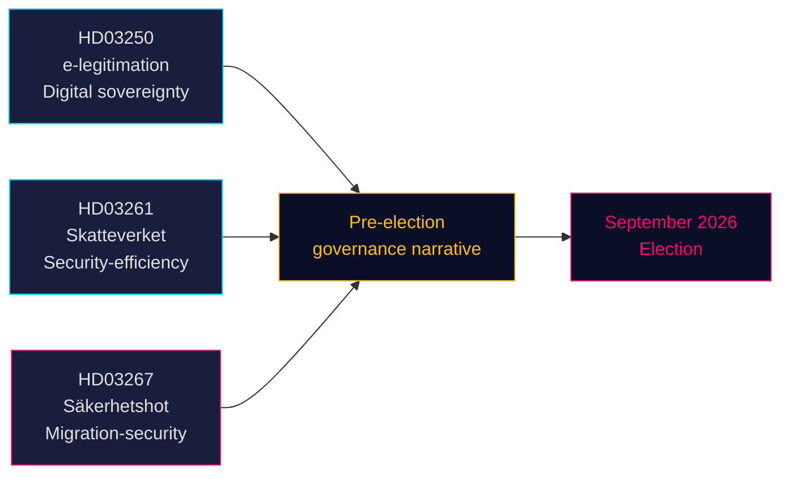

# 세 가지 법안, 선거 전 안보·디지털 거버넌스 노선 신호

**저자**: 제임스 페터 쇠를링  
**날짜**: 2026-05-14 (발효일: 2026-05-07)  
**분류**: 공개 | **신뢰도**: 높음 [B2]  
**선거 근접도**: ≤6개월 (2026년 9월)

## 🎯 BLUF (핵심 요약)

티도 정부는 2026년 5월 7일 세 가지 법안을 제출하여 선거 전 정책 서사를 포괄적으로 정의했다. 스웨덴의 디지털 주권을 확립하는 국가 전자신분증 시스템(HD03250), 효율성·안보 거버넌스를 신호하는 세무청의 인구등록 권한 확대(HD03261), 그리고 SD 지지층을 직접 겨냥한 자격 있는 안보 위협에 대한 대폭 강화된 추방 권한(HD03267)이다. 세 법안 모두 2026년 9월 선거 전에 처리되어 의회 일정을 압축하고 야당들이 정부가 선택한 영역에서 대응하도록 강요한다.

## 🧭 이 문서가 지원하는 3가지 의사결정

1. **릭스다그 위원회 일정** — 세 법안 모두 여름 휴회 전(≈ 2026년 6월) 위원회 심의와 표결이 필요. 빡빡한 의회 일정으로 토론 시간이 압축된다.
2. **야당 포지셔닝** — S, V, MP는 어려운 선택에 직면: HD03267(안보 추방)에 반대하여 "범죄/안보에 유약"한 프레이밍 위험을 감수하거나, 지지하여 티도의 이민 서사를 승인하거나.
3. **시민사회 / 법적 이의제기** — HD03267의 광범위한 "자격 있는 안보 위협" 기준은 ECHR 제8조·제3조 이의제기를 초래할 수 있다; NGO와 법률 권리 단체들은 릭스다그 표결 전에 의견서를 준비해야 한다.

## 주요 발견사항

### 1. 국가 전자신분증 — En statlig e-legitimation (HD03250)
스웨덴은 현재 시장 기반 BankID 독점을 보완할 국가 발행 디지털 신원을 제안한다. EU eIDAS2 규정 요건과 경쟁 우려에 대응. 새로운 국가 기관(임시명: *Statens e-legitimationsmyndighet*)이 자격증명을 발행할 예정. 구현 일정: 2027~2028년. 위원회: TU. 중요도: 중간~높음(디지털 인프라 + EU 준수).

### 2. Skatteverket 인구등록 권한 확대 (HD03261)
세무청은 사기, 신원 조작 및 잘못된 주소 등록을 방지하기 위해 인구등록 데이터를 다른 등록부와 상호 조회·검증하는 새로운 권한을 획득한다. 유령 주소와 조직범죄의 folkbokföring 시스템 악용에 관한 Skatteverket의 최근 보고서에 직접 대응. 위원회: SkU. 정치적 민감도: 중간(효율성 프레임, 다만 감시 범위에 관한 시민 자유 우려 존재).

### 3. 외국인에 대한 강화된 보호 — 안보 위협 — Stärkt skydd mot utlänningar — säkerhetshot (HD03267)
정치적으로 가장 민감한 법안: SÄPO가 위협으로 평가한 외국인을 기밀 증거를 근거로 완전한 사법 심사 없이 추방할 수 있는 새로운 법적 범주 "자격 있는 안보 위협"(kvalificerat säkerhetshot)을 생성한다. 논란: ECHR 제8조, 제3조 및 공정 재판 보장(제6조)과의 양립 가능성. 법무부장관 군나르 스트뢰메르(M)는 선거 전 국가안보에 필수적이라고 표명. 위원회: JuU. 중요도: **높음**(선거 근접도 계수 1.5× 활성화; 논쟁적 정책 영역).

## 전략적 평가



## 경제적 맥락

IMF WEO 2026년 4월: 스웨덴 2026년 실질 GDP 성장률 2.1% 추정, 정부 총채무 GDP 대비 약 35%(WEO:GGXWDG_NGDP, SWE, 2026년 추정). 새 기관(전자신분증 기관) 설립을 위한 재정 여유 있음, 예산에 실질적 영향 없음. Riksbank 정책금리 궤도: 완화 사이클 진행 중.

## ⚠️ 주요 경고: ECHR 절차적 위험 (HD03267)

안보 추방 법안(HD03267)은 특별 옹호인 제도가 없다 — 추방 절차에서 기밀 증거 사용을 위해 ECHR이 *Othman (Abu Qatada) 대 영국* [2012] ECHR 56에서 확립한 최소 절차적 보호 장치다. Lagrådet이 이 우려를 제기할 것으로 예상된다. 수정 없이 채택되면 SÄPO가 고프로파일 개인에게 새로운 경로를 최초 적용할 때 ECHR 규정 39에 따른 임시 조치 신청이 촉발될 가능성이 높다. 시기 위험: 2026년 8~9월 선거 전 기간에 현실화될 수 있다.

## 경제 출처 데이터
```json
{"economicProvenance": {"provider": "imf", "dataflow": "WEO", "indicator": "NGDP_RPCH / GGXWDG_NGDP", "vintage": "Apr-2026", "retrieved_at": "2026-05-14", "stale": false}}
```

<!-- source-sha: 13fb01dbf19848515cc9696908bf9f099436e97c -->
