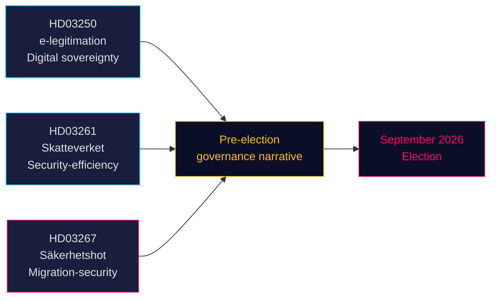

# Drie wetsvoorstellen signaleren een verkiezingsgedreven koers op het gebied van veiligheid en digitaal bestuur

**Auteur**: James Pether Sörling  
**Datum**: 2026-05-14 (van kracht: 2026-05-07)  
**Classificatie**: OPENBAAR | **Betrouwbaarheidsniveau**: HOOG [B2]  
**Verkiezingsnabijheid**: ≤6 maanden (september 2026)

## 🎯 BLUF

De Tidö-regering diende op 7 mei 2026 drie wetsvoorstellen in die gezamenlijk het pre-electorale politieke narratief definiëren: een staatlijk e-identiteitssysteem (HD03250) dat Zweden's digitale soevereiniteit verankert, uitgebreide bevolkingsregistratiebevoegdheden voor de Belastingdienst (HD03261) die efficiëntie- en veiligheidsbestuur signaleren, en aanzienlijk versterkte uitzettingsbevoegdheden tegen gekwalificeerde veiligheidsdreigingen (HD03267) die rechtstreeks gericht zijn op het SD-electoraat. Alle drie wetsvoorstellen worden behandeld vóór de verkiezingen van september 2026, wat de parlementaire agenda verdicht en de oppositiepartijen dwingt te reageren op door de regering gekozen terrein.

## 🧭 3 Beslissingen die dit document ondersteunt

1. **Riksdag-commissieplanning** — Alle drie wetsvoorstellen vereisen commissievergaderingen en stemmingen vóór het zomerreces (≈ juni 2026). De krappe parlementaire agenda beperkt de debattijd.
2. **Oppositiepositiebepaling** — S, V, MP staan voor moeilijke keuzes: HD03267 (veiligheidsuitwijzing) afwijzen en het risico lopen te worden geframed als 'soft on crime/security', of het steunen en het Tidö-migratienarratief valideren.
3. **Maatschappelijk middenveld / juridische aanvechting** — De brede norm 'gekwalificeerde veiligheidsdreiging' van HD03267 nodigt uit tot betwistingen op grond van EVRM art. 8 en art. 3; ngo's en juridische belangenorganisaties moeten verweerschriften voorbereiden vóór de Riksdag-stemming.

## Hoofdbevindingen

### 1. En statlig e-legitimation (HD03250)
Zweden stelt een door de staat uitgegeven digitale identiteit voor als aanvulling op het huidige marktgebaseerde BankID-monopolie. Het voorstel reageert op de EU eIDAS2-verordening en concurrentieoverwegingen. Een nieuwe staatsautoriteit (werknaam: *Statens e-legitimationsmyndighet*) zal het credential uitgeven. Implementatietijdlijn: 2027–2028. Commissie: TU. Belang: matig-hoog (digitale infrastructuur + EU-compliance).

### 2. Uitgebreide bevolkingsregistratiebevoegdheden van Skatteverket (HD03261)
De Belastingdienst krijgt nieuwe bevoegdheid om bevolkingsregistratiegegevens te koppelen en te valideren met andere registers ter bestrijding van fraude, identiteitsmanipulatie en onjuiste adresregistraties. Reageert direct op recente rapporten van Skatteverket over spookadressen en de exploitatie van het folkbokföring-systeem door de georganiseerde misdaad. Commissie: SkU. Politieke gevoeligheid: gemiddeld (efficiëntieframing, maar burgervrijheidszorgen over de reikwijdte van surveillance).

### 3. Stärkt skydd mot utlänningar — säkerhetshot (HD03267)
Het politiek meest beladen wetsvoorstel: creëert een nieuwe juridische categorie van 'gekwalificeerde veiligheidsdreiging' (kvalificerat säkerhetshot) waarmee vreemdelingen die door SÄPO als bedreigingen worden beoordeeld, kunnen worden uitgezet zonder volledige rechterlijke toetsing, op basis van geclassificeerd bewijs. Controverse: verenigbaarheid met EVRM art. 8, art. 3 en eerlijk-procesgaranties (art. 6). Minister van Justitie Gunnar Strömmer (M) bestempelt het als essentieel voor de nationale veiligheid voor de verkiezingen. Commissie: JuU. Belang: **hoog** (verkiezingsnabijheidsmultiplicator 1,5× actief; omstreden beleidsterrein).

## Strategische beoordeling



## Economische context

IMF WEO apr-2026: Zweedse reële bbp-groei 2026 geschat op 2,1%, brutoschuld ~35% van bbp (WEO:GGXWDG_NGDP, SWE, schatting 2026). Fiscale ruimte voor nieuwe autoriteit (e-identiteitsautoriteit) zonder materiële begrotingsimpact. Riksbank-renteprofiel: lopende versoepelingscyclus.

## ⚠️ Kritische waarschuwing: EVRM-procedureel risico (HD03267)

Het wetsvoorstel inzake veiligheidsuitwijzing (HD03267) mist een bijzondere-advocaatmechanisme — de minimale procedurele waarborg vastgesteld door het EHRM in *Othman (Abu Qatada) t. Verenigd Koninkrijk* [2012] EVRM 56 voor het gebruik van geclassificeerd bewijs in uitzettingsprocedures. Verwacht wordt dat de Lagrådet deze zorg zal uiten. Als het wetsvoorstel zonder wijziging wordt aangenomen, zal de eerste toepassing door SÄPO van het nieuwe traject tegen een prominent individu waarschijnlijk een verzoek om voorlopige maatregel op grond van EVRM Regel 39 uitlokken. Tijdrisico: dit kan zich materialiseren tijdens de pre-electorale periode augustus-september 2026.

## Economische herkomstgegevens
```json
{"economicProvenance": {"provider": "imf", "dataflow": "WEO", "indicator": "NGDP_RPCH / GGXWDG_NGDP", "vintage": "Apr-2026", "retrieved_at": "2026-05-14", "stale": false}}
```

<!-- source-sha: 13fb01dbf19848515cc9696908bf9f099436e97c -->
