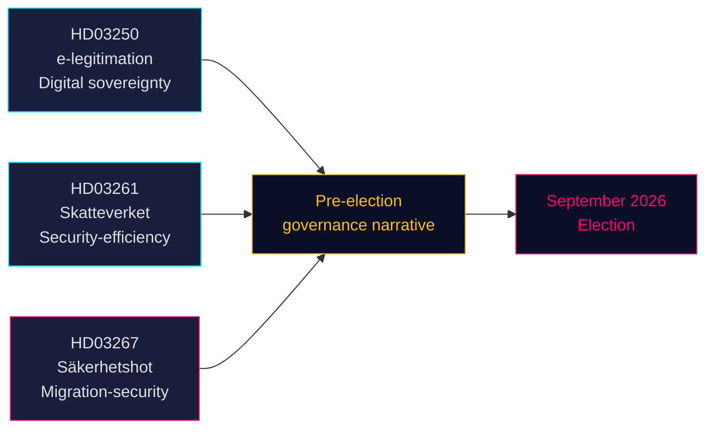

# Tre proposisjoner signaliserer valgdrevne satsinger på sikkerhet og digital styring

**Forfatter**: James Pether Sörling  
**Dato**: 2026-05-14 (gjelder fra: 2026-05-07)  
**Klassifisering**: OFFENTLIG | **Konfidensnivå**: HØY [B2]  
**Valnærhet**: ≤6 måneder (september 2026)

## 🎯 BLUF

Tidö-regjeringen fremla tre proposisjoner 7. mai 2026 som samlet definerer regjeringens narrativ for perioden frem mot valget: et statlig e-identitetssystem (HD03250) som forankrer Sveriges digitale suverenitet, utvidede folkeregistreringsbeføyelser for Skatteverket (HD03261) som signaliserer effektivitets- og sikkerhetsforvaltning, og kraftig styrket utvisningsadgang mot kvalifiserte sikkerhetstrusler (HD03267) som direkte retter seg mot SD-velgernes kjernesaker. Alle tre proposisjoner behandles før valget i september 2026, noe som komprimerer den parlamentariske kalenderen og tvinger opposisjonspartiene til å reagere på valgt regjeringsterreng.

## 🧭 3 Beslutninger dette dokumentet støtter

1. **Stortingsutvalgets planlegging** — Alle tre proposisjoner krever utvalgsbehandling og avstemning før sommerferien (≈ juni 2026). Den stramme parlamentariske kalenderen komprimerer debatten.
2. **Opposisjonens posisjonering** — S, V, MP står overfor vanskelige valg: motsette seg HD03267 (sikkerhetsutvisning) og risikere "myk mot kriminalitet/sikkerhet"-innramming, eller støtte den og validere Tidös migrasjonsnarrativ.
3. **Sivilsamfunn / rettslige utfordringer** — HD03267s brede standard "kvalifisert sikkerhetstrussel" inviterer til ECHR Art. 8- og Art. 3-utfordringer; NGO-er og juridiske interesseorganisasjoner må forberede høringsinnspill før riksdagsavstemningen.

## Sentrale funn

### 1. En statlig e-legitimation (HD03250)
Sverige foreslår en statlig utstedt digital identitet som supplement til det nåværende markedsbaserte BankID-monopolet. Proposisjonen svarer på EUs eIDAS2-forordning og konkurransehensyn. En ny statlig myndighet (arbeidsnavn: *Statens e-legitimationsmyndighet*) skal utstede legitimasjonen. Implementeringstidsplan: 2027–2028. Utvalg: TU. Betydning: moderat-høy (digital infrastruktur + EU-overholdelse).

### 2. Skatteverkets utvidede folkeregistreringsbeføyelser (HD03261)
Skatteverket får ny adgang til å krysskontrollere og validere folkeregistreringsdata mot andre registre for å bekjempe svindel, identitetsmanipulasjon og feil adresseregistreringer. Svarer direkte på Skatteverkets nylige rapporter om spøkeadresser og organisert kriminalitets utnyttelse av folkebokføringssystemet. Utvalg: SkU. Politisk sensitivitet: middels (effektivitetsinnramming, men borgerrettighetsbekymringer om overvåkningens omfang).

### 3. Stärkt skydd mot utlänningar — säkerhetshot (HD03267)
Den mest politisk ladede proposisjonen: oppretter en ny juridisk kategori "kvalifisert sikkerhetstrussel" (kvalificerat säkerhetshot) som muliggjør utvisning av utlendinger som vurderes som trusler av SÄPO uten full domstolsprøving, basert på gradert bevis. Kontrovers: forenelighet med ECHR Art. 8, Art. 3 og rettferdig retterganggarantier (Art. 6). Justisminister Gunnar Strömmer (M) betegner det som nødvendig for nasjonal sikkerhet før valget. Utvalg: JuU. Betydning: **høy** (valgdistansekoeffisient 1,5× aktiv; omstridt politikkområde).

## Strategisk vurdering



## Økonomisk kontekst

IMF WEO apr-2026: Sveriges reale BNP-vekst 2026 estimert til 2,1 %, bruttogjeldsandel ~35 % av BNP (WEO:GGXWDG_NGDP, SWE, 2026 estimat). Finanspolitisk handlingsrom for ny myndighet (e-legitimasjonsmyndighet) uten vesentlig budsjettvirkning. Riksbankens rentetrend: pågående lettelsessyklus.

## ⚠️ Kritisk advarsel: ECHR-prosessuell risiko (HD03267)

Proposisjonen om sikkerhetsutvisning (HD03267) mangler en spesialadvokatordning — den minimale prosessuelle garanti fastslått av EMD i *Othman (Abu Qatada) mot Storbritannia* [2012] ECHR 56 for bruk av gradert bevis i utvisningssaker. Lagrådet forventes å reise dette spørsmålet. Vedtas proposisjonen uten endring, vil SÄPOs første bruk av det nye sporet mot en profilert person sannsynligvis utløse en søknad om midlertidig forføyning etter ECHR regel 39. Tidsrisiko: dette kan materialisere seg i perioden august–september 2026 i forkant av valget.

## Økonomiproveniens
```json
{"economicProvenance": {"provider": "imf", "dataflow": "WEO", "indicator": "NGDP_RPCH / GGXWDG_NGDP", "vintage": "Apr-2026", "retrieved_at": "2026-05-14", "stale": false}}
```

<!-- source-sha: 13fb01dbf19848515cc9696908bf9f099436e97c -->
