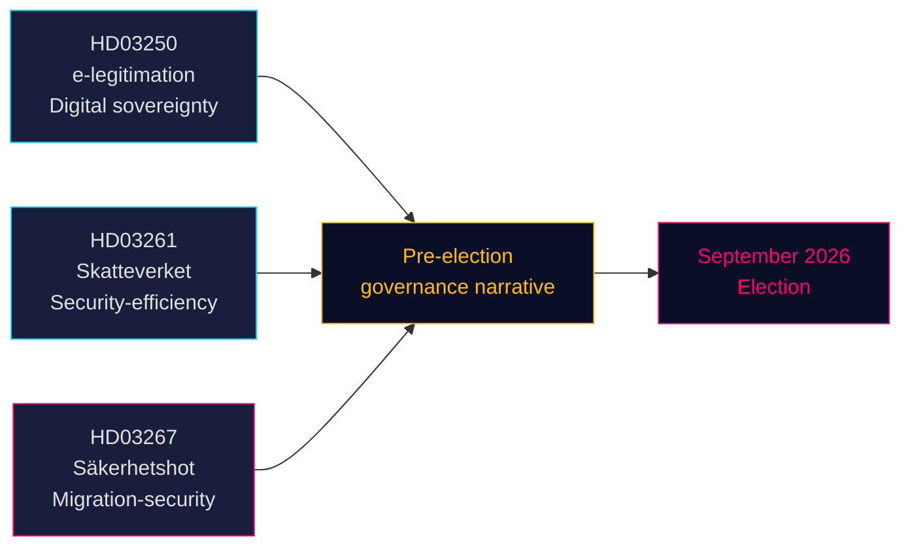

# Tre propositioner signalerar valdrivna satsningar på säkerhet och digital styrning

**Författare**: James Pether Sörling  
**Datum**: 2026-05-14 (gäller från: 2026-05-07)  
**Klassificering**: OFFENTLIG | **Konfidensgrad**: HÖG [B2]  
**Valnärhet**: ≤6 månader (september 2026)

## 🎯 BLUF

Tidöregeringen lade fram tre propositioner den 7 maj 2026 som sammantaget definierar regeringens förvalvärdsberättelse: ett statligt e-legitimationssystem (HD03250) som förankrar Sveriges digitala suveränitet, utvidgade folkbokföringsuppgifter för Skatteverket (HD03261) som signalerar effektivitets- och säkerhetsstyrning, samt kraftigt förstärkt utvisningsbefogenhet mot kvalificerade säkerhetshot (HD03267) som direkt riktar sig till SD:s väljarBas. Alla tre propositioner behandlas före valet i september 2026, vilket pressar den parlamentariska kalendern och tvingar oppositionspartierna att reagera på regeringsvalt terrain.

## 🧭 3 Beslut som detta underrättelsedokument stödjer

1. **Riksdagsutskottets planering** — Alla tre propositioner kräver utskottsbehandling och omröstning före sommaruppehållet (≈ juni 2026). Den snäva parlamentariska kalendern komprimerar debattstiden.
2. **Oppositionens positionering** — S, V, MP ställs inför svåra val: motsätta sig HD03267 (säkerhetsutvisning) och riskera "mjuk mot brott/säkerhet"-inramning, eller stödja den och validera Tidös migrationsberättelse.
3. **Civilsamhälle / rättsliga överklaganden** — HD03267:s breda standard "kvalificerat säkerhetshot" inbjuder till ECHR Art. 8- och Art. 3-utmaningar; NGO:er och rättighetsadvokater måste förbereda remissyttranden före riksdagsomröstningen.

## Viktiga iakttagelser

### 1. En statlig e-legitimation (HD03250)
Sverige föreslår en statligt utfärdad digital identitet som komplement till det nuvarande marknadsbaserade BankID-monopolet. Propositionen svarar på EU:s eIDAS2-förordning och konkurrensproblem. En ny statlig myndighet (arbetsnamn: *Statens e-legitimationsmyndighet*) ska utfärda legitimationen. Implementeringstidplan: 2027–2028. Utskott: TU. Betydelse: måttlig-hög (digital infrastruktur + EU-efterlevnad).

### 2. Skatteverkets utvidgade folkbokföringsbefogenheter (HD03261)
Skatteverket får ny befogenhet att korskontrollera och validera folkbokföringsdata mot andra register för att bekämpa bedrägerier, identitetsmanipulation och felaktiga adressregistreringar. Svarar direkt på Skatteverkets senaste rapporter om spökadressen och organiserad brottslighets utnyttjande av folkbokföringssystemet. Utskott: SkU. Politisk känslighet: medel (effektivitetsinramning, men medborgerliga frihetsbekymmer kring övervakningens omfattning).

### 3. Stärkt skydd mot utlänningar — säkerhetshot (HD03267)
Den politiskt mest laddade propositionen: skapar en ny rättslig kategori "kvalificerat säkerhetshot" (kvalificerat säkerhetshot) som möjliggör utvisning av utlänningar som av SÄPO bedöms utgöra hot utan fullständig domstolsprövning, på grundval av klassificerade bevis. Kontrovers: förenlighet med ECHR Art. 8, Art. 3 och rätten till rättvis rättegång (Art. 6). Justitieminister Gunnar Strömmer (M) framhåller det som nödvändigt för nationell säkerhet inför valet. Utskott: JuU. Betydelse: **hög** (valnärhetskoefficient 1,5× aktiv; omtvistat politikområde).

## Strategisk bedömning



## Ekonomisk kontext

IMF WEO apr-2026: Sveriges reala BNP-tillväxt 2026 beräknas till 2,1 %, statsskuld brutto ~35 % av BNP (WEO:GGXWDG_NGDP, SWE, 2026 prognos). Finansiellt utrymme finns för ny myndighet (e-legitimationsmyndigheten) utan materiell budgetpåverkan. Riksbankens reporäntebana: pågående lättnadscykel.

## ⚠️ Kritisk varning: ECHR-processuell risk (HD03267)

Propositionen om säkerhetsutvisning (HD03267) saknar ett system med särskild advokat — den minimiprocedurella garanti som fastlagts av ECHR i *Othman (Abu Qatada) mot Storbritannien* [2012] ECHR 56 för användning av klassificerade bevis i utvisningsärenden. Lagrådet förväntas lyfta denna fråga. Om propositionen antas utan ändring är det troligt att SÄPO:s första tillämpning av det nya förfarandet mot en välkänd person leder till en begäran om interimistisk åtgärd enligt ECHR regel 39. Tidrisk: detta kan materialisera sig under förvalperioden augusti–september 2026.

## Ekonomisk proveniens
```json
{"economicProvenance": {"provider": "imf", "dataflow": "WEO", "indicator": "NGDP_RPCH / GGXWDG_NGDP", "vintage": "Apr-2026", "retrieved_at": "2026-05-14", "stale": false}}
```

<!-- source-sha: 13fb01dbf19848515cc9696908bf9f099436e97c -->
