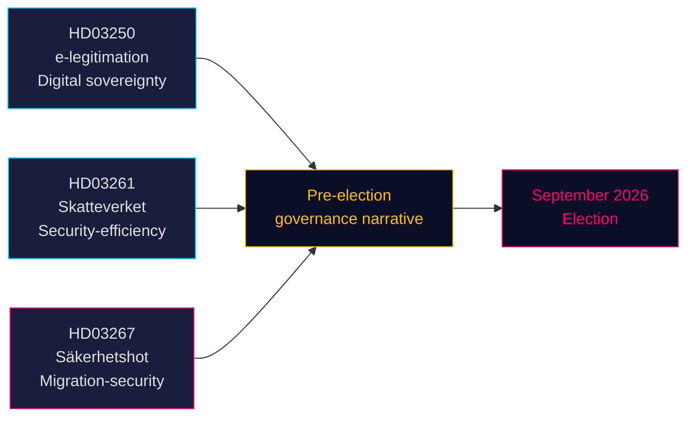

# 三项法案预示选前安全与数字治理路线

**作者**：詹姆斯·彼得·索林  
**日期**：2026-05-14（生效日期：2026-05-07）  
**分类**：公开 | **置信度**：高 [B2]  
**选举临近度**：≤6个月（2026年9月）

## 🎯 执行摘要

提多政府于2026年5月7日提出三项法案，共同构建其选前政策叙事：国家电子身份系统（HD03250）奠定瑞典数字主权基础，Skatteverket扩展的人口登记权限（HD03261）传递效率和安全治理信号，以及针对合格安全威胁的大幅强化驱逐权限（HD03267），直接指向SD选民基本盘。三项法案均在2026年9月选举前推进，压缩议会日历，迫使反对党在政府选定的战场上作出回应。

## 🧭 本文件支持的3项决策

1. **里克斯达格委员会日程安排** — 三项法案均需在夏季休会前（≈ 2026年6月）完成委员会听证和投票。紧凑的议会日程压缩辩论时间。
2. **反对派定位** — S、V、MP面临艰难选择：反对HD03267（安全驱逐）并冒着"对犯罪/安全软弱"的定性风险，或支持它并验证提多的移民叙事。
3. **公民社会/法律挑战** — HD03267宽泛的"合格安全威胁"标准将引发ECHR第8条和第3条的质疑；非政府组织和法律倡导团体必须在里克斯达格投票前准备意见书。

## 主要发现

### 1. 国家电子身份证 — En statlig e-legitimation (HD03250)
瑞典提议建立国家颁发的数字身份，作为现有市场型BankID垄断的补充。法案回应欧盟eIDAS2法规要求和竞争关切。新的国家机构（工作名称：*Statens e-legitimationsmyndighet*）将颁发证件。实施时间表：2027–2028年。委员会：TU。重要性：中高（数字基础设施+欧盟合规）。

### 2. Skatteverket扩展的人口登记权限 (HD03261)
税务局获得新权限，可将人口登记数据与其他登记册交叉核查验证，以打击欺诈、身份操控和错误地址注册。直接回应Skatteverket近期关于幽灵地址和有组织犯罪利用folkbokföring系统的报告。委员会：SkU。政治敏感度：中等（效率框架，但对监控范围有公民自由方面的关切）。

### 3. 加强对外国人的保护——安全威胁 — Stärkt skydd mot utlänningar — säkerhetshot (HD03267)
政治上最具争议的法案：创建"合格安全威胁"（kvalificerat säkerhetshot）新法律类别，允许在无完整司法审查的情况下，依据机密证据驱逐被SÄPO评估为威胁的外国人。争议：与ECHR第8条、第3条及公正审判保障（第6条）的兼容性。司法部长贡纳尔·斯特雷默（M）将其定性为选前国家安全必需举措。委员会：JuU。重要性：**高**（选举临近系数1.5×激活；政策争议领域）。

## 战略评估



## 经济背景

国际货币基金组织WEO 2026年4月：瑞典2026年实际GDP增长率预计2.1%，政府总债务约占GDP的35%（WEO:GGXWDG_NGDP，SWE，2026年预测）。新机构（电子身份机构）的财政空间充裕，无实质性预算影响。瑞典央行利率路径：宽松周期持续。

## ⚠️ 关键警告：ECHR程序风险 (HD03267)

安全驱逐法案（HD03267）缺少特别辩护人机制——这是欧洲人权法院在*Othman (Abu Qatada)诉英国* [2012] ECHR 56案中确立的驱逐程序中使用机密证据的最低程序保障。预计Lagrådet将提出这一关切。若未经修订通过，SÄPO首次对高知名度人士适用新程序时，很可能触发ECHR第39条规则的临时措施申请。时间风险：此情况可能在2026年8至9月选前期间成真。

## 经济来源数据
```json
{"economicProvenance": {"provider": "imf", "dataflow": "WEO", "indicator": "NGDP_RPCH / GGXWDG_NGDP", "vintage": "Apr-2026", "retrieved_at": "2026-05-14", "stale": false}}
```

<!-- source-sha: 13fb01dbf19848515cc9696908bf9f099436e97c -->
