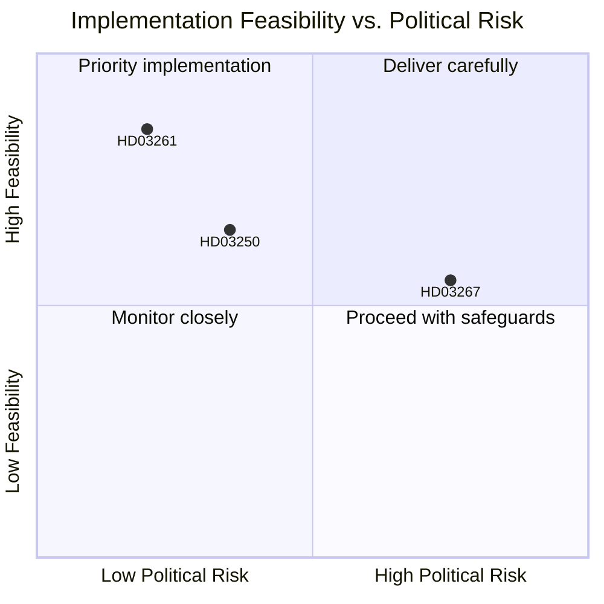

# Implementation Feasibility — Government Propositions 2026-05-07

## HD03250 — State e-ID

| Dimension | Assessment | Rating |
|-----------|-----------|--------|
| Legal authority | EU Regulation 2024/1183 provides clear mandate | HIGH |
| Budget | New agency required; Finansdepartementet has not published full cost analysis | MODERATE |
| Technical complexity | Identity wallet infrastructure; FIDO2/PKI integration | HIGH |
| Interoperability | Must meet eIDAS2 technical specifications by EU deadline | MEDIUM |
| Timeline | EU compliance deadline drives urgency; 2027 target feasible | MODERATE |
| Stakeholder resistance | BankID/banks will delay via lobbying and legal challenge | HIGH |
| **Statskontoret relevance** | Statskontoret capacity assessment of digital agency formation would be appropriate; no specific review found as of 2026-05-14 |
| **Overall feasibility** | **MODERATE-HIGH** — mandate clear, resources uncertain |

## HD03261 — Skatteverket Registers

| Dimension | Assessment | Rating |
|-----------|-----------|--------|
| Legal authority | Expansion of existing Skatteverket mandate | HIGH |
| Budget | Incremental; Skatteverket has digital capacity (Statskontoret: strong agency) | HIGH |
| Technical complexity | Cross-register API integration; existing technical infrastructure | LOW-MEDIUM |
| GDPR compliance | IMY oversight required; proportionality assessment pending | MODERATE |
| Timeline | 2026 H2 implementation feasible | HIGH |
| **Statskontoret relevance** | Statskontoret has reviewed Skatteverket digital capacity positively in prior assessments (strong agency rating); direct HD03261 review not found |
| **Overall feasibility** | **HIGH** — incremental expansion of established agency |

## HD03267 — Security Deportation

| Dimension | Assessment | Rating |
|-----------|-----------|--------|
| Legal authority | New legislative track — depends on Riksdag passage | CONDITIONAL |
| Budget | Marginal; SÄPO/Migrationsverket existing infrastructure | HIGH |
| Technical complexity | Legal procedure; classified evidence handling; coordination with SÄPO | MODERATE |
| ECHR compliance | Lagrådet and ECtHR review risk — Special Advocate gap | LOW |
| Implementation timeline | Post-enactment SÄPO operational readiness: 3-6 months | MODERATE |
| Migrationsverket capacity | Strained; new workload without resources (no Statskontoret review found) | LOW |
| **Statskontoret relevance** | Direct capacity review of Migrationsverket for HD03267 not found; Statskontoret has reviewed Migrationsverket generally in 2023 (capacity concerns noted) |
| **Overall feasibility** | **MODERATE** — operationally simple but legally contested |

## Summary Feasibility Matrix

