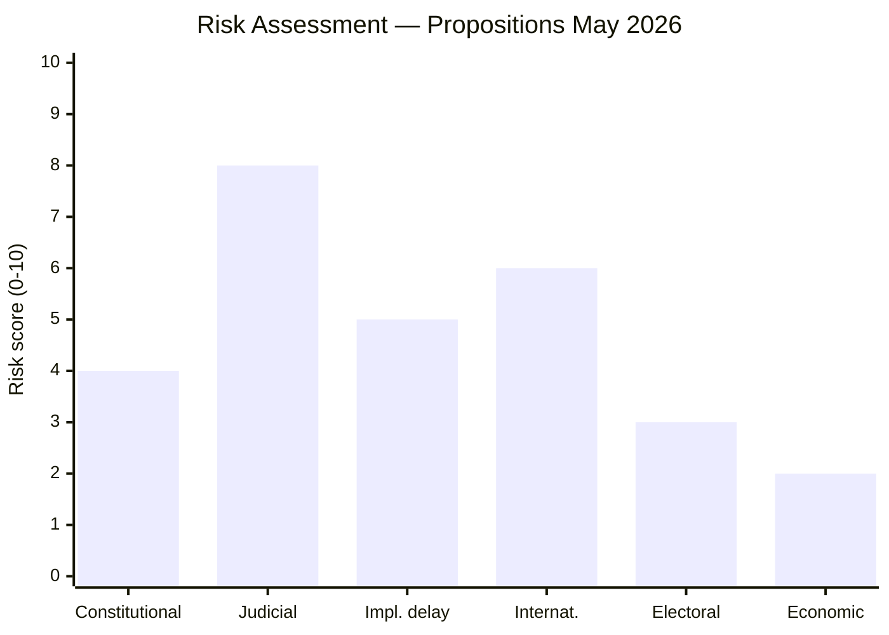

# Risk Assessment — Government Propositions 2026-05-07

**Methodology**: `political-risk-methodology.md`  
**Dimensions**: Constitutional, Institutional, Judicial, International, Economic, Electoral

## Risk Matrix

## HD03267 — Stärkt skydd (Highest risk profile)

### Constitutional risk — MEDIUM (4/10)
RF Chapter 2 rights protections, ECHR incorporation via Swedish Law 1994:1219. HD03267's classified-evidence procedure sits at the boundary of Art. 6 ECHR fair trial. Swedish courts may apply ECHR directly. *Source: HD03267 (riksdagen.se); ECHR Art. 3, 6, 8, 13*

### Judicial risk — HIGH (8/10)
ECtHR has previously found against Sweden in deportation cases (e.g., *N. v. Sweden*, security deportation series). Classified-evidence deportation procedures have been struck down in other Council of Europe member states. Risk: **at least one high-profile ECtHR interim measure expected within 12 months of enactment**. Lagrådet yttrande pending — may recommend mandatory judicial review of classified evidence. *Source: HD03267 (riksdagen.se); ECtHR case database; ECHR Art. 3*

### International reputation risk — MEDIUM-HIGH (6/10)
Nordic partners (Denmark, Norway, Finland) have implemented comparable regimes with more procedural safeguards. EU Agency for Fundamental Rights (FRA) and Council of Europe Commissioner for Human Rights may issue critical statements. *Source: HD03267; European Commission Rule of Law Report*

### Electoral risk — LOW (3/10)
HD03267 is electorally beneficial for the Tidö coalition in the short term. Risk only emerges if a high-profile ECtHR blocking order appears before September 2026. *Source: Swedish opinion polling 2025/2026 — security/migration priority voter segment*

### Statskontoret relevance
Migrationsverket and SÄPO are principal implementing agencies. Statskontoret pre-warm: `none found` — no directly relevant capacity assessment. Migrationsverket already resource-constrained; new security track may require dedicated staffing.

## HD03250 — E-legitimation risk

### Implementation delay — MEDIUM (5/10)
New agency setup timeline 2027–2028 is ambitious. EU eIDAS2 technical specifications not yet fully published; delays possible. BankID consortium may challenge through market competition law. *Source: HD03250 (riksdagen.se); EU Regulation 2024/1183*

### Economic risk — LOW (2/10)
WEO Apr-2026 Sweden fiscal space adequate (debt 35% GDP). Agency setup cost manageable within existing digital-government budget. (WEO:GGXWDG_NGDP, SWE, 2026)

## HD03261 — Skatteverket risk

### Civil liberties / GDPR risk — MEDIUM (4/10)
Broad register cross-checking mandate requires proportionality assessment under GDPR Art. 5. IMY (Swedish DPA) oversight expected. Risk of scope creep — expanded powers persist after initial fraud-reduction phase. *Source: HD03261 (riksdagen.se)*

### Institutional risk — LOW (2/10)
Skatteverket has strong digital capacity and trust. Implementation risk is low. *Source: HD03261; Skatteverket annual report*
