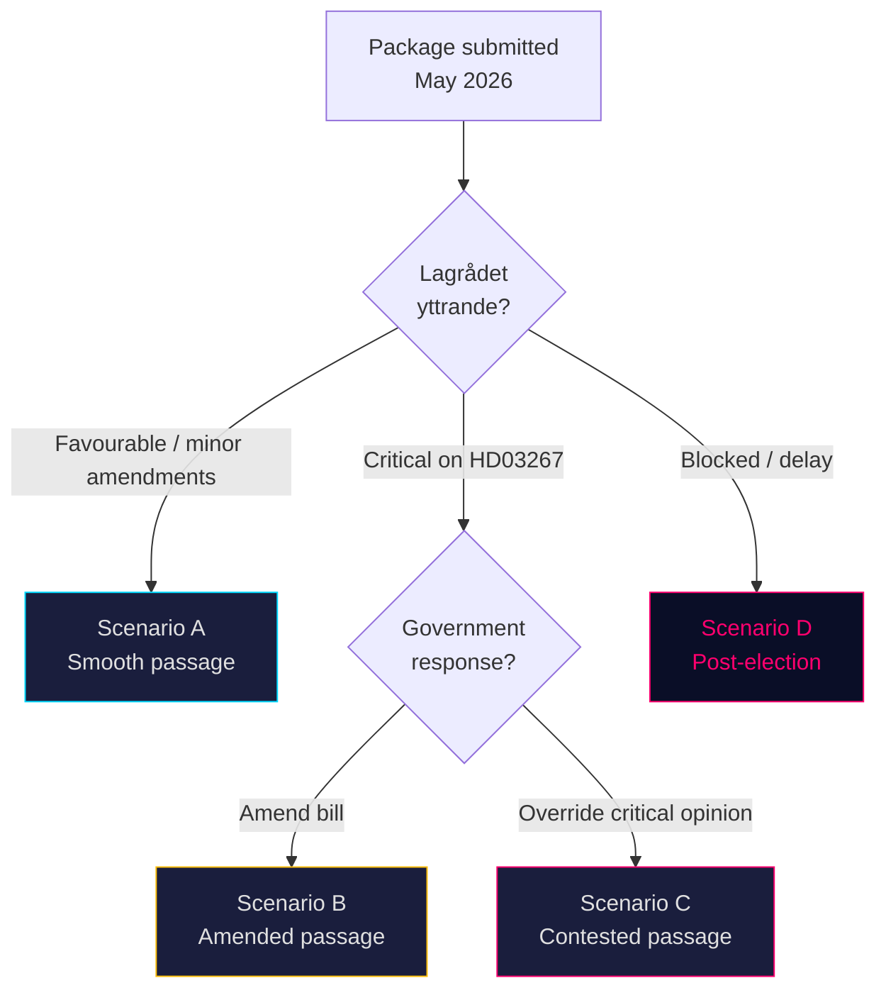

# Scenario Analysis — Government Propositions 2026-05-07

**Methodology**: Scenario tree — 4 scenarios for the proposition package outcome

## Scenario Framework

## Scenario A — Smooth Passage Before Election (Probability: 30%)

**Narrative**: Lagrådet issues a broadly supportive yttrande on HD03267 with only minor technical recommendations. All three propositions pass committee before summer recess. HD03267 enters into force autumn 2026. SÄPO can begin using the new deportation track.

**Indicators**:
- Lagrådet yttrande published by June 2026 with no blocking criticism
- JuU schedules hearings before 17 June
- S votes for HD03267 in committee (signals broad support)

**Electoral consequence**: Strong Tidö pre-election narrative. SD voters see concrete delivery.

## Scenario B — Amended Passage (Probability: 40%)

**Narrative**: Lagrådet issues critical yttrande on HD03267 ECHR procedural compatibility. Government accepts limited amendments (e.g., mandatory special advocate for subjects to review classified evidence). Passes with qualified support, including S abstaining or supporting with reservations.

**Indicators**:
- Lagrådet yttrande before mid-June with specific ECHR Art. 6 recommendations
- Government tables amendment within 2 weeks
- S tables own amendments; some adopted

**Electoral consequence**: Government can claim delivery with "responsible" procedural safeguards. Opposition criticism muted. Likely best-case governance outcome.

## Scenario C — Contested Passage / Override (Probability: 20%)

**Narrative**: Government overrides critical Lagrådet opinion on HD03267. Passes with Tidö majority (M/KD/L/C/SD) against S/V/MP. ECtHR interim measures block first deportation attempt within 12 months of enactment.

**Indicators**:
- Government rejects Lagrådet recommendation
- S, V, MP vote against HD03267
- Human rights NGOs immediately file ECtHR applications upon enactment

**Electoral consequence**: Short-term SD-voter enthusiasm; medium-term reputational damage if ECtHR intervenes visibly before or shortly after election.

## Scenario D — Post-Election Delay (Probability: 10%)

**Narrative**: Lagrådet issues blocking criticism of HD03267 close to summer recess deadline; Government lacks time to amend and re-submit. HD03267 pushed to post-election parliament. HD03250 and HD03261 pass normally.

**Indicators**:
- Lagrådet yttrande delayed past late June
- JuU cannot schedule before summer recess
- Government announces post-election consideration

**Electoral consequence**: Significant SD voter disappointment. Risk of coalition tension. M/KD must manage narrative.
