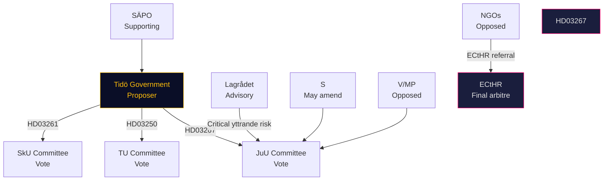

# Stakeholder Perspectives — Government Propositions 2026-05-07

**Framework**: Actor-interest-position matrix

## Principal Stakeholders

### Swedish Government (Tidö Coalition: M, KD, L, C, SD)
**Position**: Proposing party — unanimous coalition support  
**Interest**: Electoral positioning pre-September 2026; HD03267 is SD's core demand; HD03250/HD03261 are KD/M governance agenda  
**Key actor**: Gunnar Strömmer (M) on HD03267; Ebba Busch (KD) on HD03250+HD03261  
**Confidence**: HIGH — government controls bill drafting and committee scheduling  
*Source: HD03267, HD03250, HD03261 (riksdagen.se)*

### Socialdemokraterna (S)
**Position**: Critical on HD03267 (procedural concerns); likely support on HD03261 (anti-fraud); neutral-positive on HD03250  
**Interest**: Avoid "soft on crime" framing while maintaining rule-of-law credibility  
**Key tension**: S may table amendments to HD03267 requiring judicial review of classified evidence — if accepted by Government, S can claim co-ownership; if rejected, strengthens opposition narrative  
*Source: S party programme; parliamentary debate pattern*

### Vänsterpartiet (V) and Miljöpartiet (MP)
**Position**: Full opposition to HD03267 (civil liberties); procedural objections to HD03261; neutral-positive on HD03250  
**Interest**: Maintain civil liberties / human rights identity; differentiate from S  
**Impact**: V+MP unlikely to affect outcome but shape media framing  
*Source: V/MP party programmes*

### Säkerhetspolisen (SÄPO)
**Position**: Strong support for HD03267 — law gives SÄPO operational tool they have lobbied for  
**Interest**: Close perceived gap between SÄPO assessment and legal expulsion power  
**Influence**: SÄPO's risk assessments provide the evidentiary foundation for the law's operation  
*Source: HD03267 (riksdagen.se); SÄPO annual report 2025*

### Migrationsverket
**Position**: Neutral-administrative — will implement HD03267 if enacted  
**Interest**: New workload without new resources; seeks clarity on evidence-handling procedure  
**Risk**: Agency capacity already strained (Statskontoret: none found for specific review)  
*Source: HD03267; Migrationsverket annual report*

### BankID / Swedish Banks
**Position**: Opposed to HD03250 (market competition threat)  
**Interest**: Protect dominant market position; argue state scheme is unnecessary  
**Influence**: Banks lobby through Swedish Bankers' Association (Bankföreningen)  
*Source: HD03250 (riksdagen.se); Bankföreningen public statements*

### Swedish DPA (IMY)
**Position**: Will scrutinise HD03261 register cross-checking; may require additional safeguards  
**Interest**: Proportionality compliance; GDPR Art. 5 purpose limitation  
*Source: HD03261; IMY annual report 2025*

### Civil Society / Human Rights NGOs
**Position**: Strongly opposed to HD03267  
**Interest**: ECHR procedural standards; protection of persons with strong residence ties  
**Key actors**: Amnesty Sverige, Human Rights Watch, UNHCR Sweden, Röda Korset  
*Source: HD03267; NGO public statements*

### EU and Council of Europe
**Position**: HD03250 — supportive (eIDAS2 compliance); HD03267 — cautionary scrutiny expected  
**Key bodies**: European Commission, FRA, Council of Europe Commissioner for Human Rights  
*Source: EU Regulation 2024/1183; Council of Europe monitoring mechanism*

## Stakeholder Influence Map

