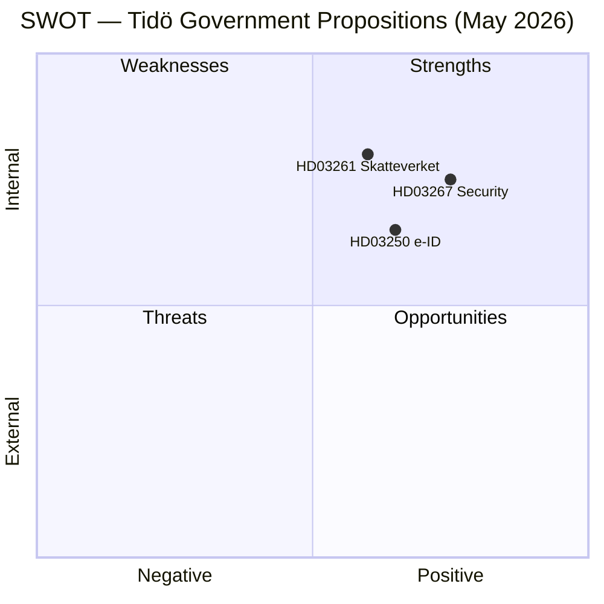

# SWOT Analysis — Government Propositions 2026-05-07

**Framework**: `political-swot-framework.md`  
**Scope**: Cross-proposition package analysis

## Strengths

- **HD03267** — Responds to documented SÄPO threat assessments; addresses legal gap for security deportation that courts have flagged. Coalition fully united: M, KD, L, C, SD unanimous (HD03267, riksdagen.se).
- **HD03250** — EU eIDAS2 mandate removes political controversy about state overreach; digital sovereignty framing is broadly popular. Addresses documented BankID monopoly risk (riksdagen.se, HD03250).
- **HD03261** — Skatteverket has strongest digital-government track record of any Swedish agency; technical capacity high. Anti-fraud mandate is cross-partisan. (HD03261, riksdagen.se)
- Timing package: three propositions in one session creates governance momentum narrative pre-election.

## Weaknesses

- **HD03267** — Classified-evidence deportation procedures conflict with established ECHR fair-trial standards. Lagrådet yttrande pending (potential critical opinion). Risk of ECtHR loss post-enactment damages government credibility.
- **HD03250** — New e-ID authority requires 2–3 year setup; voters will not see the service before the election. Risk of being perceived as "paper reform" (riksdagen.se, HD03250 timeline).
- **HD03261** — Scope of register cross-checking unclear; broad data-sharing mandate could be exploited for purposes beyond fraud (civil liberties risk). (HD03261, riksdagen.se)
- Parliamentary calendar: three committee hearings before summer recess is a tight schedule.

## Opportunities

- **Election 2026**: HD03267 directly targets the largest security-and-migration voter segment. HD03261 anti-fraud narrative appeals to public-efficiency voters. HD03250 positions Sweden as EU digital-leader.
- **Cross-coalition signal**: Package shows M/KD/L/C/SD can govern cohesively on multiple fronts simultaneously.
- **HD03250** aligns with EU Digital Decade 2030 targets — opportunity for Sweden to be referenced as EU implementation leader. (EU Regulation 2024/1183)
- **HD03261** — if implemented early, Skatteverket can demonstrate measurable fraud reduction before election.

## Threats

- **ECHR challenge to HD03267**: ECtHR interim measures could block expulsions; any high-profile case blocked by Strasbourg Court is headline risk. (HD03267, riksdagen.se; ECHR Art. 3, Art. 8)
- **Lagrådet critical yttrande on HD03267**: Could force amendment, delay Riksdag vote past summer, reducing election-campaign benefit.
- **Opposition narrative capture**: S, V, MP can frame HD03267 as "rule-of-law regression" for Nordic/EU audiences; international reputational risk.
- **HD03250 implementation delay**: If EU eIDAS2 technical specifications slip, Sweden's authority cannot launch on time; reform promise becomes unfulfilled.
- **IMF economic headwinds**: WEO Apr-2026 projects Sweden growth 2.1% but uncertainty from global trade fragmentation. Budget constraints could squeeze new agency funding (HD03250). (WEO:NGDP_RPCH, SWE, 2026)
