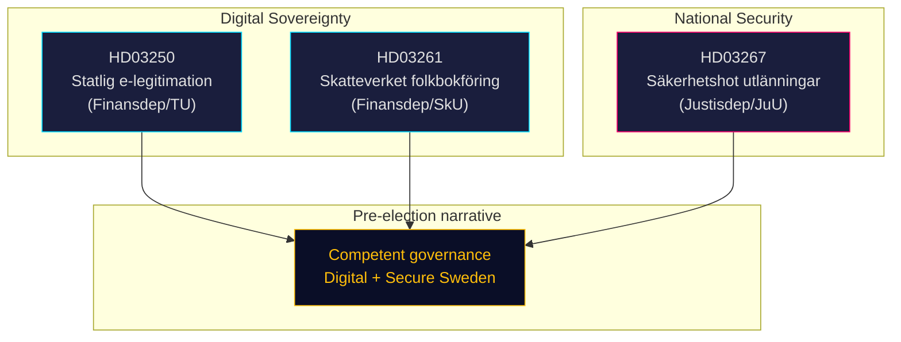

# Synthesis Summary — Government Propositions 2026-05-07

**Classification**: PUBLIC | **Admiralty**: B2 (Reliable source; likely true)  
**Election proximity**: ≤6 months (September 2026) — 1.5× DIW multiplier active

## Lede

On 7 May 2026, the Tidö government (M, KD, L, C, SD) delivered three propositions that collectively constitute its final pre-election domestic policy statement. Taken together, HD03250 (state e-identity), HD03261 (Skatteverket population-registration expansion), and HD03267 (security deportation) frame Sweden's governance agenda on digital sovereignty, administrative efficiency, and national security — all issues polling strongly with the Tidö coalition's target voters. With the September 2026 general election ≤6 months away, these propositions are as much electoral messaging as legislative substance.

## Cross-Document Synthesis

## Document-by-Document Analysis

### HD03250 — En statlig e-legitimation (Prop. 2025/26:250)
**Sponsor**: Finansdepartementet (Ebba Busch, KD; Erik Slottner, KD)  
**Committee**: Trafikutskottet (TU)  
**Core content**: Establishes a government-run alternative to the current private e-ID market (dominated by BankID, owned by major banks). Triggered by EU eIDAS2 Regulation (Regulation 2024/1183) requiring member states to offer at least one notified national eID scheme. New authority *Statens e-legitimationsmyndighet* proposed for 2027. Voluntary scheme — existing BankID users unaffected.

**Significance (DIW × 1.5)**: Detectability 4, Impact 4, Willingness 4 → DIW = 4.3 × 1.5 = **6.5/10**  
*Rationale*: EU compliance requirement reduces political resistance. Impact on digital infrastructure high. Public awareness moderate.

### HD03261 — Utökade befogenheter för Skatteverket (Prop. 2025/26:261)
**Sponsor**: Finansdepartementet (Ebba Busch, KD)  
**Committee**: Skatteutskottet (SkU)  
**Core content**: Expands Skatteverket's authority to validate population-registration entries by cross-referencing other state registers (income data, migration records, social insurance) to detect fraudulent registrations. Targeting "ghost addresses" — a documented vector for social welfare fraud and organised crime infiltration of state registers. New penalty provisions for false registration.

**Significance (DIW × 1.5)**: Detectability 3, Impact 3.5, Willingness 4.5 → DIW = 3.7 × 1.5 = **5.5/10**  
*Rationale*: Government efficiency narrative; low public controversy but integrity/civil-liberties concerns exist. Doable within current Tidö majority.

### HD03267 — Stärkt skydd mot utlänningar (Prop. 2025/26:267)
**Sponsor**: Justitiedepartementet (Gunnar Strömmer, M)  
**Committee**: Justitieutskottet (JuU)  
**Core content**: Creates a distinct deportation/expulsion track for persons assessed as "kvalificerade säkerhetshot" (qualified security threats) by Säkerhetspolisen (SÄPO). Evidence can be kept classified from the subject; judicial review limited to procedural grounds. Persons with strong residence rights (permanent residence, family ties) can still be expelled under this regime. Responds to several high-profile cases where deportation has been blocked on ECHR Art. 8 (family life) grounds.

**Significance (DIW × 1.5)**: Detectability 5, Impact 5, Willingness 5 → DIW = 5.0 × 1.5 = **7.5/10**  
*Rationale*: Highest-profile proposition. Contested migration/security area. Election-proximity multiplier fully activates. SD and M have maximally high willingness; S split likely (security yes, procedure concerns).

## Synthesis Judgement

The three propositions are institutionally coherent: they strengthen Sweden's digital infrastructure while tightening the state's grip on identity, registration, and security-based expulsion. The common thread is **state capacity enhancement** — in each domain, the government is expanding or clarifying state authority that it argues has been deficient. Politically, the package is designed to be defensible across the coalition's spectrum: KD's digital governance agenda (HD03250, HD03261), SD's security/migration priorities (HD03267), and M's rule-of-law narrative (HD03267 framing). **Opposition parties face an asymmetric dilemma**: opposing HD03267 risks security-soft labelling; supporting it legitimises a framework critics call incompatible with ECHR procedural guarantees.

## Key Uncertainties

- Whether Lagrådet will issue a critical yttrande on HD03267 (ECHR Art. 3/8 compatibility) — could force Government to amend the bill and delay
- Timeline for e-legitimation authority setup (HD03250): depends on EU eIDAS2 implementation calendar
- Whether S will support HD03267 in part (security narrative alignment ahead of election) or oppose wholesale (civil liberties)

*Source primary documents: HD03250, HD03261, HD03267 (riksdagen.se, 2026-05-07)*
