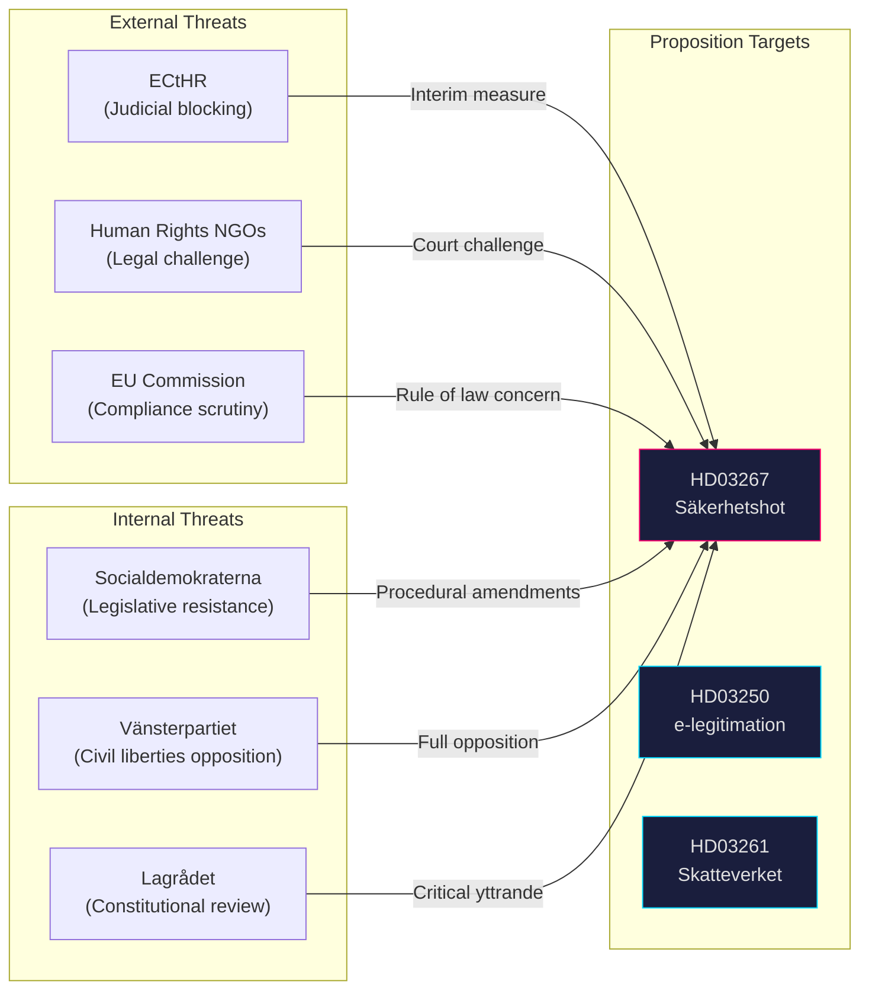

# Threat Analysis — Government Propositions 2026-05-07

**Methodology**: `political-threat-framework.md`  
**STRIDE applied to: institutional threat actors**

## Threat Actor Map

## Primary Threats — HD03267

### T1: ECtHR Interim Measures (Judicial)
**Actor**: European Court of Human Rights  
**Mechanism**: Rule 39 interim measures blocking deportation of persons facing classified-evidence expulsion orders  
**Probability**: HIGH — Sweden has faced Rule 39 measures in comparable cases  
**Impact**: HIGH — each case blocked is a government political embarrassment  
**Timeline**: Activated immediately upon first deportation attempt under new law  
*Evidence: HD03267 (riksdagen.se); ECtHR Rule 39 track record*

### T2: Lagrådet Critical Yttrande (Institutional)
**Actor**: Lagrådet (Council on Legislation)  
**Mechanism**: Advisory opinion finding incompatibility with ECHR Art. 6/Art. 8/RF Chapter 2  
**Probability**: MEDIUM-HIGH — Lagrådet has previously flagged classified evidence procedures  
**Impact**: MEDIUM — forces Government to amend bill or override critical opinion (politically costly)  
**Timeline**: Yttrande expected before summer 2026  
*Evidence: HD03267; Lagrådet: referral pending (see manifest)*

### T3: NGO Strategic Litigation (Judicial/Reputational)
**Actor**: ECHR Centre, Amnesty International, Human Rights Watch, Röda Korset  
**Mechanism**: Coordinated applications to ECtHR once first deportation under new law occurs  
**Probability**: HIGH — all major NGOs have published critical statements on comparable EU national security deportation frameworks  
**Impact**: MEDIUM-HIGH — reputational damage if cases succeed in Strasbourg  
*Evidence: HD03267 (riksdagen.se); NGO public statements*

## Secondary Threats — HD03250

### T4: BankID Consortium Legal Challenge (Market law)
**Actor**: Major Swedish banks (SHB, SEB, Nordea, Swedbank) that own BankID  
**Mechanism**: Competition law challenge — state undercutting private market with subsidised public alternative  
**Probability**: LOW-MEDIUM — EU state aid rules may be implicated if state e-ID is subsidised  
**Impact**: MEDIUM — could delay or constrain the state scheme  
*Evidence: HD03250 (riksdagen.se); EU state aid framework*

## Secondary Threats — HD03261

### T5: IMY (Swedish DPA) Proportionality Scrutiny
**Actor**: Integritetsskyddsmyndigheten (IMY)  
**Mechanism**: Regulatory challenge — cross-register data sharing beyond stated fraud-prevention purpose  
**Probability**: MEDIUM — IMY consistently scrutinises broad data sharing mandates  
**Impact**: LOW-MEDIUM — may require limiting amendments  
*Evidence: HD03261 (riksdagen.se)*
