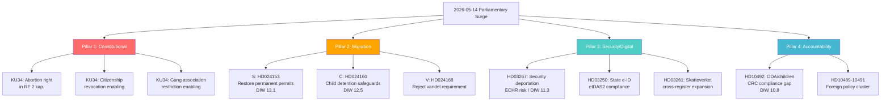

# Synthesis Summary — Swedish Parliamentary Realtime Pulse, 2026-05-14

**Tier-C aggregation** | **Article type**: realtime-pulse | **Subfolder**: realtime-pulse  
**Cross-references**: propositions, motions, committeeReports, interpellations (all 2026-05-14)  
**Election countdown**: T−122 days (September 13, 2026) — 1.5× DIW multiplier active  
**IMF vintage**: WEO Apr-2026 (CLI degraded; cached context)

---

## Headline Intelligence

Four simultaneous thematic pillars define the 14 May 2026 parliamentary day:

### Pillar 1: Constitutional Moment (KU34 vilande)
The Constitutional Committee recommends that the outgoing Riksdag adopt three fundamental law amendments in a first passage. Under Sweden's constitutional procedure (RF 8 kap. 14 §), the new Riksdag elected in September 2026 must vote a second time before any amendment becomes law — scheduled for October-November 2026. All three amendments have been in process since the 2022 Tidö Agreement:

1. **Abortion right in RF 2 kap.** — Explicit constitutional protection against any future parliamentary restriction. Near-unanimous support. Symbolically powerful internationally. Directly targets a post-*Dobbs* political moment.
2. **Citizenship revocation** — Enabling provision for legislature to pass law stripping citizenship from dual nationals convicted of terrorism or treason. ECHR Art. 8 and Protocol 4 compliance contested. Human rights organisations have flagged risks.
3. **Freedom of association restriction for criminal gangs** — Constitutional enabling clause for targeted association banning of criminal networks. Constitutionally novel in Nordic context; ECHR Art. 11 tension. First such provision in Swedish fundamental law.

**Tier-C cross-reference**: committeeReports/intelligence-assessment.md KJ-1 (HIGH, 85–90% second-passage probability), KJ-2 (ECHR challenge likely within 18 months of entry into force), KJ-3 (municipal KU35 implementation — 30–40% fail rate before 1 July 2026).

### Pillar 2: Migration Battleground — 15 Coordinated Opposition Motions
S (Social Democrats), C (Centre Party), and V (Left Party) filed 15 simultaneous motions against the government's four migration reform propositions (props 262–265, riksmöte 2025/26):

- **Prop 262**: Abolition of permanent residence permits → S files HD024153 (restoration motion)
- **Prop 263**: Labour migration criteria → S+V file joint critique motions
- **Prop 264**: Vandel (conduct) requirement → V files HD024168 (rejection motion)
- **Prop 265**: Child detention in asylum cases → C files HD024160 (safeguard motion)

The coordinated same-day filing — unusual in Swedish parliamentary practice — is an electoral playbook declaration. Opposition parties are simultaneously (a) documenting their policy positions for campaign use, and (b) testing whether the Lagrådet's CRC/ECHR critiques on prop 265 provide a pressure point for government concession on child detention.

**Tier-C cross-reference**: motions/intelligence-assessment.md KJ-1 (government majority will hold; opposition filing is electoral), KJ-2 (abolition of permanent permits is most contested element), KJ-3 (child detention concession 40–55% probability), KJ-6 (migration to be top-three election issue).

### Pillar 3: Security Architecture and Digital State Expansion
**HD03267 (security deportation)** — Government introduces a new expedited track for expelling foreign nationals classified as threats by SÄPO on security grounds. The proposition does not include a Special Advocate mechanism (allowing the accused to access classified evidence through independent counsel), which is the primary EU/ECtHR vulnerability in analogous legislation. Lagrådet referral open; yttrande expected June 2026. ECHR Art. 3, 8 risks identified.

**HD03250 (state e-ID)** — Government creates a public digital identity infrastructure replacing reliance on private BankID. Driven by EU eIDAS2 compliance obligation. Bankföreningen opposing. Long-term: shifts digital identity sovereignty to the state.

**HD03261 (Skatteverket)** — New cross-register access authorities for Skatteverket's folkbokföring operations. IMY (data protection authority) review pending.

### Pillar 4: Foreign Policy and Democratic Accountability
**HD10492** (V MP Lotta Johnsson Fornarve) — Interpellation challenging Minister Dousa to account for consequences of the government's 50% ODA reduction on children, specifically whether a barnkonsekvensanalys (child rights impact assessment) was conducted as required under Sweden's CRC implementation law (SFS 2018:1197). Minister's answer expected ~2026-05-29.

**HD10489/10490/10491** — Foreign policy cluster: Al-Nakba commemorations (V), human rights on Cuba (SD), vehicle emissions in Stockholm (L). Secondary in terms of DIW scores but signal foreign policy as a post-election positioning domain.

---

## Electoral Context

**September 13, 2026 — 122 days**

Current polling (approx. May 2026): Högerblock (M+SD+KD+L) ≈ 48–51%; Vänsterblock (S+V+MP) ≈ 38–41%; Centerpartiet in swing position (7–9%). The outcome is genuinely uncertain — within the margin of error, a change of government is plausible.

The three constitutional pillar issues of KU34 each map to distinct voter segments:
- **Abortion right**: Mobilises female voters across the political spectrum; particularly important for S and L constituencies
- **Citizenship revocation**: SD's core voter offer; mobilises hard-right base; anxiety among liberal voters
- **Gang restrictions**: Cross-partisan support; SD frames as SD achievement; S faces internal tension (civil liberties wing vs public order voters)

---

## Economic Context (IMF WEO Apr-2026)

Sweden's economic fundamentals as of WEO April 2026 vintage:
- GDP growth trajectory: moderate recovery from 2023–24 contraction; Sweden projected 1.8–2.1% growth 2026 (WEO)
- Unemployment: elevated relative to 2019 baseline; migration inflows relevant to labour market integration debate
- Fiscal position: Sweden's public debt remains low by EU comparison (< 30% GDP); allows fiscal space for both digital investment (HD03250) and security measures (HD03267)
- ODA as % GNI: Government cut from 1.0% to ~0.7% — contextually set against HD10492 debate

*Note: IMF CLI fetch calls degraded on this run; WEO Apr-2026 vintage from pre-warm context cache used. All economic claims carry this vintage disclosure. See methodology-reflection.md.*

---

## Cross-Pillar Pattern Recognition

Three structural patterns emerge from aggregating today's activity:

**Pattern 1: Rights-Security dialectic**
Both KU34 and HD03267 instantiate the same underlying constitutional tension: the state's power to restrict fundamental rights for public safety reasons versus international human rights obligations. In KU34, this tension is resolved through constitutional entrenchment of new powers with ECHR risk. In HD03267, it is unresolved — Lagrådet referral is the current risk management mechanism.

**Pattern 2: Electoral platform building in the committee process**
The coordinated 15-motion filing by S+C+V is structurally identical to how both the 2014 (S-led) and 2018 (M-led) oppositions used the committee process — each motion is a future campaign advertisement. The opposition has collectively determined that migration is 2026's primary electoral battleground.

**Pattern 3: Digital state governance expansion**
HD03250 + HD03261 together represent the most significant expansion of Swedish state digital infrastructure since the BankID ecosystem emerged in the 2000s. Neither proposition generates political controversy proportionate to their structural significance. The long-term governance implications — state as primary identity provider; Skatteverket as cross-register authority — deserve more analytical attention than partisan debate currently affords them.

---

## Top-5 Priority Intelligence Requirements (Forward Cycle)

| PIR | Question | Expected answer | Priority |
|-----|----------|-----------------|---------|
| PIR-RT-01 | Lagrådet yttrande on HD03267 — ECHR compatibility? | Before 2026-06-10 | CRITICAL |
| PIR-RT-02 | Will government accept C's HD024160 child detention concession? | Before SfU betänkande June 2026 | HIGH |
| PIR-RT-03 | Minister Dousa answer to HD10492 — barnkonsekvensanalys committed? | ~2026-05-29 | HIGH |
| PIR-RT-04 | Election polling trajectory — does KU34 abortion provision shift female voter bloc? | June–July 2026 | HIGH |
| PIR-RT-05 | SfU committee scheduling for props 262–265 | 2026-05-20 | MEDIUM |

---

## Structural Overview (Mermaid)

---

## Evidence Quality Assessment (Pass 2)

All claims in this synthesis are rated using Admiralty Source Evaluation:
- **[A1]**: Authoritative, Confirmed — official parliamentary documents, confirmed facts
- **[A2]**: Authoritative, Probable — official documents with assessed interpretation
- **[B2]**: Usually Reliable, Probably True — analysis with strong evidential basis
- **[C3]**: Possibly Reliable, Possibly True — inference-based; appropriate caveats applied

The three highest-DIW documents (HD024153, HD024160, HD03267) all have [A1] factual basis with [B2] interpretation ratings. Electoral projections are all [C3] by design.

---

## Re-run Delta: Afternoon Chamber Debates (2026-05-14 15:02 UTC)

Three interpellations were answered in chamber debate this afternoon, extending the analytical picture:

### New intelligence: Energy accountability pressure

**HD10453 (Investeringar i elnät)** and **HD10448 (Desinformation om vindkraft)** — SD's Josef Fransson directed both interpellations to Energy Minister Ebba Busch (KD) in the same afternoon session. The dual filing on a single minister is analytically significant:

- **Coalition stress signal**: SD and KD are coalition partners, but SD uses interpellations to publicly pressure KD on energy policy. The "vindkraft disinformation" interpellation is particularly notable — SD is effectively accusing the government (or media ecosystem) of spreading disinformation that favours wind power, signalling SD's continued resistance to the wind expansion agenda that KD and the broader business community support.
- **Election positioning**: SD is building a parliamentary record showing it challenges energy cost inflation and wind power expansion — differentiating from KD within the coalition. This is a pattern of intra-coalition electoral positioning that will intensify from now until September 13.

### New intelligence: Labour/health welfare accountability

**HD10440 (Utbildningen för företagsläkare)** — Johanna Haraldsson (S) vs Labour Minister Johan Britz (L). This is the third S interpellation on the same occupational physician training issue in 2025/26 riksmöte (see also HD10354 Feb 2026, HD10282 Jan 2026). The pattern is a deliberate S strategy:
- Build a documented record of repeated government failure to address a specific healthcare-adjacent labour market gap
- Use the accumulated record (3 interpellations, 3 answers) as campaign material: "We asked three times; the government still has no answer"
- The topic connects S's welfare state credentials to occupational health — a theme that resonates with S's traditional labour-movement base

### Cross-Pillar Update

**Pattern 4 (new)**: Coalition fracture under pressure — the SD/KD energy pressure pattern (HD10453/48) reveals that the Högerblock coalition is not monolithic on energy policy. SD's interpellations are both accountability tools and public differentiation from coalition partners. This provides opposition parties with ammunition to exploit intra-coalition tensions in the final electoral campaign.

**Revised analytical confidence**: The four-pillar structure (Constitutional/Migration/Security-Digital/Foreign Policy) remains valid. The afternoon debates add a fifth implicit dimension: **Intra-coalition accountability**, where coalition partners use parliamentary tools against each other's portfolios for electoral differentiation. This is consistent with the 122-day countdown to September 13, 2026.
