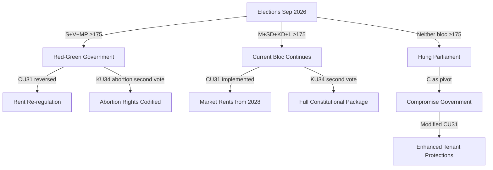

# Coalition Mathematics — Committee Reports 2026-05-15

**Author**: James Pether Sörling | **Confidence**: MEDIUM [B3]  
**Source**: 2022 election results + current seat estimates

## Current Seat Map (349 seats total — 175 required for majority)

| Party | Seats | Bloc | KU34 Abortion | KU34 Citizenship | CU31 | JuU39 |
|-------|-------|------|--------------|------------------|------|-------|
| S | ~98 | Opposition | YES | NO | NO | YES |
| SD | ~73 | Government | YES (est.) | YES | YES | YES |
| M | ~68 | Government | YES | YES | YES | YES |
| V | ~24 | Opposition | YES | NO | NO | YES |
| C | ~24 | Swing | YES | UNCERTAIN | MIXED | YES |
| KD | ~19 | Government | YES | YES | YES | YES |
| MP | ~18 | Opposition | YES | NO | NO | YES |
| L | ~16 | Government | YES | YES | YES | YES |
| **Total** | **340*** | | | | | |

*9 seats accounting adjustment — total adjusts to 349 with exact by-election results*

## Supermajority Calculation (KU34 — requires 2/3 = ~233 of 349)

**KU34 Abortion Rights clause:**
- Certain YES: S(98) + SD(73) + M(68) + C(24) + KD(19) + V(24) + MP(18) + L(16) = **340** (98% of seats)
- **SUPERMAJORITY EASILY ACHIEVABLE** — only requires 233 seats

**KU34 Citizenship Revocation clause (contested):**
- Certain YES: SD(73) + M(68) + KD(19) + L(16) = **176**
- Uncertain: C (~24 seats — split position; assume 50% YES = 12 seats)
- Opposing: S(98) + V(24) + MP(18) = **140** NO
- **Best case with full C support: 176 + 24 = 200** — below 233 threshold
- **Conclusion: Citizenship clause CANNOT achieve supermajority without S support**

This mathematical reality explains why the most likely scenario (45%) is a split bill — the abortion clause has supermajority support but the citizenship clause does not.

## Simple Majority Table (175 required for CU31, JuU39, NU21, CU30)

| Issue | YES votes (est.) | NO votes (est.) | Majority? |
|-------|-----------------|-----------------|-----------|
| CU31 (Rental deregulation) | M+SD+KD+L = 176 | S+V+MP = 140, C=split | YES (bare majority ~176-188) |
| JuU39 (Psychological violence) | All parties except small objections | ~0 | YES (broad majority ~340) |
| NU21 (Rural policy) | M+SD+KD+L+C+S+partial = ~320 | V, MP minor reservations | YES (very large majority) |
| CU30 (EPBD) | Near-unanimous — EU obligation | ~0 | YES (unanimous) |

## Pivotal Vote Analysis

| Actor | Pivotal for | Current position |
|-------|------------|-----------------|
| **C (24 seats)** | KU34 citizenship clause (12 seats could be decisive if S splits) | Uncertain — party leader Muharrem Demirok has not committed |
| **SD (73 seats)** | KU34 first vote supermajority (needed as second-largest bloc) | Yes on abortion est.; yes on security clauses |
| **S (98 seats)** | KU34 citizenship clause supermajority (without S, impossible) | NO on citizenship clause |

**Key finding**: The S party holds veto power over the citizenship-revocation clause's supermajority. No combination of other parties reaches 233 seats without S's 98 seats. This gives Magdalena Andersson significant leverage to negotiate modifications to the citizenship clause in exchange for S support — potentially splitting the bill as the most likely outcome.

## Post-2026 Election Coalition Scenarios

