# Riksdagen Inför Grundlagsskydd för Abort — Och Utvidgar Säkerhetsstatens Verktyg

**Author**: James Pether Sörling | **Date**: 2026-05-15 | **Classification**: PUBLIC  
**Confidence**: HIGH [B2] | **Run ID**: news-committee-reports-2026-05-15

## BLUF

Sweden's Constitutional Committee (KU) has tabled two interlocked constitutional amendments requiring a 2/3 supermajority: one entrenching abortion rights in RF 2 kap., making reproductive rights formally reversible only by the same elevated threshold; and one expanding the state's power to restrict freedom of association and revoke citizenship for terror- and organised-crime-linked individuals. Simultaneously, the Civil Affairs Committee (CU) advances contentious rental-market deregulation (HD01CU31) that would expose 800,000 rent-controlled tenants to market pricing, and the Justice Committee (JuU) criminalises psychological violence (HD01JuU39). Together these signal an active parliamentary end-of-session sprint with constitutional and social-policy consequences extending to the 2026 election cycle.

## Decisions This Brief Supports

1. **Election 2026 framing**: KU34 reshapes bloc politics — abortion rights protection has cross-party support (S, M, C, L supportive), but the association-freedom restriction and citizenship revocation clauses drive a wedge within and across blocs.
2. **Civil society / legal risk monitoring**: CU31 (rental market) and JuU39 (psychological violence) both involve significant implementation challenges and potential Lagrådet constitutional objections.
3. **EU alignment tracking**: CU30 (EPBD) and CU31 (rental market) sit at the intersection of EU regulatory obligations and Swedish domestic housing politics — with distinct impacts on municipal budgets.

## 60-Second Read

- 🔴 **KU34** (Constitutional): Abortion rights constitutionally protected; association freedom restricted for security threats; citizenship revocation expanded. Requires 2× supermajority vote across two riksmöten. Evidence: `HD01KU34`, KU, 2026-05-11. [A2][horizon:week]
- 🟠 **CU31** (Housing): Rental deregulation passes committee. 800,000+ rent-controlled tenants face market rents. Strong opposition from S, V, MP. Evidence: `HD01CU31`, CU, 2026-05-08. [A2][horizon:month]
- 🟠 **JuU39** (Criminal law): New criminal offence of psychological violence (psykiskt våld) — modelled on Nordic peers. Passed JuU with cross-bloc majority. Evidence: `HD01JuU39`, JuU, 2026-05-07. [A2][horizon:week]
- 🟡 **NU21** (Rural): Comprehensive rural-policy framework — funding for broadband, infrastructure, local service access in sparsely populated areas. Evidence: `HD01NU21`, NU, 2026-05-12. [A2][horizon:month]
- 🟡 **CU30** (Energy): EPBD implementation — building energy performance standards updated; 700 bn SEK investment window for renovation sector estimated. Evidence: `HD01CU30`, CU, 2026-05-12. [A2][horizon:year]

## Top Forward Trigger

**HD01KU34 first-round vote** expected in the riksdag plenary week of 2026-05-18–22. If approved with 2/3 majority, the amendment enters the 2026/27 riksmöte pipeline for the mandatory second-round vote required by RF 8:14. Failure to reach supermajority triggers a hung constitutional process and potential renegotiation of the association-freedom clauses.

## Confidence Assessment

| Claim | Confidence | Admiralty | Basis |
|-------|------------|-----------|-------|
| KU34 tabled with two constitutional changes | VERY HIGH | A1 | Official KU betänkande dok_id HD01KU34 |
| CU31 advances rental deregulation | HIGH | A2 | dok_id HD01CU31, CU betänkande |
| JuU39 criminalises psychological violence | HIGH | A2 | dok_id HD01JuU39, JuU betänkande |
| IMF WEO Apr-2026 economic context | HIGH | A1 | data/imf-context.json, status: ok |

```mermaid
%%{init: {'theme': 'dark', 'themeVariables': {'primaryColor': '#00d9ff', 'primaryTextColor': '#e0e0e0', 'primaryBorderColor': '#ff006e', 'lineColor': '#ffbe0b', 'background': '#0a0e27'}}}%%
flowchart LR
    KU34["🔴 KU34\nGrundlag: Abort+Säkerhet\nL3 · 2/3 supermajority"] --> VOTE["Riksdag plenary\n2026-05-18~22"]
    CU31["🟠 CU31\nHyresmarknad\nL2+ · Passed committee"] --> VOTE
    JuU39["🟠 JuU39\nPsykiskt våld\nL2+ · Passed JuU"] --> VOTE
    VOTE --> E26["2026 Election\nframing impact"]
    style KU34 fill:#ff006e,color:#fff
    style CU31 fill:#ff8c00,color:#fff
    style JuU39 fill:#ff8c00,color:#fff
    style VOTE fill:#1a1e3d,stroke:#00d9ff
    style E26 fill:#0a0e27,stroke:#ffbe0b
```

