<!-- dir: rtl -->
# الريكسداغ يُكرّس الحماية الدستورية للإجهاض — ويوسّع أدوات دولة الأمن

**المؤلف**: جيمس بيثر سورلينغ | **التاريخ**: 2026-05-15 | **التصنيف**: عام  
**الثقة**: HIGH [B2] | **معرّف التشغيل**: news-committee-reports-2026-05-15

## BLUF

قدّمت لجنة الدستور السويدية (KU) تعديلَين دستوريَّين مترابطَين يستلزمان أغلبية ثلثين: أحدهما يُرسّخ حق الإجهاض في الفصل الثاني من قانون الحكم (RF)، مما يجعل الحقوق الإنجابية غير قابلة للعكس إلا بالعتبة المرتفعة ذاتها؛ والآخر يوسّع صلاحيات الدولة لتقييد حرية تكوين الجمعيات وسحب الجنسية من الأشخاص المرتبطين بالإرهاب والجريمة المنظمة. في الوقت ذاته، تدفع لجنة الشؤون المدنية (CU) نحو إلغاء تنظيمي مثير للجدل في سوق الإيجار (HD01CU31) من شأنه أن يعرّض 800,000 مستأجر خاضعاً لتنظيم الإيجار لأسعار السوق، فيما تُجرّم لجنة العدل (JuU) العنف النفسي (HD01JuU39). تُشير هذه الوقائع مجتمعةً إلى اندفاعة برلمانية نهاية الجلسة فاعلة، ذات تداعيات دستورية وسياسية اجتماعية تمتد إلى دورة انتخابات 2026.

## القرارات التي تدعمها هذه الوثيقة

1. **إطار انتخابات 2026**: يُعيد KU34 تشكيل سياسة الكتلة — تحظى حماية حق الإجهاض بدعم واسع من الأحزاب (S وM وC وL مؤيدون)، لكن بنود تقييد حرية تكوين الجمعيات وتوسيع سحب الجنسية تُحدث شرخاً داخل الكتل وفيما بينها.
2. **رصد مخاطر المجتمع المدني والقانون**: يستدعي كلٌّ من CU31 (سوق الإيجار) وJuU39 (العنف النفسي) تحدياتٍ تنفيذية بالغة ومعارضات دستورية محتملة من مجلس التشريع (Lagrådet).
3. **متابعة التوافق مع الاتحاد الأوروبي**: يقع CU30 (توجيه EPBD) وCU31 (سوق الإيجار) عند تقاطع الالتزامات التنظيمية الأوروبية والسياسة السكنية الوطنية السويدية — مع تأثيرات واضحة على ميزانيات البلديات.

## قراءة 60 ثانية

- 🔴 **KU34** (الدستور): حق الإجهاض محمي دستورياً؛ حرية تكوين الجمعيات مقيَّدة لمواجهة التهديدات الأمنية؛ توسيع سحب الجنسية. يستلزم تصويتاً بأغلبية الثلثين مرتين في riksmöten. المصدر: `HD01KU34`، KU، 2026-05-11. [A2][الأفق:أسبوع]
- 🟠 **CU31** (الإسكان): إلغاء تنظيم سوق الإيجار يمرّ باللجنة. 800,000+ مستأجر خاضع لتنظيم الإيجار معرَّض لأسعار السوق. معارضة قوية من S وV وMP. المصدر: `HD01CU31`، CU، 2026-05-08. [A2][الأفق:شهر]
- 🟠 **JuU39** (القانون الجنائي): جريمة جديدة من العنف النفسي — مستوحاة من الدول الإسكندنافية. أُقرّ في JuU بأغلبية متعددة الأحزاب. المصدر: `HD01JuU39`، JuU، 2026-05-07. [A2][الأفق:أسبوع]
- 🟡 **NU21** (الريف): إطار شامل لسياسة الأرياف — تمويل النطاق العريض والبنية التحتية والخدمات المحلية في المناطق قليلة السكان. المصدر: `HD01NU21`، NU، 2026-05-12. [A2][الأفق:شهر]
- 🟡 **CU30** (الطاقة): تنفيذ EPBD — تحديث معايير أداء الطاقة للمباني؛ تقدير نافذة استثمارية بـ700 مليار كرونة للقطاع التجديدي. المصدر: `HD01CU30`، CU، 2026-05-12. [A2][الأفق:سنة]

## المؤشر المُقدِّم التالي

**جولة التصويت الأولى لـHD01KU34** متوقعة في الأسبوع الاجتماعي العام للريكسداغ 2026-05-18–22. في حال الموافقة بأغلبية ثلثين، يدخل التعديل مسار riksmöte 2026/27 لجولة التصويت الثانية الإلزامية وفق RF 8:14. عدم بلوغ أغلبية الثلثين يُفضي إلى إجراء دستوري معلّق وإعادة تفاوض محتملة على بنود حرية تكوين الجمعيات.

## تقييم الثقة

| الادعاء | الثقة | أدميرالتي | الأساس |
|---------|-------|-----------|--------|
| KU34 مُقدَّم بتعديلَين دستوريَّين | VERY HIGH | A1 | بيتانكاندي رسمي لـKU، dok_id HD01KU34 |
| CU31 يدفع نحو إلغاء تنظيم سوق الإيجار | HIGH | A2 | dok_id HD01CU31، بيتانكاندي CU |
| JuU39 يُجرّم العنف النفسي | HIGH | A2 | dok_id HD01JuU39، بيتانكاندي JuU |
| سياق اقتصادي IMF WEO أبريل 2026 | HIGH | A1 | data/imf-context.json، الحالة: ok |

```mermaid
%%{init: {'theme': 'dark', 'themeVariables': {'primaryColor': '#00d9ff', 'primaryTextColor': '#e0e0e0', 'primaryBorderColor': '#ff006e', 'lineColor': '#ffbe0b', 'background': '#0a0e27'}}}%%
flowchart LR
    KU34["🔴 KU34\nConstitution: Abortion+Security\nL3 · 2/3 supermajority"] --> VOTE["Riksdag plenary\n2026-05-18~22"]
    CU31["🟠 CU31\nRental market\nL2+ · Passed committee"] --> VOTE
    JuU39["🟠 JuU39\nPsychological violence\nL2+ · Passed JuU"] --> VOTE
    VOTE --> E26["2026 Election\nframing impact"]
    style KU34 fill:#ff006e,color:#fff
    style CU31 fill:#ff8c00,color:#fff
    style JuU39 fill:#ff8c00,color:#fff
    style VOTE fill:#1a1e3d,stroke:#00d9ff
    style E26 fill:#0a0e27,stroke:#ffbe0b
```

---

## ✅ ملاحظة التحديث (2026-05-16)

**الصياغة الأصلية**: 2026-05-15 وفق قالب executive-brief الإصدار < 4.4.  
**التحليل الجوهري والأدلة والاستنتاجات دون تغيير.**

<!-- source-sha: 7be28fdb403d82b122314d8fdecbc5fc60b72ddf -->
