# Riksdagen grundlovssikrer retten til abort — og udvider sikkerhedsstatens værktøjer

**Forfatter**: James Pether Sörling | **Dato**: 2026-05-15 | **Klassifikation**: PUBLIC  
**Tillid**: HIGH [B2] | **Kørsel-ID**: news-committee-reports-2026-05-15

## BLUF

Sveriges Grundlovsudvalg (KU) har fremsat to sammenkoblede grundlovsændringer, der kræver 2/3 supermajoritet: én der forankrer retten til abort i RF 2. kap., hvilket gør reproduktive rettigheder formelt reversible kun med den samme forhøjede tærskel; og én der udvider statens magt til at begrænse foreningsfriheden og tilbagekalde statsborgerskab for terror- og organiseret-kriminalitetsrelaterede enkeltpersoner. Simultaneously fremfører Civiludvalget (CU) en kontroversiel husmarkedsderegulering (HD01CU31), der ville udsætte 800.000 huslejeregulerede lejere for markedspriser, og Retsudvalget (JuU) kriminaliserer psykisk vold (HD01JuU39). Tilsammen signalerer disse en aktiv parlamentarisk sessionsafslutningssprint med konstitutionelle og socialpolitiske konsekvenser, der strækker sig ind i 2026-valgcyklussen.

## Beslutninger dette underlag understøtter

1. **Valg 2026-indramning**: KU34 omformer blokpolitikken — abortretsbeskyttelsen har bred partistøtte (S, M, C, L støtter), men klausulerne om begrænset foreningsfrihed og udvidet tilbagekaldelse af statsborgerskab skaber en kile inden for og på tværs af blokkene.
2. **Civilsamfund/juridisk risikoovervågning**: CU31 (husmarkedet) og JuU39 (psykisk vold) indebærer begge betydelige implementeringsudfordringer og potentielle Lagrådet-forfatningsindvendinger.
3. **EU-tilpasningssporing**: CU30 (EPBD) og CU31 (husmarkedet) befinder sig i skæringspunktet mellem EU's reguleringsforpligtelser og dansk indenlandsk boligpolitik — med distinkte virkninger på kommunale budgetter.

## 60-sekunders læsning

- 🔴 **KU34** (Grundlov): Abortretten grundlovssikret; foreningsfriheden begrænset for sikkerhedstrusler; tilbagekaldelse af statsborgerskab udvidet. Kræver 2× supermajoritetsafstemning i to riksmøder. Kilde: `HD01KU34`, KU, 2026-05-11. [A2][horisont:uge]
- 🟠 **CU31** (Bolig): Husmarkedsderegulering vedtages i udvalg. 800.000+ huslejeregulerede lejere risikerer markedslejer. Stærk modstand fra S, V, MP. Kilde: `HD01CU31`, CU, 2026-05-08. [A2][horisont:måned]
- 🟠 **JuU39** (Strafferet): Ny strafbar handling psykisk vold — modelleret efter nordiske lande. Vedtaget i JuU med tværbloks flertal. Kilde: `HD01JuU39`, JuU, 2026-05-07. [A2][horisont:uge]
- 🟡 **NU21** (Landdistrikter): Samlet landdistriktspolitisk ramme — finansiering til bredbånd, infrastruktur og lokal serviceadgang i tyndt befolkede områder. Kilde: `HD01NU21`, NU, 2026-05-12. [A2][horisont:måned]
- 🟡 **CU30** (Energi): EPBD-implementering — bygningers energipræstationsstandarder opdateres; 700 mia. SEK investeringsvindue for renoveringssektoren estimeret. Kilde: `HD01CU30`, CU, 2026-05-12. [A2][horisont:år]

## Næste fremadrettede indikator

**HD01KU34 første afstemning** forventes i Riksdagens plenumuge 2026-05-18–22. Ved godkendelse med 2/3 supermajoritet indgår ændringsforslaget i 2026/27 riksmøde-pipeline til den obligatoriske anden runde-afstemning krævet af RF 8:14. Manglende supermajoritet udløser en hængt konstitutionel proces og potentiel genforhandling af foreningsfrihedsklausulerne.

## Tillidsvurdering

| Påstand | Tillid | Admiralty | Grundlag |
|---------|--------|-----------|---------|
| KU34 fremsat med to forfatningsændringer | VERY HIGH | A1 | Officielt KU-betænkning dok_id HD01KU34 |
| CU31 fremmer husmarkedsderegulering | HIGH | A2 | dok_id HD01CU31, CU-betænkning |
| JuU39 kriminaliserer psykisk vold | HIGH | A2 | dok_id HD01JuU39, JuU-betænkning |
| IMF WEO Apr-2026 økonomisk kontekst | HIGH | A1 | data/imf-context.json, status: ok |

```mermaid
%%{init: {'theme': 'dark', 'themeVariables': {'primaryColor': '#00d9ff', 'primaryTextColor': '#e0e0e0', 'primaryBorderColor': '#ff006e', 'lineColor': '#ffbe0b', 'background': '#0a0e27'}}}%%
flowchart LR
    KU34["🔴 KU34\nConstitution: Abortion+Security\nL3 · 2/3 supermajority"] --> VOTE["Riksdag plenary\n2026-05-18~22"]
    CU31["🟠 CU31\nRental market\nL2+ · Passed committee"] --> VOTE
    JuU39["🟠 JuU39\nPsychological violence\nL2+ · Passed JuU"] --> VOTE
    VOTE --> E26["2026 Election\nframing impact"]
    style KU34 fill:#ff006e,color:#fff
    style CU31 fill:#ff8c00,color:#fff
    style JuU39 fill:#ff8c00,color:#fff
    style VOTE fill:#1a1e3d,stroke:#00d9ff
    style E26 fill:#0a0e27,stroke:#ffbe0b
```

---

## ✅ Retrofit-note (2026-05-16)

**Oprindelig udarbejdelse**: 2026-05-15 under executive-brief-skabelon v < 4.4.
**Retrofit-omfang** (anvendt 2026-05-16): Dansksprogede H1 og Mermaid-etiketter oversat til engelsk (kanonisk sprogoverenstemmelse). Ingen ændringer af beviser, dok_ids eller analytiske konklusioner.

**Ikke retrofitted**: Beslutningsklasse BLUF-rubrik, overskriftskandidater, 14-sprogs SEO-frø, fuld Pass-2 Selvrevisionsregneark v4.4.

**Faktisk analyse, beviser og konklusioner uændrede.**

<!-- source-sha: 7be28fdb403d82b122314d8fdecbc5fc60b72ddf -->
