# Der Riksdag verankert verfassungsrechtlichen Schutz für Abtreibung — und erweitert das Toolkit des Sicherheitsstaates

**Autor**: James Pether Sörling | **Datum**: 2026-05-15 | **Klassifizierung**: PUBLIC  
**Konfidenz**: HIGH [B2] | **Lauf-ID**: news-committee-reports-2026-05-15

## BLUF

Schwedens Verfassungsausschuss (KU) hat zwei miteinander verbundene Verfassungsänderungen vorgelegt, die eine 2/3-Supermehrheit erfordern: eine, die das Abtreibungsrecht in RF Kap. 2 verankert und reproduktive Rechte formal nur mit derselben erhöhten Schwelle umkehrbar macht; und eine, die die staatliche Macht zur Einschränkung der Vereinigungsfreiheit und zum Entzug der Staatsbürgerschaft für terror- und organisierter Kriminalität verbundene Personen ausdehnt. Gleichzeitig treibt der Zivilausschuss (CU) eine umstrittene Mietmarktderegulierung (HD01CU31) voran, die 800.000 mietpreisgebundene Mieter Marktpreisen aussetzen würde, und der Justizausschuss (JuU) kriminalisiert psychische Gewalt (HD01JuU39). Zusammen signalisieren diese einen aktiven parlamentarischen Endspurt der Sitzungsperiode mit verfassungs- und sozialpolitischen Konsequenzen, die sich in den Wahlzyklus 2026 erstrecken.

## Entscheidungen, die dieses Dokument unterstützt

1. **Wahlkampf-Rahmung 2026**: KU34 gestaltet die Blockpolitik um — der Schutz des Abtreibungsrechts hat breite Parteiunterstützung (S, M, C, L befürworten), aber die Einschränkung der Vereinigungsfreiheit und die erweiterte Staatsbürgerschaftsentzugsklausel schaffen einen Keil innerhalb und zwischen den Blöcken.
2. **Zivilgesellschaft/rechtliche Risikoüberwachung**: CU31 (Mietmarkt) und JuU39 (psychische Gewalt) beinhalten beide erhebliche Umsetzungsherausforderungen und potenzielle Lagrådet-Verfassungseinwände.
3. **EU-Angleichungsverfolgung**: CU30 (EPBD) und CU31 (Mietmarkt) befinden sich an der Schnittstelle zwischen EU-Regulierungsverpflichtungen und schwedischer Inlandswohnungspolitik — mit deutlichen Auswirkungen auf kommunale Haushalte.

## 60-Sekunden-Lektüre

- 🔴 **KU34** (Verfassung): Abtreibungsrecht verfassungsrechtlich geschützt; Vereinigungsfreiheit für Sicherheitsbedrohungen eingeschränkt; Staatsbürgerschaftsentzug erweitert. Erfordert 2× Supermajoritätsabstimmung in zwei Riksmöten. Quelle: `HD01KU34`, KU, 2026-05-11. [A2][Horizont:Woche]
- 🟠 **CU31** (Wohnen): Mietmarktderegulierung passiert Ausschuss. 800.000+ mietpreisgebundene Mieter sind Marktmieten ausgesetzt. Starker Widerstand von S, V, MP. Quelle: `HD01CU31`, CU, 2026-05-08. [A2][Horizont:Monat]
- 🟠 **JuU39** (Strafrecht): Neuer Straftatbestand psychische Gewalt — nach nordischen Ländern modelliert. Mit blockübergreifender Mehrheit in JuU verabschiedet. Quelle: `HD01JuU39`, JuU, 2026-05-07. [A2][Horizont:Woche]
- 🟡 **NU21** (Ländlich): Umfassendes ländliches Politikrahmenwerk — Finanzierung für Breitband, Infrastruktur und lokale Dienstleistungen in dünn besiedelten Gebieten. Quelle: `HD01NU21`, NU, 2026-05-12. [A2][Horizont:Monat]
- 🟡 **CU30** (Energie): EPBD-Umsetzung — Energieeffizienzstandards für Gebäude aktualisiert; geschätztes Investitionsfenster von 700 Mrd. SEK für den Renovierungssektor. Quelle: `HD01CU30`, CU, 2026-05-12. [A2][Horizont:Jahr]

## Nächster Vorwärtsindikator

**HD01KU34 Erste-Runde-Abstimmung** wird in der Riksdag-Plenumwoche 2026-05-18–22 erwartet. Bei Genehmigung mit 2/3-Supermehrheit tritt der Änderungsantrag in die 2026/27-Riksmöte-Pipeline für die gemäß RF 8:14 erforderliche obligatorische Zweite-Runde-Abstimmung ein. Fehlen der Supermehrheit löst ein hängendes Verfassungsverfahren und potenzielle Neuverhandlung der Vereinigungsfreiheitsklauseln aus.

## Konfidenzeinschätzung

| Behauptung | Konfidenz | Admiralty | Grundlage |
|------------|-----------|-----------|-----------|
| KU34 mit zwei Verfassungsänderungen vorgelegt | VERY HIGH | A1 | Offizielles KU-Ausschussgutachten dok_id HD01KU34 |
| CU31 treibt Mietmarktderegulierung voran | HIGH | A2 | dok_id HD01CU31, CU-Ausschussgutachten |
| JuU39 kriminalisiert psychische Gewalt | HIGH | A2 | dok_id HD01JuU39, JuU-Ausschussgutachten |
| IMF WEO Apr-2026 wirtschaftlicher Kontext | HIGH | A1 | data/imf-context.json, Status: ok |

```mermaid
%%{init: {'theme': 'dark', 'themeVariables': {'primaryColor': '#00d9ff', 'primaryTextColor': '#e0e0e0', 'primaryBorderColor': '#ff006e', 'lineColor': '#ffbe0b', 'background': '#0a0e27'}}}%%
flowchart LR
    KU34["🔴 KU34\nConstitution: Abortion+Security\nL3 · 2/3 supermajority"] --> VOTE["Riksdag plenary\n2026-05-18~22"]
    CU31["🟠 CU31\nRental market\nL2+ · Passed committee"] --> VOTE
    JuU39["🟠 JuU39\nPsychological violence\nL2+ · Passed JuU"] --> VOTE
    VOTE --> E26["2026 Election\nframing impact"]
    style KU34 fill:#ff006e,color:#fff
    style CU31 fill:#ff8c00,color:#fff
    style JuU39 fill:#ff8c00,color:#fff
    style VOTE fill:#1a1e3d,stroke:#00d9ff
    style E26 fill:#0a0e27,stroke:#ffbe0b
```

---

## ✅ Retrofit-Hinweis (2026-05-16)

**Ursprüngliche Erstellung**: 2026-05-15 unter executive-brief-Vorlage v < 4.4.
**Inhaltliche Analyse, Nachweise und Schlussfolgerungen unverändert.**

<!-- source-sha: 7be28fdb403d82b122314d8fdecbc5fc60b72ddf -->
