# El Riksdag consagra la protección constitucional del aborto — y amplía el arsenal del estado de seguridad

**Autor**: James Pether Sörling | **Fecha**: 2026-05-15 | **Clasificación**: PUBLIC  
**Confianza**: HIGH [B2] | **ID de ejecución**: news-committee-reports-2026-05-15

## BLUF

El Comité Constitucional sueco (KU) ha presentado dos enmiendas constitucionales interconectadas que requieren una supermayoría de 2/3: una que ancla el derecho al aborto en el RF cap. 2, haciendo los derechos reproductivos formalmente reversibles solo con el mismo umbral elevado; y otra que amplía el poder del Estado para restringir la libertad de asociación y revocar la ciudadanía para personas vinculadas al terrorismo y la delincuencia organizada. Simultáneamente, el Comité de Asuntos Civiles (CU) impulsa una desregulación controvertida del mercado de alquiler (HD01CU31) que expondría a 800 000 inquilinos con renta controlada a precios de mercado, y el Comité de Justicia (JuU) tipifica la violencia psicológica (HD01JuU39). En conjunto, señalan un activo sprint parlamentario de fin de sesión con consecuencias constitucionales y de política social que se extienden al ciclo electoral de 2026.

## Decisiones que este documento apoya

1. **Encuadre electoral 2026**: KU34 remodela la política de bloques — la protección del derecho al aborto tiene amplio apoyo de partidos (S, M, C, L favorables), pero las cláusulas de restricción de la libertad de asociación y ampliación de la revocación de ciudadanía crean una cuña dentro de los bloques y entre ellos.
2. **Monitoreo de riesgos de la sociedad civil/jurídicos**: CU31 (mercado de alquiler) y JuU39 (violencia psicológica) implican ambos desafíos de implementación significativos y posibles objeciones constitucionales del Lagrådet.
3. **Seguimiento de alineación UE**: CU30 (EPBD) y CU31 (mercado de alquiler) se encuentran en la intersección de las obligaciones regulatorias de la UE y la política de vivienda nacional sueca — con impactos distintos en los presupuestos municipales.

## Lectura de 60 segundos

- 🔴 **KU34** (Constitución): Derecho al aborto protegido constitucionalmente; libertad de asociación restringida para amenazas de seguridad; revocación de ciudadanía ampliada. Requiere 2× votación por supermayoría en dos riksmöten. Fuente: `HD01KU34`, KU, 2026-05-11. [A2][horizonte:semana]
- 🟠 **CU31** (Vivienda): La desregulación del mercado de alquiler supera el comité. 800 000+ inquilinos con renta controlada se exponen a alquileres de mercado. Fuerte oposición de S, V, MP. Fuente: `HD01CU31`, CU, 2026-05-08. [A2][horizonte:mes]
- 🟠 **JuU39** (Derecho penal): Nuevo delito de violencia psicológica — modelado en países nórdicos. Aprobado en JuU con mayoría multipartidista. Fuente: `HD01JuU39`, JuU, 2026-05-07. [A2][horizonte:semana]
- 🟡 **NU21** (Rural): Marco integral de política rural — financiamiento para banda ancha, infraestructura y acceso a servicios locales en zonas poco pobladas. Fuente: `HD01NU21`, NU, 2026-05-12. [A2][horizonte:mes]
- 🟡 **CU30** (Energía): Implementación EPBD — normas de eficiencia energética de edificios actualizadas; ventana de inversión de 700 Mrd SEK para el sector de renovación estimada. Fuente: `HD01CU30`, CU, 2026-05-12. [A2][horizonte:año]

## Próximo indicador adelantado

**Votación de primera ronda HD01KU34** esperada en la semana plenaria del Riksdag 2026-05-18–22. Si se aprueba con supermayoría de 2/3, la enmienda entra en la canalización del riksmöte 2026/27 para la votación obligatoria de segunda ronda requerida por RF 8:14. La falta de supermayoría desencadena un proceso constitucional pendiente y potencial renegociación de las cláusulas de libertad de asociación.

## Evaluación de confianza

| Afirmación | Confianza | Admiralty | Base |
|------------|-----------|-----------|------|
| KU34 presentado con dos cambios constitucionales | VERY HIGH | A1 | Betänkande oficial del KU dok_id HD01KU34 |
| CU31 impulsa desregulación del mercado de alquiler | HIGH | A2 | dok_id HD01CU31, betänkande CU |
| JuU39 tipifica la violencia psicológica | HIGH | A2 | dok_id HD01JuU39, betänkande JuU |
| Contexto económico IMF WEO Abr-2026 | HIGH | A1 | data/imf-context.json, estado: ok |

```mermaid
%%{init: {'theme': 'dark', 'themeVariables': {'primaryColor': '#00d9ff', 'primaryTextColor': '#e0e0e0', 'primaryBorderColor': '#ff006e', 'lineColor': '#ffbe0b', 'background': '#0a0e27'}}}%%
flowchart LR
    KU34["🔴 KU34\nConstitution: Abortion+Security\nL3 · 2/3 supermajority"] --> VOTE["Riksdag plenary\n2026-05-18~22"]
    CU31["🟠 CU31\nRental market\nL2+ · Passed committee"] --> VOTE
    JuU39["🟠 JuU39\nPsychological violence\nL2+ · Passed JuU"] --> VOTE
    VOTE --> E26["2026 Election\nframing impact"]
    style KU34 fill:#ff006e,color:#fff
    style CU31 fill:#ff8c00,color:#fff
    style JuU39 fill:#ff8c00,color:#fff
    style VOTE fill:#1a1e3d,stroke:#00d9ff
    style E26 fill:#0a0e27,stroke:#ffbe0b
```

---

## ✅ Nota de actualización (2026-05-16)

**Redacción original**: 2026-05-15 bajo la plantilla executive-brief v < 4.4.
**Análisis sustantivo, evidencia y conclusiones sin cambios.**

<!-- source-sha: 7be28fdb403d82b122314d8fdecbc5fc60b72ddf -->
