# Riksdag perustuslaillisesti suojelee aborttioikeuden — ja laajentaa turvallisuusvaltion työkaluja

**Tekijä**: James Pether Sörling | **Päivämäärä**: 2026-05-15 | **Luokitus**: PUBLIC  
**Luottamus**: HIGH [B2] | **Ajotunnus**: news-committee-reports-2026-05-15

## BLUF

Ruotsin perustuslakivaliokunta (KU) on tuonut esille kaksi toisiinsa kytkettyä perustuslain muutosta, jotka vaativat 2/3 yli enemmistön: yksi joka ankkuroi aborttioikeuden RF 2 luvussa, tehden lisääntymisõigudet muodollisesti kumottaviksi vain samalla korotetulla kynnyksellä; ja yksi joka laajentaa valtion valtaa rajoittaa yhdistymisvapautta ja peruuttaa kansalaisuus terrorismi- ja järjestäytyneen rikollisuuden sidonnaisille henkilöille. Samanaikaisesti siviilivaliokunna (CU) ajaa kiistanalaista vuokramarkkinoiden sääntelyn purkamista (HD01CU31), joka altistaisi 800 000 vuokrasäännöstelyyn kuuluvaa vuokralaista markkinahinnoille, ja oikeusvaliokunta (JuU) kriminalisoi psyykkisen väkivallan (HD01JuU39). Yhdessä nämä merkitsevät aktiivista parlamentaarista istuntokauden päätössprinttiä, jolla on perustuslaillisia ja sosiaalipolitiikan seurauksia ulottuen vuoden 2026 vaalijaksoon.

## Päätökset joita tämä asiakirja tukee

1. **Vuosi 2026 vaalien kehystäminen**: KU34 muovaa lohkopolitiikkaa — aborttioikeuden suoja saa laajan puoluekannatuksen (S, M, C, L tukevat), mutta yhdistymisvapauden rajoitukset ja laajennettu kansalaisuuden peruuttaminen luovat kiilan lohkojen sisällä ja välillä.
2. **Kansalaisyhteiskunta/oikeudellinen riskiseuranta**: CU31 (vuokramarkkinat) ja JuU39 (psyykkinen väkivalta) sisältävät molemmat merkittäviä toteutushaasteita ja mahdollisia Lagrådetin perustuslaillisia vastalauseita.
3. **EU-yhdenmukaistamisen seuranta**: CU30 (EPBD) ja CU31 (vuokramarkkinat) sijaitsevat EU:n sääntelyvelvoitteiden ja ruotsalaisen kotimaisen asuntopolitiikan leikkauspisteessä — selkein vaikutuksin kunnallisille budjeteille.

## 60 sekunnin luenta

- 🔴 **KU34** (Perustuslaki): Aborttioikeus perustuslaillisesti suojeltu; yhdistymisvapaus rajoitettu turvallisuusuhille; kansalaisuuden peruuttaminen laajennettu. Vaatii 2× yli enemmistön äänestyksen kahdessa riksmötessä. Lähde: `HD01KU34`, KU, 2026-05-11. [A2][horisontti:viikko]
- 🟠 **CU31** (Asuminen): Vuokramarkkinoiden sääntelyn purkaminen etenee valiokunnassa. 800 000+ vuokrasäännöstelyyn kuuluvaa vuokralaista altistuu markkinahinnoille. Voimakas vastustus S, V, MP:ltä. Lähde: `HD01CU31`, CU, 2026-05-08. [A2][horisontti:kuukausi]
- 🟠 **JuU39** (Rikosoikeus): Uusi rikos psyykkinen väkivalta — mallina pohjoismaiset maat. Hyväksytty JuU:ssa lohkojen välisellä enemmistöllä. Lähde: `HD01JuU39`, JuU, 2026-05-07. [A2][horisontti:viikko]
- 🟡 **NU21** (Maaseutu): Kattava maaseutupolitiikan kehys — rahoitus laajakaistoille, infrastruktuurille ja paikallisille palveluille harvaanasutuilla alueilla. Lähde: `HD01NU21`, NU, 2026-05-12. [A2][horisontti:kuukausi]
- 🟡 **CU30** (Energia): EPBD:n toimeenpano — rakennusten energiatehokkuusstandardit päivitetty; 700 mrd. SEK investointimahdollisuus saneeraussektorille arvioitu. Lähde: `HD01CU30`, CU, 2026-05-12. [A2][horisontti:vuosi]

## Seuraava eteenpäin katsova indikaattori

**HD01KU34 ensimmäinen äänestys** odotetaan Riksdagenin täysistuntoviikolla 2026-05-18–22. Jos hyväksytään 2/3 yli enemmistöllä, muutosehdotus siirtyy 2026/27 riksmöte-putkistoon RF 8:14 vaatimaa pakollista toista kierrosta varten. Yli enemmistön puuttuminen käynnistää riippuvan perustuslaillisen prosessin ja potentiaalisen uudelleenneuvottelun yhdistymisvapauden lausekkeista.

## Luottamusarviointi

| Väite | Luottamus | Admiralty | Perusta |
|-------|-----------|-----------|---------|
| KU34 esitetty kahdella perustuslain muutoksella | VERY HIGH | A1 | Virallinen KU-mietintö dok_id HD01KU34 |
| CU31 ajaa vuokramarkkinoiden sääntelyn purkamista | HIGH | A2 | dok_id HD01CU31, CU-mietintö |
| JuU39 kriminalisoi psyykkisen väkivallan | HIGH | A2 | dok_id HD01JuU39, JuU-mietintö |
| IMF WEO Apr-2026 taloudellinen konteksti | HIGH | A1 | data/imf-context.json, tila: ok |

```mermaid
%%{init: {'theme': 'dark', 'themeVariables': {'primaryColor': '#00d9ff', 'primaryTextColor': '#e0e0e0', 'primaryBorderColor': '#ff006e', 'lineColor': '#ffbe0b', 'background': '#0a0e27'}}}%%
flowchart LR
    KU34["🔴 KU34\nConstitution: Abortion+Security\nL3 · 2/3 supermajority"] --> VOTE["Riksdag plenary\n2026-05-18~22"]
    CU31["🟠 CU31\nRental market\nL2+ · Passed committee"] --> VOTE
    JuU39["🟠 JuU39\nPsychological violence\nL2+ · Passed JuU"] --> VOTE
    VOTE --> E26["2026 Election\nframing impact"]
    style KU34 fill:#ff006e,color:#fff
    style CU31 fill:#ff8c00,color:#fff
    style JuU39 fill:#ff8c00,color:#fff
    style VOTE fill:#1a1e3d,stroke:#00d9ff
    style E26 fill:#0a0e27,stroke:#ffbe0b
```

---

## ✅ Jälkikäteinen sovitus (2026-05-16)

**Alkuperäinen laadinta**: 2026-05-15 executive-brief-mallipohjalla v < 4.4.
**Sisällöllinen analyysi, todisteet ja johtopäätökset muuttumattomina.**

<!-- source-sha: 7be28fdb403d82b122314d8fdecbc5fc60b72ddf -->
