# Le Riksdag consacre la protection constitutionnelle de l'avortement — et élargit la boîte à outils de l'État sécuritaire

**Auteur**: James Pether Sörling | **Date**: 2026-05-15 | **Classification**: PUBLIC  
**Confiance**: HIGH [B2] | **ID de run**: news-committee-reports-2026-05-15

## BLUF

La Commission constitutionnelle suédoise (KU) a déposé deux amendements constitutionnels interconnectés nécessitant une supermajorité des 2/3 : l'un ancrant le droit à l'avortement dans RF chap. 2, rendant les droits reproductifs formellement réversibles uniquement avec le même seuil élevé ; et l'autre élargissant le pouvoir de l'État de restreindre la liberté d'association et de révoquer la citoyenneté pour les personnes liées au terrorisme et à la criminalité organisée. Simultaneously, la Commission des affaires civiles (CU) fait avancer une déréglementation controversée du marché locatif (HD01CU31) qui exposerait 800 000 locataires protégés aux prix du marché, et la Commission de justice (JuU) criminalise la violence psychologique (HD01JuU39). Ensemble, ceux-ci signalent un sprint actif de fin de session parlementaire avec des conséquences constitutionnelles et politiques sociales s'étendant jusqu'au cycle électoral 2026.

## Décisions que ce document soutient

1. **Cadrage électoral 2026**: KU34 remodèle la politique des blocs — la protection du droit à l'avortement bénéficie d'un large soutien des partis (S, M, C, L favorables), mais les clauses de restriction de la liberté d'association et d'élargissement de la révocation de citoyenneté créent un clivage au sein des blocs et entre eux.
2. **Surveillance des risques de la société civile/juridique**: CU31 (marché locatif) et JuU39 (violence psychologique) impliquent tous deux des défis de mise en œuvre significatifs et des objections constitutionnelles potentielles du Lagrådet.
3. **Suivi de l'alignement UE**: CU30 (EPBD) et CU31 (marché locatif) se trouvent à l'intersection des obligations réglementaires de l'UE et de la politique du logement nationale suédoise — avec des impacts distincts sur les budgets municipaux.

## Lecture en 60 secondes

- 🔴 **KU34** (Constitution): Droit à l'avortement protégé constitutionnellement; liberté d'association restreinte pour les menaces sécuritaires; révocation de citoyenneté élargie. Nécessite 2× vote à la supermajorité dans deux riksmöten. Source: `HD01KU34`, KU, 2026-05-11. [A2][horizon:semaine]
- 🟠 **CU31** (Logement): La déréglementation du marché locatif passe en commission. 800 000+ locataires protégés exposés aux loyers du marché. Forte opposition de S, V, MP. Source: `HD01CU31`, CU, 2026-05-08. [A2][horizon:mois]
- 🟠 **JuU39** (Droit pénal): Nouvelle infraction pénale de violence psychologique — modélisée sur les pays nordiques. Adoptée en JuU avec une majorité multipartite. Source: `HD01JuU39`, JuU, 2026-05-07. [A2][horizon:semaine]
- 🟡 **NU21** (Rural): Cadre politique rural complet — financement pour le haut débit, l'infrastructure et l'accès aux services locaux dans les zones peu peuplées. Source: `HD01NU21`, NU, 2026-05-12. [A2][horizon:mois]
- 🟡 **CU30** (Énergie): Mise en œuvre EPBD — normes de performance énergétique des bâtiments mises à jour; fenêtre d'investissement de 700 Mrd SEK pour le secteur de la rénovation estimée. Source: `HD01CU30`, CU, 2026-05-12. [A2][horizon:an]

## Prochain indicateur avancé

**Vote de premier tour HD01KU34** attendu lors de la semaine plénière du Riksdag 2026-05-18–22. Si approuvé avec une supermajorité des 2/3, l'amendement entre dans le pipeline du riksmöte 2026/27 pour le vote obligatoire de deuxième tour requis par RF 8:14. L'absence de supermajorité déclenche un processus constitutionnel suspendu et une renégociation potentielle des clauses de liberté d'association.

## Évaluation de confiance

| Affirmation | Confiance | Admiralty | Base |
|-------------|-----------|-----------|------|
| KU34 déposé avec deux modifications constitutionnelles | VERY HIGH | A1 | Betänkande officiel du KU dok_id HD01KU34 |
| CU31 fait avancer la déréglementation du marché locatif | HIGH | A2 | dok_id HD01CU31, betänkande CU |
| JuU39 criminalise la violence psychologique | HIGH | A2 | dok_id HD01JuU39, betänkande JuU |
| Contexte économique IMF WEO Avr-2026 | HIGH | A1 | data/imf-context.json, statut: ok |

```mermaid
%%{init: {'theme': 'dark', 'themeVariables': {'primaryColor': '#00d9ff', 'primaryTextColor': '#e0e0e0', 'primaryBorderColor': '#ff006e', 'lineColor': '#ffbe0b', 'background': '#0a0e27'}}}%%
flowchart LR
    KU34["🔴 KU34\nConstitution: Abortion+Security\nL3 · 2/3 supermajority"] --> VOTE["Riksdag plenary\n2026-05-18~22"]
    CU31["🟠 CU31\nRental market\nL2+ · Passed committee"] --> VOTE
    JuU39["🟠 JuU39\nPsychological violence\nL2+ · Passed JuU"] --> VOTE
    VOTE --> E26["2026 Election\nframing impact"]
    style KU34 fill:#ff006e,color:#fff
    style CU31 fill:#ff8c00,color:#fff
    style JuU39 fill:#ff8c00,color:#fff
    style VOTE fill:#1a1e3d,stroke:#00d9ff
    style E26 fill:#0a0e27,stroke:#ffbe0b
```

---

## ✅ Note de retrofit (2026-05-16)

**Rédaction originale**: 2026-05-15 sous le modèle executive-brief v < 4.4.
**Analyse substantielle, preuves et conclusions inchangées.**

<!-- source-sha: 7be28fdb403d82b122314d8fdecbc5fc60b72ddf -->
