<!-- dir: rtl -->
# הריקסדאג מעגן הגנה חוקתית על הפלות — ומרחיב את ארסנל מדינת הביטחון

**מחבר**: ג'יימס פת'ר סורלינג | **תאריך**: 2026-05-15 | **סיווג**: ציבורי  
**ביטחון**: HIGH [B2] | **מזהה ריצה**: news-committee-reports-2026-05-15

## BLUF

ועדת החוקה השבדית (KU) הגישה שני תיקונים חוקתיים משולבים הדורשים רוב של שני שלישים: אחד המעגן את זכות ההפלה בפרק 2 של חוק הממשל (RF), מה שהופך את הזכויות הרבייתיות לברות היפוך פורמאלית רק עם אותה סף גבוה; ואחד המרחיב את כוח המדינה להגביל את חופש ההתאגדות ולשלול אזרחות מאנשים הקשורים לטרור ולפשע מאורגן. במקביל, ועדת ענייני האזרחות (CU) מקדמת ביטול רגולציה שנוי במחלוקת בשוק השכירות (HD01CU31) שיחשוף 800,000 שוכרים עם שכר דירה מבוקר למחירי שוק, וועדת המשפט (JuU) מפלילה אלימות פסיכולוגית (HD01JuU39). ביחד, הם מסמנים ספרינט פרלמנטרי פעיל לסיום הפגרה עם השלכות חוקתיות ומדיניות חברתית המתפרשות אל מחזור הבחירות של 2026.

## החלטות שמסמך זה תומך בהן

1. **מיסגור בחירות 2026**: KU34 מעצב מחדש את פוליטיקת הגוש — להגנה על זכות ההפלה יש תמיכה מפלגתית רחבה (S, M, C, L בעד), אך סעיפי הגבלת חופש ההתאגדות והרחבת שלילת האזרחות יוצרים טריז בתוך הגושים וביניהם.
2. **ניטור סיכונים של חברה אזרחית/משפטית**: CU31 (שוק השכירות) ו-JuU39 (אלימות פסיכולוגית) כרוכים שניהם באתגרי יישום משמעותיים ובהתנגדויות חוקתיות אפשריות מהלגרוד (Lagrådet).
3. **מעקב אחר יישור האיחוד האירופי**: CU30 (EPBD) ו-CU31 (שוק השכירות) נמצאים בצומת של התחייבויות רגולטוריות של האיחוד האירופי ומדיניות הדיור הלאומית השבדית — עם השפעות ברורות על תקציבי הרשויות המקומיות.

## קריאה של 60 שניות

- 🔴 **KU34** (חוקה): זכות ההפלה מוגנת חוקתית; חופש ההתאגדות מוגבל לאיומים ביטחוניים; שלילת אזרחות מורחבת. דורש הצבעת רוב שני שלישים פעמיים בשני riksmöten. מקור: `HD01KU34`‏, KU, 2026-05-11. [A2][אופק:שבוע]
- 🟠 **CU31** (דיור): ביטול רגולציה בשוק השכירות עובר בוועדה. 800,000+ שוכרים עם שכר דירה מבוקר נחשפים למחירי שוק. התנגדות חזקה מ-S, V, MP. מקור: `HD01CU31`‏, CU, 2026-05-08. [A2][אופק:חודש]
- 🟠 **JuU39** (משפט פלילי): עבירה חדשה של אלימות פסיכולוגית — מדוגמת על בסיס מדינות סקנדינביות. אושר ב-JuU ברוב רב-מפלגתי. מקור: `HD01JuU39`‏, JuU, 2026-05-07. [A2][אופק:שבוע]
- 🟡 **NU21** (כפרי): מסגרת מדיניות כפרית מקיפה — מימון לפס רחב, תשתיות וגישה לשירותים מקומיים באזורים דלי אוכלוסין. מקור: `HD01NU21`‏, NU, 2026-05-12. [A2][אופק:חודש]
- 🟡 **CU30** (אנרגיה): יישום EPBD — עדכון תקני ביצועי אנרגיה של מבנים; חלון השקעות של 700 מיליארד SEK לסקטור השיפוץ משוער. מקור: `HD01CU30`‏, CU, 2026-05-12. [A2][אופק:שנה]

## מדד מוביל הבא

**הצבעת סבב ראשון של HD01KU34** צפויה בשבוע המליאה של הריקסדאג 2026-05-18–22. אם תאושר ברוב שני שלישים, התיקון ייכנס לצינור riksmöte 2026/27 להצבעת סבב שני חובה הנדרשת על-פי RF 8:14. כישלון בהשגת רוב שני שלישים מפעיל הליך חוקתי תלוי ומשא ומתן מחודש אפשרי על סעיפי חופש ההתאגדות.

## הערכת ביטחון

| טענה | ביטחון | אדמירלטי | בסיס |
|------|--------|-----------|------|
| KU34 הוגש עם שני שינויים חוקתיים | VERY HIGH | A1 | בטנקאנדה רשמי של KU, dok_id HD01KU34 |
| CU31 מקדם ביטול רגולציה בשוק השכירות | HIGH | A2 | dok_id HD01CU31, בטנקאנדה CU |
| JuU39 מפלילה אלימות פסיכולוגית | HIGH | A2 | dok_id HD01JuU39, בטנקאנדה JuU |
| הקשר כלכלי IMF WEO אפריל 2026 | HIGH | A1 | data/imf-context.json, סטטוס: ok |

```mermaid
%%{init: {'theme': 'dark', 'themeVariables': {'primaryColor': '#00d9ff', 'primaryTextColor': '#e0e0e0', 'primaryBorderColor': '#ff006e', 'lineColor': '#ffbe0b', 'background': '#0a0e27'}}}%%
flowchart LR
    KU34["🔴 KU34\nConstitution: Abortion+Security\nL3 · 2/3 supermajority"] --> VOTE["Riksdag plenary\n2026-05-18~22"]
    CU31["🟠 CU31\nRental market\nL2+ · Passed committee"] --> VOTE
    JuU39["🟠 JuU39\nPsychological violence\nL2+ · Passed JuU"] --> VOTE
    VOTE --> E26["2026 Election\nframing impact"]
    style KU34 fill:#ff006e,color:#fff
    style CU31 fill:#ff8c00,color:#fff
    style JuU39 fill:#ff8c00,color:#fff
    style VOTE fill:#1a1e3d,stroke:#00d9ff
    style E26 fill:#0a0e27,stroke:#ffbe0b
```

---

## ✅ הערת עדכון (2026-05-16)

**טיוטה מקורית**: 2026-05-15 תחת תבנית executive-brief v < 4.4.  
**ניתוח מהותי, ראיות ומסקנות ללא שינוי.**

<!-- source-sha: 7be28fdb403d82b122314d8fdecbc5fc60b72ddf -->
