# スウェーデン議会、中絶の憲法的保護を確立——安全保障国家のツールキットを拡大

**著者**: ジェームズ・ペサー・ソーリング | **日付**: 2026-05-15 | **分類**: 公開  
**信頼度**: HIGH [B2] | **実行ID**: news-committee-reports-2026-05-15

## BLUF

スウェーデン憲法委員会（KU）は、3分の2の超多数決を要する2つの相互に関連した憲法改正案を提出した。1つは中絶権を統治法（RF）第2章に明記し、生殖の権利を同じ高い閾値でのみ正式に覆せるものとするもの、もう1つはテロや組織犯罪に関与した者の結社の自由を制限し市民権を剥奪する国家権力を拡大するものである。同時に、市民問題委員会（CU）は論争的な賃貸市場規制緩和（HD01CU31）を推進しており、これにより家賃規制下の80万人以上の入居者が市場価格にさらされることになる。司法委員会（JuU）は心理的暴力を犯罪化する（HD01JuU39）。これらを合わせると、2026年選挙サイクルにまで及ぶ憲法的・社会政策的影響を持つ活発な議会セッション終盤の追い込みを示している。

## この文書が支援する意思決定

1. **2026年選挙フレーミング**: KU34はブロック政治を再編——中絶権保護は幅広い政党支持（S、M、C、Lが賛成）を持つが、結社の自由制限と市民権剥奪拡大条項はブロック内外に亀裂を生み出す。
2. **市民社会・法的リスク監視**: CU31（賃貸市場）とJuU39（心理的暴力）は共に重大な実施上の課題と立法審議会（Lagrådet）からの潜在的な憲法上の異議を伴う。
3. **EU整合追跡**: CU30（EPBD）とCU31（賃貸市場）はEUの規制義務とスウェーデン国内住宅政策の交差点に位置し、地方自治体予算への明確な影響がある。

## 60秒の読み

- 🔴 **KU34**（憲法）: 中絶権が憲法で保護、安全保障上の脅威に対し結社の自由を制限、市民権剥奪を拡大。2つのriksmötenにおける超多数決2回が必要。出典: `HD01KU34`、KU、2026-05-11。[A2][地平:週]
- 🟠 **CU31**（住宅）: 賃貸市場規制緩和が委員会を通過。80万人以上の家賃規制入居者が市場価格にさらされる。S、V、MPからの強い反対。出典: `HD01CU31`、CU、2026-05-08。[A2][地平:月]
- 🟠 **JuU39**（刑事法）: 心理的暴力の新犯罪——北欧諸国をモデルとする。JuUで多党派過半数により可決。出典: `HD01JuU39`、JuU、2026-05-07。[A2][地平:週]
- 🟡 **NU21**（農村）: 包括的農村政策枠組み——過疎地域におけるブロードバンド、インフラ、地域サービスへのアクセスへの資金提供。出典: `HD01NU21`、NU、2026-05-12。[A2][地平:月]
- 🟡 **CU30**（エネルギー）: EPBD実施——建築エネルギー性能基準を更新、改修部門向けの7,000億SEKの投資枠を推定。出典: `HD01CU30`、CU、2026-05-12。[A2][地平:年]

## 次の先行指標

**HD01KU34第1回投票**は議会本会議週2026-05-18〜22に予定。3分の2超多数決で可決された場合、改正案はRF 8:14が定める義務的な第2回投票のためのriksmöte 2026/27パイプラインに入る。超多数決未達は保留中の憲法プロセスと結社の自由条項の再交渉の可能性をもたらす。

## 信頼度評価

| 主張 | 信頼度 | アドミラルティ | 根拠 |
|------|--------|---------------|------|
| KU34が2つの憲法改正で提出 | VERY HIGH | A1 | KU公式ベタンカンデ、dok_id HD01KU34 |
| CU31が賃貸市場規制緩和を推進 | HIGH | A2 | dok_id HD01CU31、CUベタンカンデ |
| JuU39が心理的暴力を犯罪化 | HIGH | A2 | dok_id HD01JuU39、JuUベタンカンデ |
| IMF WEO 2026年4月経済コンテキスト | HIGH | A1 | data/imf-context.json、状態: ok |

```mermaid
%%{init: {'theme': 'dark', 'themeVariables': {'primaryColor': '#00d9ff', 'primaryTextColor': '#e0e0e0', 'primaryBorderColor': '#ff006e', 'lineColor': '#ffbe0b', 'background': '#0a0e27'}}}%%
flowchart LR
    KU34["🔴 KU34\nConstitution: Abortion+Security\nL3 · 2/3 supermajority"] --> VOTE["Riksdag plenary\n2026-05-18~22"]
    CU31["🟠 CU31\nRental market\nL2+ · Passed committee"] --> VOTE
    JuU39["🟠 JuU39\nPsychological violence\nL2+ · Passed JuU"] --> VOTE
    VOTE --> E26["2026 Election\nframing impact"]
    style KU34 fill:#ff006e,color:#fff
    style CU31 fill:#ff8c00,color:#fff
    style JuU39 fill:#ff8c00,color:#fff
    style VOTE fill:#1a1e3d,stroke:#00d9ff
    style E26 fill:#0a0e27,stroke:#ffbe0b
```

---

## ✅ 追記ノート（2026-05-16）

**原稿作成**: 2026-05-15、executive-briefテンプレート v < 4.4の下。  
**実質的な分析、証拠、結論に変更なし。**

<!-- source-sha: 7be28fdb403d82b122314d8fdecbc5fc60b72ddf -->
