# 스웨덴 의회, 낙태의 헌법적 보호 확립 — 보안 국가 도구 확대

**저자**: 제임스 페서 솔링 | **날짜**: 2026-05-15 | **분류**: 공개  
**신뢰도**: HIGH [B2] | **실행 ID**: news-committee-reports-2026-05-15

## BLUF

스웨덴 헌법위원회(KU)는 3분의 2 초다수결이 필요한 두 개의 상호 연관된 헌법 개정안을 제출했다. 하나는 낙태권을 통치법(RF) 제2장에 명시하여 생식권을 동일한 높은 기준으로만 공식적으로 되돌릴 수 있도록 하는 것이고, 다른 하나는 테러 및 조직 범죄와 연루된 사람들의 결사의 자유를 제한하고 시민권을 박탈하는 국가 권한을 확대하는 것이다. 동시에 시민사무위원회(CU)는 임대료 규제 세입자 80만 명 이상을 시장 가격에 노출시킬 논란의 임대 시장 규제 완화(HD01CU31)를 추진하고 있으며, 법무위원회(JuU)는 심리적 폭력을 범죄화한다(HD01JuU39). 종합하면, 2026년 선거 주기까지 이어지는 헌법적·사회 정책적 결과를 가진 활발한 의회 회기 말 스프린트를 나타낸다.

## 이 문서가 지원하는 결정

1. **2026년 선거 프레이밍**: KU34는 블록 정치를 재편——낙태권 보호는 광범위한 정당 지지(S, M, C, L 찬성)를 받지만, 결사의 자유 제한 및 시민권 박탈 확대 조항은 블록 내외에 쐐기를 박는다.
2. **시민사회·법적 위험 모니터링**: CU31(임대 시장)과 JuU39(심리적 폭력) 모두 상당한 실행 과제와 Lagrådet의 잠재적 헌법적 이의 제기를 수반한다.
3. **EU 정합성 추적**: CU30(EPBD)과 CU31(임대 시장)은 EU 규제 의무와 스웨덴 국내 주택 정책의 교차점에 위치하며, 지방 자치 단체 예산에 명확한 영향을 미친다.

## 60초 읽기

- 🔴 **KU34**(헌법): 낙태권 헌법 보호, 안보 위협에 대한 결사의 자유 제한, 시민권 박탈 확대. 두 riksmöten에서 초다수결 2회 필요. 출처: `HD01KU34`, KU, 2026-05-11. [A2][지평:주]
- 🟠 **CU31**(주택): 임대 시장 규제 완화 위원회 통과. 임대료 규제 세입자 80만 명 이상이 시장 가격에 노출. S, V, MP의 강한 반대. 출처: `HD01CU31`, CU, 2026-05-08. [A2][지평:월]
- 🟠 **JuU39**(형법): 새로운 심리적 폭력 범죄——북유럽 국가를 모델로. JuU에서 다당파 과반수로 가결. 출처: `HD01JuU39`, JuU, 2026-05-07. [A2][지평:주]
- 🟡 **NU21**(농촌): 포괄적 농촌 정책 프레임워크——과소 지역 광대역, 인프라 및 지역 서비스 접근을 위한 자금 조달. 출처: `HD01NU21`, NU, 2026-05-12. [A2][지평:월]
- 🟡 **CU30**(에너지): EPBD 이행——건물 에너지 성능 기준 업데이트, 개조 부문에 7,000억 SEK 투자 창구 추정. 출처: `HD01CU30`, CU, 2026-05-12. [A2][지평:년]

## 다음 선행 지표

**HD01KU34 1차 투표**는 의회 본회의 주 2026-05-18~22에 예정. 3분의 2 초다수결로 가결되면 RF 8:14에 의거한 의무적인 2차 투표를 위해 riksmöte 2026/27 파이프라인에 진입한다. 초다수결 미달 시 보류 중인 헌법 절차와 결사의 자유 조항 재협상 가능성을 초래한다.

## 신뢰도 평가

| 주장 | 신뢰도 | 해군 | 근거 |
|------|--------|------|------|
| KU34 두 개의 헌법 개정으로 제출 | VERY HIGH | A1 | KU 공식 베탄칸데, dok_id HD01KU34 |
| CU31 임대 시장 규제 완화 추진 | HIGH | A2 | dok_id HD01CU31, CU 베탄칸데 |
| JuU39 심리적 폭력 범죄화 | HIGH | A2 | dok_id HD01JuU39, JuU 베탄칸데 |
| IMF WEO 2026년 4월 경제 맥락 | HIGH | A1 | data/imf-context.json, 상태: ok |

```mermaid
%%{init: {'theme': 'dark', 'themeVariables': {'primaryColor': '#00d9ff', 'primaryTextColor': '#e0e0e0', 'primaryBorderColor': '#ff006e', 'lineColor': '#ffbe0b', 'background': '#0a0e27'}}}%%
flowchart LR
    KU34["🔴 KU34\nConstitution: Abortion+Security\nL3 · 2/3 supermajority"] --> VOTE["Riksdag plenary\n2026-05-18~22"]
    CU31["🟠 CU31\nRental market\nL2+ · Passed committee"] --> VOTE
    JuU39["🟠 JuU39\nPsychological violence\nL2+ · Passed JuU"] --> VOTE
    VOTE --> E26["2026 Election\nframing impact"]
    style KU34 fill:#ff006e,color:#fff
    style CU31 fill:#ff8c00,color:#fff
    style JuU39 fill:#ff8c00,color:#fff
    style VOTE fill:#1a1e3d,stroke:#00d9ff
    style E26 fill:#0a0e27,stroke:#ffbe0b
```

---

## ✅ 개정 노트 (2026-05-16)

**원본 작성**: 2026-05-15, executive-brief 템플릿 v < 4.4 기준.  
**실질적 분석, 증거, 결론 변경 없음.**

<!-- source-sha: 7be28fdb403d82b122314d8fdecbc5fc60b72ddf -->
