# De Riksdag verankert grondwettelijke bescherming voor abortus — en breidt het toolkit van de veiligheidsstaat uit

**Auteur**: James Pether Sörling | **Datum**: 2026-05-15 | **Classificatie**: PUBLIC  
**Vertrouwen**: HIGH [B2] | **Run-ID**: news-committee-reports-2026-05-15

## BLUF

De Zweedse Grondwettelijke Commissie (KU) heeft twee onderling verbonden grondwetswijzigingen ingediend die een supermeerderheid van 2/3 vereisen: één die het abortusrecht verankert in RF hfst. 2, waardoor reproductieve rechten formeel alleen omkeerbaar zijn met dezelfde verhoogde drempel; en één die de staatsmacht uitbreidt om de vrijheid van vereniging te beperken en het staatsburgerschap in te trekken voor personen gelinkt aan terrorisme en georganiseerde misdaad. Tegelijkertijd drijft de Commissie Burgerlijke Zaken (CU) een controversiële deregulering van de huurmarkt (HD01CU31) die 800.000 huurgereguleerde huurders aan marktprijzen zou blootstellen, en de Commissie Justitie (JuU) criminaliseert psychisch geweld (HD01JuU39). Samen signaleren ze een actieve parlementaire eindsessiesprint met constitutionele en sociaalbeleidsgevolgen die zich uitstrekken tot de verkiezingscyclus van 2026.

## Beslissingen die dit document ondersteunt

1. **Verkiezingsframing 2026**: KU34 hervormt de blokkenpolitiek — de bescherming van het abortusrecht heeft brede partijsteun (S, M, C, L gunstig), maar de clausules van beperking van de vrijheid van vereniging en uitbreiding van intrekking van staatsburgerschap creëren een wig binnen en tussen de blokken.
2. **Maatschappelijk middenveld/juridische risicomonitoring**: CU31 (huurmarkt) en JuU39 (psychisch geweld) brengen beide aanzienlijke uitdagingen bij de implementatie en potentiële constitutionele bezwaren van de Lagrådet met zich mee.
3. **EU-afstemming volgen**: CU30 (EPBD) en CU31 (huurmarkt) bevinden zich op het snijvlak van EU-regelgevingsverplichtingen en Zweeds binnenlands woningbeleid — met duidelijke gevolgen voor gemeentelijke begrotingen.

## 60-seconden lezing

- 🔴 **KU34** (Grondwet): Abortusrecht grondwettelijk beschermd; vrijheid van vereniging beperkt voor veiligheidsrisico's; intrekking staatsburgerschap uitgebreid. Vereist 2× supermeerderheidstemming in twee riksmöten. Bron: `HD01KU34`, KU, 2026-05-11. [A2][horizon:week]
- 🟠 **CU31** (Huisvesting): Deregulering huurmarkt passeert commissie. 800.000+ huurgereguleerde huurders blootgesteld aan marktprijzen. Sterk verzet van S, V, MP. Bron: `HD01CU31`, CU, 2026-05-08. [A2][horizon:maand]
- 🟠 **JuU39** (Strafrecht): Nieuw strafbaar feit psychisch geweld — gemodelleerd naar Scandinavische landen. In JuU aangenomen met bloverstijgende meerderheid. Bron: `HD01JuU39`, JuU, 2026-05-07. [A2][horizon:week]
- 🟡 **NU21** (Platteland): Uitgebreid plattelandsbeleidskader — financiering voor breedband, infrastructuur en toegang tot lokale diensten in dunbevolkte gebieden. Bron: `HD01NU21`, NU, 2026-05-12. [A2][horizon:maand]
- 🟡 **CU30** (Energie): EPBD-implementatie — energieprestanormenen voor gebouwen bijgewerkt; investeringsvenster van 700 Mrd SEK voor de renovatiesector geschat. Bron: `HD01CU30`, CU, 2026-05-12. [A2][horizon:jaar]

## Volgende vooruitblikkende indicator

**HD01KU34 eerste ronde stemming** verwacht in de Riksdag-plenaire week 2026-05-18–22. Bij goedkeuring met 2/3-supermeerderheid treedt het wijzigingsvoorstel de 2026/27-riksmöte-pijplijn binnen voor de verplichte tweede ronde stemming vereist door RF 8:14. Het niet bereiken van de supermeerderheid leidt tot een opgeschort constitutioneel proces en potentiële heronderhandeling van de verenigingsvrijheidsclausules.

## Vertrouwensanalyse

| Bewering | Vertrouwen | Admiralty | Basis |
|----------|------------|-----------|-------|
| KU34 ingediend met twee constitutionele wijzigingen | VERY HIGH | A1 | Officieel KU-betänkande dok_id HD01KU34 |
| CU31 drijft deregulering huurmarkt | HIGH | A2 | dok_id HD01CU31, CU-betänkande |
| JuU39 criminaliseert psychisch geweld | HIGH | A2 | dok_id HD01JuU39, JuU-betänkande |
| IMF WEO Apr-2026 economische context | HIGH | A1 | data/imf-context.json, status: ok |

```mermaid
%%{init: {'theme': 'dark', 'themeVariables': {'primaryColor': '#00d9ff', 'primaryTextColor': '#e0e0e0', 'primaryBorderColor': '#ff006e', 'lineColor': '#ffbe0b', 'background': '#0a0e27'}}}%%
flowchart LR
    KU34["🔴 KU34\nConstitution: Abortion+Security\nL3 · 2/3 supermajority"] --> VOTE["Riksdag plenary\n2026-05-18~22"]
    CU31["🟠 CU31\nRental market\nL2+ · Passed committee"] --> VOTE
    JuU39["🟠 JuU39\nPsychological violence\nL2+ · Passed JuU"] --> VOTE
    VOTE --> E26["2026 Election\nframing impact"]
    style KU34 fill:#ff006e,color:#fff
    style CU31 fill:#ff8c00,color:#fff
    style JuU39 fill:#ff8c00,color:#fff
    style VOTE fill:#1a1e3d,stroke:#00d9ff
    style E26 fill:#0a0e27,stroke:#ffbe0b
```

---

## ✅ Retrofitnota (2026-05-16)

**Originele opstelling**: 2026-05-15 onder executive-brief-sjabloon v < 4.4.
**Inhoudelijke analyse, bewijs en conclusies ongewijzigd.**

<!-- source-sha: 7be28fdb403d82b122314d8fdecbc5fc60b72ddf -->
