# Riksdagen grunnlovsfester retten til abort — og utvider sikkerhetsstatens verktøy

**Forfatter**: James Pether Sörling | **Dato**: 2026-05-15 | **Klassifikasjon**: PUBLIC  
**Tillit**: HIGH [B2] | **Kjøre-ID**: news-committee-reports-2026-05-15

## BLUF

Sveriges konstitusjonskomiteen (KU) har fremmet to sammenkoblede grunnlovsendringer som krever 2/3 supermajoritet: én som forankrer abortrettigheten i RF 2. kap., noe som gjør reproduktive rettigheter formelt reversible kun med den samme forhøyede terskelen; og én som utvider statens makt til å begrense foreningsfriheten og tilbakekalle statsborgerskap for terror- og organisert-kriminalitetsrelaterte enkeltpersoner. Simultaneously fremmer sivilkomiteen (CU) en kontroversiell husleiedereregulering (HD01CU31) som ville utsette 800 000 leieregulerte leietakere for markedspriser, og Justiskomiteen (JuU) kriminaliserer psykisk vold (HD01JuU39). Samlet signaliserer disse en aktiv parlamentarisk sesjonsslutt-sprint med konstitusjonelle og sosialpolitiske konsekvenser som strekker seg inn i 2026-valgssyklusen.

## Beslutninger dette underlaget støtter

1. **Valg 2026-innramming**: KU34 omformer blokkpolitikken — abortrettsbeskyttelsen har bred partistøtte (S, M, C, L støtter), men klausulene om begrenset foreningsfrihet og utvidet tilbakekalling av statsborgerskap skaper en kile innen og på tvers av blokkene.
2. **Sivilsamfunn/juridisk risikoovervåkning**: CU31 (husleie) og JuU39 (psykisk vold) innebærer begge betydelige implementeringsutfordringer og potensielle Lagrådet-forfatningsinnsigelser.
3. **EU-tilpasningssporing**: CU30 (EPBD) og CU31 (husleie) befinner seg i skjæringspunktet mellom EUs reguleringsforpliktelser og norsk innenlands boligpolitikk — med distinkte virkninger på kommunale budsjetter.

## 60-sekunders lesning

- 🔴 **KU34** (Grunnlov): Abortretten grunnlovsfestet; foreningsfriheten begrenset for sikkerhetstrusler; tilbakekalling av statsborgerskap utvidet. Krever 2× supermajoritetsavstemning i to riksmøter. Kilde: `HD01KU34`, KU, 2026-05-11. [A2][horisont:uke]
- 🟠 **CU31** (Bolig): Husleiedereregulering vedtas i utvalg. 800 000+ leieregulerte leietakere risikerer markedsleier. Sterk motstand fra S, V, MP. Kilde: `HD01CU31`, CU, 2026-05-08. [A2][horisont:måned]
- 🟠 **JuU39** (Strafferett): Ny straffbar handling psykisk vold — modellert etter nordiske land. Vedtatt i JuU med tverrblokkflertall. Kilde: `HD01JuU39`, JuU, 2026-05-07. [A2][horisont:uke]
- 🟡 **NU21** (Distrikt): Samlet distriktspolitisk ramme — finansiering til bredbånd, infrastruktur og lokal tjenestetilgang i tynt befolkede områder. Kilde: `HD01NU21`, NU, 2026-05-12. [A2][horisont:måned]
- 🟡 **CU30** (Energi): EPBD-implementering — bygningers energiprestasjonsstandarder oppdateres; 700 mrd. SEK investeringsvindu for renoveringssektoren estimert. Kilde: `HD01CU30`, CU, 2026-05-12. [A2][horisont:år]

## Neste fremoverskuende indikator

**HD01KU34 første avstemning** forventes i Riksdagens plenumuke 2026-05-18–22. Ved godkjenning med 2/3 supermajoritet inngår endringsforslaget i 2026/27 riksmøte-pipeline til den obligatoriske andregangsavstemning krevd av RF 8:14. Manglende supermajoritet utløser en hengt konstitusjonell prosess og potensiell reforhandling av foreningsfrihetklausulene.

## Tillitvurdering

| Påstand | Tillit | Admiralty | Grunnlag |
|---------|--------|-----------|---------|
| KU34 fremmet med to forfatningsendringer | VERY HIGH | A1 | Offisiell KU-innstilling dok_id HD01KU34 |
| CU31 fremmer husleiedereregulering | HIGH | A2 | dok_id HD01CU31, CU-innstilling |
| JuU39 kriminaliserer psykisk vold | HIGH | A2 | dok_id HD01JuU39, JuU-innstilling |
| IMF WEO Apr-2026 økonomisk kontekst | HIGH | A1 | data/imf-context.json, status: ok |

```mermaid
%%{init: {'theme': 'dark', 'themeVariables': {'primaryColor': '#00d9ff', 'primaryTextColor': '#e0e0e0', 'primaryBorderColor': '#ff006e', 'lineColor': '#ffbe0b', 'background': '#0a0e27'}}}%%
flowchart LR
    KU34["🔴 KU34\nConstitution: Abortion+Security\nL3 · 2/3 supermajority"] --> VOTE["Riksdag plenary\n2026-05-18~22"]
    CU31["🟠 CU31\nRental market\nL2+ · Passed committee"] --> VOTE
    JuU39["🟠 JuU39\nPsychological violence\nL2+ · Passed JuU"] --> VOTE
    VOTE --> E26["2026 Election\nframing impact"]
    style KU34 fill:#ff006e,color:#fff
    style CU31 fill:#ff8c00,color:#fff
    style JuU39 fill:#ff8c00,color:#fff
    style VOTE fill:#1a1e3d,stroke:#00d9ff
    style E26 fill:#0a0e27,stroke:#ffbe0b
```

---

## ✅ Retroaktiv tilpasning (2026-05-16)

**Opprinnelig utarbeiding**: 2026-05-15 under executive-brief-mal v < 4.4.
**Substantiell analyse, bevis og konklusjoner uendret.**

<!-- source-sha: 7be28fdb403d82b122314d8fdecbc5fc60b72ddf -->
