# Riksdagen grundlagsskyddar rätten till abort — och utökar säkerhetsstatens verktyg

**Författare**: James Pether Sörling | **Datum**: 2026-05-15 | **Klassificering**: PUBLIC  
**Konfidensgrad**: HIGH [B2] | **Kör-ID**: news-committee-reports-2026-05-15

## BLUF

Sveriges konstitutionsutskott (KU) har lagt fram två sammanlänkade grundlagsändringar som kräver 2/3 supermajoritet: en som grundlagsfäster abortrötten i RF 2 kap., vilket gör reproduktiva rättigheter formellt vändningsbara endast med samma höjda tröskel; och en som utvidgar statens makt att begränsa föreningsfriheten och återkalla medborgarskap för individer kopplade till terror och organiserad brottslighet. Samtidigt driver civilutskottet (CU) en kontroversiell hyresmarknadsavreglering (HD01CU31) som skulle utsätta 800 000 hyresskyddade hushåll för marknadspriser, och justitieutskottet (JuU) kriminaliserar psykiskt våld (HD01JuU39). Sammantaget signalerar dessa en aktiv parlamentarisk riksmötessprint vid riksmötets slut med konstitutionella och socialpolitiska konsekvenser som sträcker sig in i 2026 års valcykel.

## Beslut detta underlag stödjer

1. **Val 2026-inramning**: KU34 omformar blockkpolitiken — abortskyddet har brett stöd (S, M, C, L stödjer), men klausulerna om inskränkt föreningsfrihet och utvidgat medborgarskapsåterkallande skapar en kil inom och mellan blocken.
2. **Civilsamhälle/rättslig riskbevakning**: CU31 (hyresmarknaden) och JuU39 (psykiskt våld) innebär båda betydande genomförandeutmaningar och potentiella konstitutionella invändningar från Lagrådet.
3. **EU-anpassningsuppföljning**: CU30 (EPBD) och CU31 (hyresmarknaden) befinner sig i skärningspunkten mellan EU:s regleringsförpliktelser och svensk bostadspolitik — med tydliga effekter på kommunala budgetar.

## 60-sekunders läsning

- 🔴 **KU34** (Grundlag): Abortrötten grundlagsskyddas; föreningsfriheten inskränks för säkerhetshot; medborgarskapsåterkallande utvidgas. Kräver 2× supermajoritetsbeslut i två riksmöten. Källa: `HD01KU34`, KU, 2026-05-11. [A2][horisont:vecka]
- 🟠 **CU31** (Bostad): Hyresmarknadsavregleringen passerar utskottet. 800 000+ hyresskyddade hushåll riskerar marknadshyror. Starkt motstånd från S, V, MP. Källa: `HD01CU31`, CU, 2026-05-08. [A2][horisont:månad]
- 🟠 **JuU39** (Straffrätt): Nytt brott psykiskt våld — modellerat efter nordiska länder. Passerade JuU med ett brett flertal över blocken. Källa: `HD01JuU39`, JuU, 2026-05-07. [A2][horisont:vecka]
- 🟡 **NU21** (Landsbygd): Sammanhållet landsbygdspolitiskt ramverk — finansiering för bredband, infrastruktur och lokal service i glesbygd. Källa: `HD01NU21`, NU, 2026-05-12. [A2][horisont:månad]
- 🟡 **CU30** (Energi): EPBD-genomförande — byggnaders energiprestanda uppdateras; uppskattad investeringsram på 700 mdr SEK för renoveringssektorn. Källa: `HD01CU30`, CU, 2026-05-12. [A2][horisont:år]

## Nästa framåtindikator

**HD01KU34 första omröstningen** förväntas under riksdagens plenisvecka 2026-05-18–22. Vid godkännande med 2/3 supermajoritet går ändringsförslaget vidare till riksmötet 2026/27 för den obligatoriska andra omröstningen enligt RF 8:14. Misslyckande att nå supermajoritet utlöser ett hängande konstitutionellt förfarande och potentiell omförhandling av föreningsfrihetets klausuler.

## Konfidensbedömning

| Påstående | Konfidensgrad | Admiralty | Underlag |
|-----------|---------------|-----------|---------|
| KU34 lagt fram med två konstitutionella förändringar | VERY HIGH | A1 | Officiellt KU-betänkande dok_id HD01KU34 |
| CU31 driver hyresmarknadsavreglering | HIGH | A2 | dok_id HD01CU31, CU-betänkande |
| JuU39 kriminaliserar psykiskt våld | HIGH | A2 | dok_id HD01JuU39, JuU-betänkande |
| IMF WEO Apr-2026 ekonomiskt sammanhang | HIGH | A1 | data/imf-context.json, status: ok |

```mermaid
%%{init: {'theme': 'dark', 'themeVariables': {'primaryColor': '#00d9ff', 'primaryTextColor': '#e0e0e0', 'primaryBorderColor': '#ff006e', 'lineColor': '#ffbe0b', 'background': '#0a0e27'}}}%%
flowchart LR
    KU34["🔴 KU34\nConstitution: Abortion+Security\nL3 · 2/3 supermajority"] --> VOTE["Riksdag plenary\n2026-05-18~22"]
    CU31["🟠 CU31\nRental market\nL2+ · Passed committee"] --> VOTE
    JuU39["🟠 JuU39\nPsychological violence\nL2+ · Passed JuU"] --> VOTE
    VOTE --> E26["2026 Election\nframing impact"]
    style KU34 fill:#ff006e,color:#fff
    style CU31 fill:#ff8c00,color:#fff
    style JuU39 fill:#ff8c00,color:#fff
    style VOTE fill:#1a1e3d,stroke:#00d9ff
    style E26 fill:#0a0e27,stroke:#ffbe0b
```

---

## ✅ Retroaktiv anpassning (2026-05-16)

**Ursprunglig granskning**: 2026-05-15 under executive-brief-mall v < 4.4.
**Retroaktivt omfång** (tillämpat 2026-05-16): Svensk-språkig H1 och Mermaid-etiketter översatta till engelska (kanonisk språkefterlevnad enligt `05-analysis-gate.md` och `executive-brief.md` H1 SERP-kontrakt). Inga ändringar av bevis, dok-id:n eller analytiska slutsatser.

**Inte retroaktivt anpassat** (skulle kräva efterhandsuppfinning): Beslutsklass BLUF-rubrik (6-axelsbedömning), Rubrikkandidater, 14-språkiga SEO-frön, fullständig Pass-2 Självgranskningsmall v4.4. Dessa krävs för underlag från 2026-05-16 och framåt enligt gate Kontroll 7.

**Sakliga analyser, bevis och slutsatser oförändrade.**

<!-- source-sha: 7be28fdb403d82b122314d8fdecbc5fc60b72ddf -->
