# 瑞典议会确立堕胎宪法保护——并扩展安全国家工具箱

**作者**: 詹姆斯·佩瑟·索林 | **日期**: 2026-05-15 | **分类**: 公开  
**置信度**: HIGH [B2] | **运行ID**: news-committee-reports-2026-05-15

## BLUF

瑞典宪法委员会（KU）提交了两项相互关联的宪法修正案，均需三分之二绝对多数通过：一项将堕胎权写入《政府组织法》（RF）第2章，使生育权正式上只能以同样的高门槛逆转；另一项扩大国家权力，限制与恐怖主义和有组织犯罪相关人员的结社自由并剥夺其公民身份。与此同时，公民事务委员会（CU）推进有争议的租赁市场去监管化（HD01CU31），将使80万名受租金管制的租户面临市场价格，司法委员会（JuU）将心理暴力入罪（HD01JuU39）。综合来看，这标志着一场积极的议会会期末冲刺，其宪法和社会政策影响将延伸至2026年选举周期。

## 本文件支持的决策

1. **2026年选举框架**：KU34重塑集团政治——堕胎权保护获得广泛政党支持（S、M、C、L赞成），但结社自由限制和公民身份剥夺扩大条款在集团内外造成裂痕。
2. **公民社会/法律风险监控**：CU31（租赁市场）和JuU39（心理暴力）均涉及重大实施挑战和Lagrådet可能提出的宪法异议。
3. **欧盟协调跟踪**：CU30（EPBD）和CU31（租赁市场）处于欧盟监管义务与瑞典国内住房政策的交叉点，对市政预算产生明确影响。

## 60秒速读

- 🔴 **KU34**（宪法）：堕胎权受宪法保护；结社自由受限于安全威胁；公民身份剥夺范围扩大。需在两届riksmöten中各进行一次三分之二多数表决。来源：`HD01KU34`，KU，2026-05-11。[A2][视野:周]
- 🟠 **CU31**（住房）：租赁市场去监管化通过委员会。80万名以上受租金管制租户面临市场价格。S、V、MP强烈反对。来源：`HD01CU31`，CU，2026-05-08。[A2][视野:月]
- 🟠 **JuU39**（刑法）：新增心理暴力罪——以北欧国家为模板。在JuU以多党派多数通过。来源：`HD01JuU39`，JuU，2026-05-07。[A2][视野:周]
- 🟡 **NU21**（农村）：综合农村政策框架——为人口稀少地区的宽带、基础设施和本地服务提供资金。来源：`HD01NU21`，NU，2026-05-12。[A2][视野:月]
- 🟡 **CU30**（能源）：EPBD实施——建筑能效标准更新；预计改造部门投资窗口7000亿SEK。来源：`HD01CU30`，CU，2026-05-12。[A2][视野:年]

## 下一个领先指标

**HD01KU34第一轮投票**预计在议会全体会议周2026-05-18至22进行。如以三分之二多数通过，修正案将进入riksmöte 2026/27管道，进行RF 8:14所要求的强制性第二轮投票。未能达到超多数将触发待定的宪法程序，并有可能重新谈判结社自由条款。

## 置信度评估

| 主张 | 置信度 | 海军部 | 依据 |
|------|--------|--------|------|
| KU34以两项宪法改变提交 | VERY HIGH | A1 | KU官方贝坦康德，dok_id HD01KU34 |
| CU31推进租赁市场去监管化 | HIGH | A2 | dok_id HD01CU31，CU贝坦康德 |
| JuU39将心理暴力入罪 | HIGH | A2 | dok_id HD01JuU39，JuU贝坦康德 |
| IMF WEO 2026年4月经济背景 | HIGH | A1 | data/imf-context.json，状态：ok |

```mermaid
%%{init: {'theme': 'dark', 'themeVariables': {'primaryColor': '#00d9ff', 'primaryTextColor': '#e0e0e0', 'primaryBorderColor': '#ff006e', 'lineColor': '#ffbe0b', 'background': '#0a0e27'}}}%%
flowchart LR
    KU34["🔴 KU34\nConstitution: Abortion+Security\nL3 · 2/3 supermajority"] --> VOTE["Riksdag plenary\n2026-05-18~22"]
    CU31["🟠 CU31\nRental market\nL2+ · Passed committee"] --> VOTE
    JuU39["🟠 JuU39\nPsychological violence\nL2+ · Passed JuU"] --> VOTE
    VOTE --> E26["2026 Election\nframing impact"]
    style KU34 fill:#ff006e,color:#fff
    style CU31 fill:#ff8c00,color:#fff
    style JuU39 fill:#ff8c00,color:#fff
    style VOTE fill:#1a1e3d,stroke:#00d9ff
    style E26 fill:#0a0e27,stroke:#ffbe0b
```

---

## ✅ 更新说明（2026-05-16）

**原始起草**：2026-05-15，基于executive-brief模板v < 4.4。  
**实质分析、证据和结论无变化。**

<!-- source-sha: 7be28fdb403d82b122314d8fdecbc5fc60b72ddf -->
