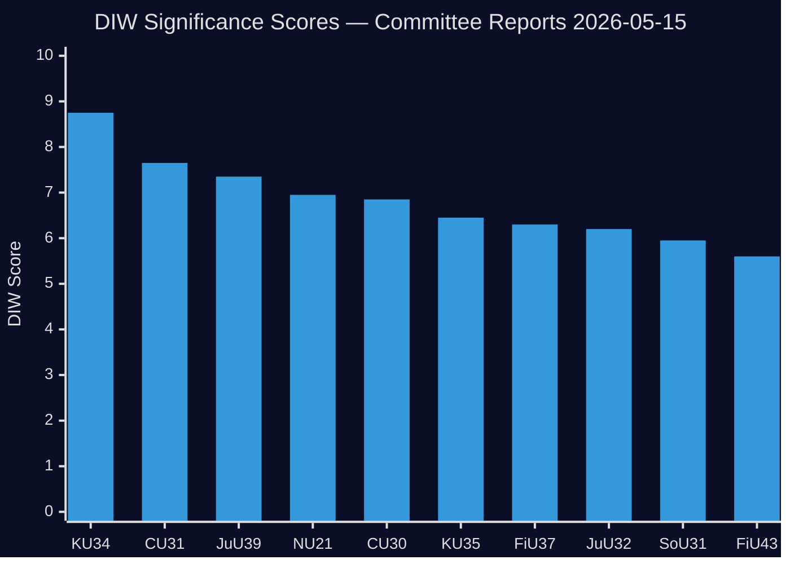

# Significance Scoring — Committee Reports 2026-05-15

**Generated**: 2026-05-15 | **Riksmöte**: 2025/26 | **Author**: James Pether Sörling  
**Confidence**: HIGH [B2] | **Method**: DIW (Democratic Impact × Implementation Likelihood × Wider Reach)

## DIW Scoring Framework

| Dimension | Weight | Scale |
|-----------|--------|-------|
| Democratic Impact (D) | 40% | 1–10 (constitutional = 10, procedural = 1) |
| Implementation Likelihood (I) | 35% | 1–10 (passed = 10, committee only = 5) |
| Wider Reach (W) | 25% | 1–10 (all citizens = 10, narrow sector = 2) |

## Document Rankings

| Rank | dok_id | Title | D | I | W | DIW Score | Tier |
|------|--------|-------|---|---|---|-----------|------|
| 1 | HD01KU34 | En grundlagsskyddad aborträtt + föreningsfrihet + medborgarskap | 10 | 7 | 10 | **8.75** | L3 Intelligence-grade |
| 2 | HD01CU31 | En mer flexibel hyresmarknad | 7 | 7 | 9 | **7.65** | L2+ Priority |
| 3 | HD01JuU39 | En särskild straffbestämmelse för psykiskt våld | 7 | 7 | 8 | **7.35** | L2+ Priority |
| 4 | HD01NU21 | Hela Sverige ska fungera — landsbygdspolitik | 6 | 7 | 8 | **6.95** | L2 Strategic |
| 5 | HD01CU30 | Energieffektivisering + EPBD-direktivet | 6 | 8 | 7 | **6.85** | L2 Strategic |
| 6 | HD01KU35 | Digitala kommunala sammanträden + privata utförare | 5 | 8 | 7 | **6.45** | L2 Strategic |
| 7 | HD01FiU37 | Operativ krishantering finansiell sektor | 6 | 7 | 6 | **6.30** | L2 Strategic |
| 8 | HD01JuU32 | Säkerhet vid allmänna sammankomster | 5 | 7 | 7 | **6.20** | L2 Strategic |
| 9 | HD01SoU31 | Nationell utredningsfunktion suicid | 5 | 7 | 6 | **5.95** | L2 Strategic |
| 10 | HD01FiU43 | Kommuner + felaktiga utbetalningar välfärd | 4 | 7 | 6 | **5.60** | L2 Strategic |

## Lead Story

**HD01KU34** (KU34) is the lead document — a double-barrelled constitutional reform proposal combining:
1. **Abortion rights constitutional protection** (inserting in RF 2 kap.) — directly responds to post-Dobbs international landscape, cementing reproductive rights beyond simple parliamentary majority reversal.
2. **Expanded restriction on association freedom** + **new citizenship revocation grounds** — security-state expansion affecting terror-linked and gang-affiliated individuals.

This document requires a **2/3 parliamentary supermajority in two separate riksmöten** (RF 8:14) — the highest legislative threshold in Sweden. Evidence cite: `HD01KU34` (dok_id), KU organ, 2026-05-11.

## Sensitivity Analysis

If HD01KU34 is excluded (e.g., delayed to next riksmöte), the lead story shifts to HD01CU31 (rental market deregulation) — which is itself highly contested and mobilises significant civil-society opposition. DIW spread between rank 1 (8.75) and rank 2 (7.65) is 1.10 points — robust lead.

