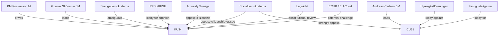

# Stakeholder Perspectives — Committee Reports 2026-05-15

**Author**: James Pether Sörling | **Confidence**: HIGH [B2]

## 6-Lens Stakeholder Matrix

| Lens | KU34 (Constitutional) | CU31 (Rental) | JuU39 (Psyk. Våld) | NU21 (Rural) |
|------|-----------------------|---------------|---------------------|--------------|
| **Government** | Leading — PM Ulf Kristersson, Justitieminister Gunnar Strömmer | Leading — Bostadsminister Andreas Carlson | Supporting | Supporting — Minister for Rural Affairs |
| **Opposition (S, V, MP)** | Split: support abortion, oppose security clauses | Strongly oppose | Support | Broadly support rural investment |
| **Industry/Business** | Neutral | SUPPORT — fastighetsbolag (property companies) | Neutral | Neutral |
| **Civil Society** | Split: RFSL/RFSU (abortion YES), Amnesty/CDR (citizenship NO) | OPPOSE — Hyresgästföreningen (800k members) | STRONG SUPPORT — ROKS, NCK | Support |
| **Municipalities (SKR)** | No position | Mixed — landlord vs. tenant municipalities | No position | SUPPORT with funding concerns |
| **Media Frame (Mainstream)** | Abortion rights positive; citizenship controversial | Housing crisis framing — tenant sympathetic | Victim rights positive | Rural-urban divide frame |

## Named Actor Analysis

### Key Actors — KU34

**PM Ulf Kristersson (M)**: Personally supports the full KU34 package. Constitutional reform aligns with M's post-2022 security-state hardening agenda. Political risk: if citizenship clause fails, it weakens his government's security credentials ahead of 2026 elections.

**Jimmie Åkesson (SD)**: SD's position on the combined package is strategically ambiguous. SD publicly supports stronger measures against terrorism but has also used abortion rights as an electoral issue. SD will likely demand a separate vote on the abortion and citizenship clauses to avoid committing to the supermajority.

**Magdalena Andersson (S)**: S supports abortion-rights constitutionalisation but has positioned the party against the citizenship and association-freedom clauses on civil liberties grounds. S's reservation in the committee report is signal of hardened opposition to parts of KU34.

### Key Actors — CU31

**Andreas Carlson (KD, Bostadsminister)**: Has driven the rental deregulation agenda as a market liberalisation flagship. Personal political capital invested in passing CU31 before elections.

**Hyresgästföreningen (Tenants' Federation)**: 500,000+ member organisation; formally opposes CU31. Will likely commence legal challenges and political mobilisation. Historically effective in shaping housing policy debates.

**Fastighetsägarna (Property Owners)**: Supports CU31 as enabling more efficient housing allocation and investment incentives. Key government lobby ally.

## Influence Network

