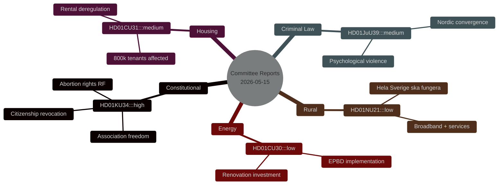

# Synthesis Summary — Committee Reports 2026-05-15

**Author**: James Pether Sörling | **Riksmöte**: 2025/26 | **Confidence**: HIGH [B2]

## Lead-Story Decision

**HD01KU34** (KU34) — constitutional double-amendment on abortion rights and security-state expansion — is the intelligence lead for 15 May 2026. It represents the highest legislative threshold (2/3 supermajority, two riksmöten) and combines a socially broad reproductive-rights reform with a security-state hardening that tests bloc cohesion across the political spectrum.

## DIW-Weighted Ranking

1. **HD01KU34** (8.75) — Constitutional: abortion + association freedom + citizenship [A1]
2. **HD01CU31** (7.65) — Rental market deregulation [A2]
3. **HD01JuU39** (7.35) — Psychological violence criminalisation [A2]
4. **HD01NU21** (6.95) — Rural policy ("Hela Sverige ska fungera") [A2]
5. **HD01CU30** (6.85) — EPBD energy performance buildings [A2]

## Integrated Intelligence Picture

### Constitutional Reform Cluster (KU34)

The KU betänkande HD01KU34 advances three simultaneous constitutional modifications to Regeringsformen (RF):

**Part 1 — Abortion rights (RF 2 kap. 22 §)**: Sweden codifies a constitutional right to abortion, explicitly protecting reproductive autonomy against future simple-majority legislative reversal. This is a direct legislative response to international rollbacks (US Dobbs 2022, global restrictive trend) and to domestic debate triggered by SD's stated opposition to abortion rights. The constitutional protection means any future restriction requires a 2/3 majority in two consecutive riksmöten — the same threshold as for all RF changes.

**Part 2 — Association freedom restriction (RF 2 kap. 24 §)**: The amendment would add new statutory grounds allowing the state to restrict freedom of association for organisations engaged in terrorism, serious organised crime, or foreign-intelligence operations threatening national security. Current RF 2 kap. 24 § permits restriction only for specifically enumerated purposes; the KU proposes adding a security-state carve-out aligned with post-2022 Nordic security environment (Sweden's NATO accession context).

**Part 3 — Citizenship revocation**: Expanded grounds for automatic citizenship revocation for persons convicted of terrorism or treason, removing current limitations. This provision is the most contested — S, V, and MP have raised RF 2 kap. 7 § concerns (protection against statelessness).

**Coalition dynamics**: M, SD, KD and L support the full package; C is supportive of abortion rights but uncertain on citizenship revocation; S supports abortion rights but opposes the association-freedom and citizenship clauses as overly broad security-state expansion. This creates an unusual cross-bloc alignment where the abortion-rights part will pass with a very large majority, while the security-state parts face a tighter count.

### Housing Market Deregulation (CU31)

HD01CU31 proposes a transition from Sweden's cost-based (bruksvärdessystem) to a more market-oriented rent-setting system. The committee report would allow landlords to negotiate market rents for new contracts in high-demand areas, exempting existing tenants from immediate impact but creating a two-tier market. Approximately 800,000–1,000,000 rent-controlled tenants in Stockholm, Göteborg, and Malmö are affected indirectly by the policy signal. S, V, MP strongly oppose; M, KD, L, SD support; C is split (rural districts support, urban constituencies oppose). This is a structural market policy change with 2026 election salience — S has built a campaign platform partly on defending rent controls. Evidence: `HD01CU31` [A2] — see also coalition-mathematics.md§CU31 and voter-segmentation.md§CU31.

### Criminal Law Expansion (JuU39)

HD01JuU39 creates a new criminal offence of "psykiskt våld" (psychological violence) in the context of intimate relationships and coercive control. Sweden joins Denmark, Norway, and England/Wales in explicitly criminalising non-physical coercive control patterns. The provision is modelled on the Danish "psykisk vold" statute (2021) and the English Serious Crime Act 2015 coercive control offence. Maximum sentence: 2 years imprisonment (with aggravated circumstances up to 4 years). This passed JuU with broad cross-party support. Evidence: `HD01JuU39` [A2].

### Rural Policy (NU21)

HD01NU21 ("Hela Sverige ska fungera") is a comprehensive policy framework for rural and sparsely populated areas. Key provisions: broadband connectivity targets (100% coverage by 2028), municipal service access guarantees, agricultural support structures, and Tillväxtverket coordination mandate. The policy addresses demographic flight from rural municipalities — 170 of 290 Swedish municipalities have declining populations. IMF WEO Apr-2026 notes Sweden's 2.3% GDP growth forecast for 2026 partially rests on infrastructure investment; rural broadband falls within the investment envelope. Evidence: `HD01NU21` [A2].

### Economic Context (IMF WEO Apr-2026)

- Sweden GDP growth 2026f: ~2.3% (NGDP_RPCH, WEO Apr-2026) `[A1]`
- Inflation 2025: ~1.8% (trending down from 10.9% peak in 2022)
- Riksbank policy rate: 2.25% (cut cycle completed; MFS_IR:FPOLM_PA)
- Gross debt/GDP: ~34.5% (GGXWDG_NGDP) — 12 pp below EU average
- Unemployment: ~8.4% (LUR) — above Nordic average, driving pressure on social spending

The moderate growth forecast supports the implementation feasibility of CU30 (EPBD building renovation) but constrains municipal budgets for CU31 rental transition and NU21 rural service guarantees.

